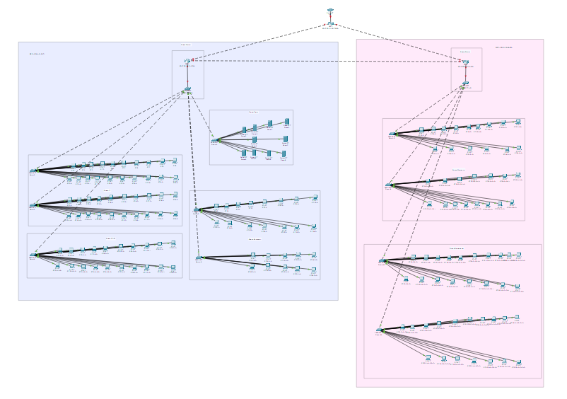

# 📅 Desain Topologi dan Skema Pengalamatan - Pekan 10

## 👥 Kelompok 3

1. Salsabila Putri Zahrani (10231086) - Network Services Specialist
2. Andini Permata Dewanti (10231014) - Network Architect
3. Ariel Itsbat Nurhaq (10231018) - Security & Documentation Specialist
4. Jonathan Joseph Tampubolon (102310478) - Network Engineer

---

## 📑 Daftar Isi

1. Diagram Topologi Fisik dan Logis
2. Tabel Pengalamatan IP
3. Daftar Perangkat yang dibutuhkan
4. Rencana Penerapan VLAN
5. Awal Implementasi dalam Packet Tracer

---

## 1. Diagram Topologi Fisik dan Logis

  
Topologi logika jaringan menghubungkan dua gedung melalui router pusat dan menyediakan jalur redundansi antar router untuk menjaga ketersediaan jaringan. Router pusat terhubung ke ISP dan menjadi gerbang utama ke internet, sementara masing-masing gedung memiliki router dan switch utama yang membagi jaringan ke beberapa subnet sesuai fungsi ruangan yaitu IT, Keuangan, SDM, Server Farm, Marketing, dan Operasional. Setiap subnet menggunakan alamat IP berbeda dengan tujuan untuk memudahkan dalam manajemen dan meningkatkan keamanan jaringan.

## 2. Tabel Pengalamatan IP

### 2.1 Tabel Pengalamatan IP Gedung A (Pusat)

| Nama VLAN     | VLAN ID | Subnet          | Subnet Mask   | Network Address | Gateaway     | IP Address   | Range IP Host               | Broadcast Address | Jumlah Host |
| ------------- | ------- | --------------- | ------------- | --------------- | ------------ | ------------ | --------------------------- | ----------------- | ----------- |
| VLAN IT       | 10      | 192.168.10.0/24 | 255.255.255.0 | 192.168.10.0    | 192.168.10.1 | 192.168.10.2 | 192.168.10.2-192.168.10.254 | 192.168.10.255    | 253         |
| VLAN Keuangan | 20      | 192.168.20.0/24 | 255.255.255.0 | 192.168.20.0    | 192.168.20.1 | 192.168.20.2 | 192.168.20.2-192.168.20.254 | 192.168.20.255    | 253         |
| VLAN SDM      | 30      | 192.168.30.0/24 | 255.255.255.0 | 192.168.30.0    | 192.168.30.1 | 192.168.30.2 | 192.168.30.2-192.168.30.254 | 192.168.30.255    | 253         |
| VLAN Server   | 40      | 192.168.40.0/24 | 255.255.255.0 | 192.168.40.0    | 192.168.40.1 | 192.168.40.2 | 192.168.40.2-192.168.40.254 | 192.168.40.255    | 253         |

### 2.2 Tabel Pengalamatan IP Gedung B (Cabang)

| Nama VLAN        | VLAN ID | Subnet          | Subnet Mask   | Network Address | Gateaway     | IP Address   | Range IP Host               | Broadcast Address | Jumlah Host |
| ---------------- | ------- | --------------- | ------------- | --------------- | ------------ | ------------ | --------------------------- | ----------------- | ----------- |
| VLAN Marketing   | 50      | 192.168.50.0/24 | 255.255.255.0 | 192.168.50.0    | 192.168.50.1 | 192.168.50.2 | 192.168.50.2-192.168.50.254 | 192.168.50.255    | 253         |
| VLAN Operasional | 60      | 192.168.60.0/24 | 255.255.255.0 | 192.168.60.0    | 192.168.60.1 | 192.168.60.2 | 192.168.60.2-192.168.60.254 | 192.168.60.255    | 253         |

## 3. Daftar Perangkat yang Dibutuhkan

### 3.1 Jenis Perangkat Jaringan dan Model

| Lokasi        | Perangkat    | Jumlah | Fungsi                                     | Model Cisco           | Keterangan                                        |
| ------------- | ------------ | ------ | ------------------------------------------ | --------------------- | ------------------------------------------------- |
| Kantor Pusat  | Router Utama | 1      | Gateway & Routing                          | Router-PT (1841)      | Routing antar VLAN & koneksi WAN ke kantor cabang |
|               | Router Lokal | 1      | Routing LAN                                | Router-PT (1841)      | Routing internal VLAN di kantor pusat             |
|               | Main Switch  | 1      | Routing antar VLAN                         | Switch-PT (2960-24TT) | Uplink & VLAN trunking utama                      |
|               | Switch       | 6      | Koneksi LAN                                | Switch-PT (2960-24TT) | Distribusi ke perangkat client per departemen     |
|               | Server       | 10     | Pengaturan DHCP, DNS & monitoring jaringan | Server-PT             | layanan DHCP,DNS, dan monitoring jaringan         |
|               | PC           | 85     | Berbagi data                               | PC                    | Terhubung ke Switch                               |
| Kantor Cabang | Router Lokal | 1      | Gateway & Routing                          | Router-PT (1841)      | Routing antar VLAN & Koneksi ke Kantor Pusat      |
|               | Main Switch  | 1      | Routing Antar VLAN                         | Switch-PT (2960-24TT) | Hub utama VLAN internal                           |
|               | Switch       | 4      | Koneksi LAN                                | Switch-PT (2960-24TT) | Distribusi ke Perangkat client                    |
|               | PC           | 65     | berbagi data                               | PC                    | Terhubung ke Switch                               |

### 3.2 Jenis Kabel yang Digunakan

| Jenis Kabel            | Nama di Cisco Packet Tracer   | Fungsi                                                         |
| ---------------------- | ----------------------------- | -------------------------------------------------------------- |
| Kabel Straight Through | Copper Straight Through       | Menghubungkan PC ke Switch atau Switch ke Router (port access) |
| Kabel Crossover        | Copper Cross-Over             | Menghubungkan Switch ke Switch, Router ke Router (khusus LAN)  |
| Kabel Serial DCE/DTE   | Serial DCE/DTE (Serial Cable) | Koneksi WAN antar router (Router Pusat ↔ Router Cabang)        |
| Kabel Fiber            | Fiber                         | Koneksi backbone Switch-to-Switch                              |

## 4. Rencana Penerapan VLAN

### 4.1 Penerapan VLAN Gedung A

| Nama VLAN     | Subnet IP       | Rentang IP                  | Tujuan                                                                                                   |
| ------------- | --------------- | --------------------------- | -------------------------------------------------------------------------------------------------------- |
| VLAN IT       | 192.168.10.0/24 | 192.168.10.1-192.168.10.254 | Mengisolasi jaringan untuk Departemen IT.                                                                |
| VLAN Keuangan | 192.168.20.0/24 | 192.168.20.1-192.168.20.254 | Mengisolasi jaringan untuk Departemen Keuangan.                                                          |
| VLAN SDM      | 192.168.30.0/24 | 192.168.30.1-192.168.30.254 | Mengisolasi jaringan untuk Departemen SDM.                                                               |
| VLAN Server   | 192.168.40.0/24 | 192.168.40.1-192.168.40.254 | Jaringan khusus untuk server farm dan layanan internal perusahaan (seperti DNS, DHCP, File Server, dll). |

### 4.2 Penerapan VLAN Gedung B

| Nama VLAN        | Subnet IP       | Rentang IP                  | Tujuan                                                              |
| ---------------- | --------------- | --------------------------- | ------------------------------------------------------------------- |
| VLAN Marketing   | 192.168.50.0/24 | 192.168.50.1-192.168.50.254 | Mengisolasi jaringan untuk Departemen Marketing di Kantor Cabang.   |
| VLAN Operasional | 192.168.60.0/24 | 192.168.60.1-192.168.60.254 | Mengisolasi jaringan untuk Departemen Operasional di Kantor Cabang. |

## 5. Awal Implementasi dalam Packet Tracer

### 5.1 Topologi Jaringan Keseluruhan

Gambar diatas merupakan topologi jaringan secara keseluruhan dari gedung A (Pusat) dan Gedung B (Cabang) yang terhubung melalui Router Pusat ke internet. Tiap gedung memiliki router utama yang terhubung ke beberapa switch, lalu terhubung ke semua perangkat seperti PC atau server masing-masing gedung. Di dalam masing-masing gedung, jaringan diatur berdasarkan ruang/departemen yaitu Ruang IT, Keuangan, SDM, Server Farm, Marketing, dan Operasional.

### 5.2 Topologi Jaringan Gedung A (Pusat)

Gambar diatas merupakan detail implementasi jaringan di Gedung A (Pusat). Router gedung A terhubung ke router gedung B, dan terhubung langsung ke router pusat. Selanjutnya mendistribusikan koneksi ke berbagai ruangan seperti Ruang IT, Keuangan, SDM, dan juga ke Server Farm. Setiap ruangan memiliki sejumlah perangkat PC yang terhubung melalui switch masing-masing, jaringan internal ini menggunakan topologi star.

### 5.3 Topologi Jaringan Gedung B (Cabang)

Gambar diatas merupakan detail implementasi jaringan di Gedung B (Cabang). Struktur jaringan pada gedung ini mirip dengan Gedung A, router lokal (Gedung B) terhubung ke router gedung A dan terhubung langsung ke router pusat, lalu menyebar ke switch-switch di ruangan Marketing dan Operasional. Masing-masing switch melayani koneksi beberapa perangkat PC dengan topologi star.
