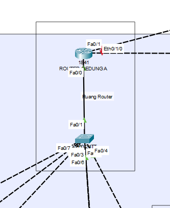

# 📅 Implementasi Topologi Dasar & VLAN - Pekan 11

## 👥 Kelompok 3

1. Salsabila Putri Zahrani (10231086) - Network Services Specialist
2. Andini Permata Dewanti (10231014) - Network Architect
3. Ariel Itsbat Nurhaq (10231018) - Security & Documentation Specialist
4. Jonathan Joseph Tampubolon (102310478) - Network Engineer

---

## 📑 Daftar Isi

1. Link file simulasi
2. Screenshot topologi yang telah diimplementasikan dengan penjelasan detail.
3. Dokumentasi konfigurasi CLI
4. Hasil pengujian konektivitas antar-VLAN dengan screenshot dan penjelasan.
5. Kendala yang dihadapi dan solusinya.

---

## Laporan Implementasi Tahap 1 

#### 🔗 Link File Simulasi

> [Unduh File Simulasi .pkt (Cisco Packet Tracer)](https://github.com/itsbat15/kelompok3/blob/main/WEEK-11.pkt)

#### 🖼️ Screenshot Topologi Jaringan 

##### 🏢 Gedung A



Gambar topologi jaringan Gedung A menunjukkan arsitektur jaringan kompleks dengan pembagian VLAN berdasarkan departemen: IT (VLAN 10), Keuangan (VLAN 20), SDM (VLAN 30), dan Server (VLAN 40). Masing-masing VLAN dihubungkan ke switch distribusi yang ditetapkan khusus untuk tiap departemen, lalu terkoneksi ke Main Switch melalui trunk port. Main Switch ini menjadi pusat komunikasi antar VLAN dan meneruskan koneksi ke Router Utama, yang menjalankan konsep Router-on-a-Stick untuk mengatur routing antar VLAN melalui sub-interface (Fa0/0.X). Selain sebagai pengatur trafik internal, router ini juga menjadi gateway utama yang menghubungkan kantor pusat ke kantor cabang melalui koneksi WAN. Infrastruktur ini memungkinkan isolasi dan pengelolaan trafik antar departemen secara efisien dan terstruktur.


##### 🏢 Gedung B


Gambar topologi jaringan Gedung B menggambarkan struktur yang lebih sederhana dibandingkan Gedung A, dengan dua VLAN utama: Marketing (VLAN 50) dan Operasional (VLAN 60). Kedua VLAN ini dikonfigurasi melalui switch distribusi yang terhubung ke Main Switch Gedung B, kemudian diarahkan ke Router Lokal. Router ini juga menggunakan metode Router-on-a-Stick pada interface FastEthernet0/1 untuk mengatur komunikasi antar VLAN di kantor cabang serta sebagai gateway menuju router di kantor pusat. Topologi ini menunjukkan bagaimana jaringan di kantor cabang tetap bisa berjalan secara mandiri namun tetap terkoneksi secara terpusat dengan Gedung A, mendukung efisiensi dan kesinambungan operasional.


##### 🏢🏢 Keseluruhan Gedung


Topologi jaringan yang diimplementasikan terdiri dari dua lokasi utama, yaitu Kantor Pusat (Gedung A) dan Kantor Cabang (Gedung B), yang terhubung melalui jaringan WAN. Masing-masing gedung menerapkan segmentasi jaringan berbasis VLAN dengan teknik routing antar-VLAN menggunakan metode Router-on-a-Stick pada router Cisco 1841. Di Gedung A, jaringan terdiri dari satu router utama, satu router lokal, satu switch utama, enam switch distribusi untuk tiap departemen, sepuluh server sebagai penyedia layanan jaringan (seperti DHCP dan DNS), serta 85 PC client. Setiap departemen di kantor pusat—seperti IT, Keuangan, SDM, dan Server—memiliki VLAN masing-masing, dengan pengalamatan IP terpisah menggunakan subnet /24 dan gateway pada router melalui konfigurasi subinterface. Switch distribusi menggunakan mode access, sedangkan trunking diterapkan pada port uplink ke switch utama untuk membawa lalu lintas antar VLAN.

Sementara itu, di Gedung B, topologi jaringan terdiri dari satu router lokal, satu switch utama, empat switch distribusi, dan 65 PC client yang terbagi ke dalam dua departemen: Marketing dan Operasional. Masing-masing departemen memiliki VLAN tersendiri, dengan pengaturan IP subnet yang juga menggunakan skema /24. Trunking diterapkan pada setiap switch untuk menghubungkan VLAN ke switch utama dan router lokal. Koneksi antara kedua gedung dilakukan melalui antarmuka fisik pada router masing-masing, memungkinkan komunikasi antar jaringan melalui jaringan WAN. Konfigurasi ini memungkinkan pengelolaan jaringan yang lebih efisien dan aman, dengan pemisahan lalu lintas data antar departemen, serta kemudahan dalam pengawasan dan pemeliharaan infrastruktur jaringan. Dengan adanya routing antar-VLAN dan segmentasi jaringan yang jelas, sistem ini mendukung skalabilitas dan fleksibilitas dalam perkembangan infrastruktur jaringan perusahaan di masa mendatang.


Gambar di atas menunjukkan implementasi topologi jaringan dengan 10 switch, masing-masing terhubung melalui port trunk dan telah dikonfigurasi VLAN 10–60. Port access telah dialokasikan sesuai divisi masing-masing seperti IT, Keuangan, SDM, dll.


#### 🖥️ Dokumentasi Konfigurasi CLI

Berikut adalah konfigurasi VLAN, trunking, dan routing antar-VLAN menggunakan CLI untuk seluruh perangkat.


#### Konfigurasi VLAN dan Assign Port
Konfigurasi VLAN dan penetapan port pada switch bertujuan untuk membagi jaringan menjadi beberapa segmen terpisah sesuai dengan fungsi departemen dalam organisasi. Pada Switch 1, VLAN 10 digunakan untuk departemen IT, memastikan perangkat hanya berkomunikasi dalam jaringan IT. Switch 2 mengonfigurasi VLAN 20 untuk Keuangan, memisahkan perangkat dan data keuangan dari departemen lain. Switch 3 dengan VLAN 30 mengisolasi perangkat SDM untuk mengelola data karyawan dengan aman. Pada Switch 4, VLAN 40 digunakan untuk mengisolasi server dan mengontrol lalu lintas data server. Switch 5 mengonfigurasi VLAN 50 untuk Marketing, memberikan akses terbatas ke sumber daya pemasaran, sementara Switch 6 dengan VLAN 60 memisahkan perangkat operasional untuk mempermudah pengelolaan dan pemantauan kegiatan operasional.

Switch 1 - IT
```bash
# Masuk ke mode konfigurasi
Switch> enable
Switch# configure terminal

# Buat VLAN
Switch(config)# vlan 10
Switch(config-vlan)# name IT
Switch(config-vlan)# exit

# Assign port ke VLAN
Switch(config)# interface range fa0/1 - 24
Switch(config-if)# switchport mode access
Switch(config-if)# switchport access vlan 10
Switch(config-if)# exit


```

Switch 2 - Keuangan
```bash
# Masuk ke mode konfigurasi
Switch> enable
Switch# configure terminal

# Buat VLAN
Switch(config)# vlan 20
Switch(config-vlan)# name Keuangan
Switch(config-vlan)# exit

# Assign port ke VLAN
Switch(config)# interface range fa0/1 - 24
Switch(config-if)# switchport mode access
Switch(config-if)# switchport access vlan 20
Switch(config-if)# exit

```
Switch 3 - SDM
```bash
# Masuk ke mode konfigurasi
Switch> enable
Switch# configure terminal

# Buat VLAN
Switch(config)# vlan 30
Switch(config-vlan)# name SDM
Switch(config-vlan)# exit

# Assign port ke VLAN
Switch(config)# interface range fa0/1 - 24
Switch(config-if)# switchport mode access
Switch(config-if)# switchport access vlan 30
Switch(config-if)# exit

```
Switch 4 - Server
```bash
# Masuk ke mode konfigurasi
Switch> enable
Switch# configure terminal

# Buat VLAN
Switch(config)# vlan 40
Switch(config-vlan)# name Server
Switch(config-vlan)# exit

# Assign port ke VLAN
Switch(config)# interface range fa0/1 - 24
Switch(config-if)# switchport mode access
Switch(config-if)# switchport access vlan 40
Switch(config-if)# exit

```
Switch 5 - Marketing
```bash
# Masuk ke mode konfigurasi
Switch> enable
Switch# configure terminal

# Buat VLAN
Switch(config)# vlan 50
Switch(config-vlan)# name Marketing
Switch(config-vlan)# exit

# Assign port ke VLAN
Switch(config)# interface range fa0/1 - 24
Switch(config-if)# switchport mode access
Switch(config-if)# switchport access vlan 50
Switch(config-if)# exit

```
Switch 6 - Operasional
```bash
# Masuk ke mode konfigurasi
Switch> enable
Switch# configure terminal

# Buat VLAN
Switch(config)# vlan 60
Switch(config-vlan)# name Operasional
Switch(config-vlan)# exit

# Assign port ke VLAN
Switch(config)# interface range fa0/1 - 24
Switch(config-if)# switchport mode access
Switch(config-if)# switchport access vlan 60
Switch(config-if)# exit


```
#### Konfigurasi Trunk
Konfigurasi trunking digunakan untuk menghubungkan berbagai switch dalam jaringan dengan membawa lalu lintas dari beberapa VLAN melalui satu port fisik. Setiap switch, seperti Switch 2 hingga Switch 7, dikonfigurasi dengan port trunk yang menghubungkan VLAN spesifik ke **Main Switch**. Misalnya, Switch 2 menghubungkan VLAN 10 (IT) ke Main Switch melalui port fa0/2, sementara Switch 3, 4, 5, 6, dan 7 menghubungkan VLAN 10, 40, 20, 20, dan 30, masing-masing, menggunakan port trunk ke Main Switch. Pada **Main Switch**, port fa0/2 hingga fa0/7 diatur untuk trunking dengan VLAN 10, 20, 30, dan 40, memungkinkan lalu lintas antar VLAN tersebut dapat mengalir melalui satu port fisik. Konfigurasi ini meningkatkan efisiensi jaringan, mengurangi kebutuhan port fisik, dan memastikan komunikasi antar VLAN yang terisolasi tetap terjaga dengan aman.
Switch 2 - IT
```bash
# VLAN IT
Switch(config)# vlan 10
Switch(config-vlan)# name IT

# Trunk ke Main Switch fa0/2
Switch(config)# interface fa0/1
Switch(config-if)# switchport mode trunk
Switch(config-if)# switchport trunk allowed vlan 10
```

Switch 3 - IT
```bash
# VLAN IT
Switch(config)# vlan 10
Switch(config-vlan)# name IT

# Trunk ke Main Switch fa0/3
Switch(config)# interface fa0/1
Switch(config-if)# switchport mode trunk
Switch(config-if)# switchport trunk allowed vlan 10
```

Switch 4 - Server
```bash
# VLAN Server
Switch(config)# vlan 40
Switch(config-vlan)# name Server

# Trunk ke Main Switch fa0/4
Switch(config)# interface fa0/1
Switch(config-if)# switchport mode trunk
Switch(config-if)# switchport trunk allowed vlan 40
```

Switch 5 - Keuangan
```bash
# VLAN Keuangan
Switch(config)# vlan 20
Switch(config-vlan)# name Keuangan

# Trunk ke Main Switch fa0/5
Switch(config)# interface fa0/1
Switch(config-if)# switchport mode trunk
Switch(config-if)# switchport trunk allowed vlan 20
```

Switch 6 - Keuangan
```bash
# VLAN Keuangan
Switch(config)# vlan 20
Switch(config-vlan)# name Keuangan

# Trunk ke Main Switch fa0/6
Switch(config)# interface fa0/1
Switch(config-if)# switchport mode trunk
Switch(config-if)# switchport trunk allowed vlan 20
```

Switch 7 - SDM
```bash
# VLAN SDM
Switch(config)# vlan 30
Switch(config-vlan)# name SDM

# Trunk ke Main Switch fa0/7
Switch(config)# interface fa0/1
Switch(config-if)# switchport mode trunk
Switch(config-if)# switchport trunk allowed vlan 30
```

Main Switch 
```bash
# Buat VLAN
Switch(config)# vlan 10
Switch(config-vlan)# name IT
Switch(config)# vlan 20
Switch(config-vlan)# name Keuangan
Switch(config)# vlan 30
Switch(config-vlan)# name SDM
Switch(config)# vlan 40
Switch(config-vlan)# name Server

# Trunk ke semua switch ruangan
Switch(config)# interface range fa0/2 - 7
Switch(config-if-range)# switchport mode trunk
Switch(config-if-range)# switchport trunk allowed vlan 10,20,30,40
```

#### 🌐 Routing Antar VLAN dengan Router-on-a-Stick
Konfigurasi Routing Antar VLAN dengan Router-on-a-Stick bertujuan untuk menghubungkan beberapa VLAN di Gedung A dan Gedung B melalui satu router menggunakan sub-interface pada antarmuka fisik router. Di Gedung A, VLAN 10 (Administrasi), VLAN 20 (Akademik), VLAN 30 (Keuangan), dan VLAN 40 (Laboratorium) masing-masing dikonfigurasi dengan sub-interface yang memiliki alamat IP yang sesuai. Di Gedung B, VLAN 50 (Perpustakaan) dan VLAN 60 (Gudang) juga dikonfigurasi dengan alamat IP masing-masing. Setiap sub-interface menggunakan encapsulation dot1Q untuk mengelola lalu lintas dari masing-masing VLAN. Setelah konfigurasi VLAN selesai, interface fisik pada kedua router diaktifkan, memungkinkan komunikasi antar VLAN yang terpisah di kedua gedung tersebut melalui satu router.

##### 🏢 Gedung A – VLAN Configuration

```bash
! VLAN 10 – Administrasi
interface FastEthernet0/0.10
 encapsulation dot1Q 10
 ip address 192.168.10.1 255.255.255.0
exit

! VLAN 20 – Akademik
interface FastEthernet0/0.20
 encapsulation dot1Q 20
 ip address 192.168.20.1 255.255.255.0
exit

! VLAN 30 – Keuangan
interface FastEthernet0/0.30
 encapsulation dot1Q 30
 ip address 192.168.30.1 255.255.255.0
exit

! VLAN 40 – Laboratorium
interface FastEthernet0/0.40
 encapsulation dot1Q 40
 ip address 192.168.40.1 255.255.255.0
exit

! Aktifkan interface fisik
interface FastEthernet0/0
 no shutdown
exit
```
##### 🏢 Gedung B – VLAN Configuration
```bash
! VLAN 50 – Perpustakaan
interface FastEthernet0/1.50
 encapsulation dot1Q 50
 ip address 192.168.50.1 255.255.255.0
exit

! VLAN 60 – Gudang
interface FastEthernet0/1.60
 encapsulation dot1Q 60
 ip address 192.168.60.1 255.255.255.0
exit

! Aktifkan interface fisik
interface FastEthernet0/1
 no shutdown
exit
```

### 📶 Hasil Pengujian Konektivitas antar-VLAN 


Berdasarkan keseluruhan konfigurasi, router pada masing-masing gedung sudah dikonfigurasi dengan sub-interface untuk mendukung komunikasi antar VLAN (Router-on-a-Stick). Pada gambar pertama dan kedua, output perintah show vlan brief menunjukkan bahwa VLAN 10 (IT), VLAN 20 (Keuangan), VLAN 30 (SDM), VLAN 40 (Server), VLAN 50 (Marketing), dan VLAN 60 (Operasional) telah dikonfigurasi dengan benar dan masing-masing VLAN aktif serta terhubung pada port yang sesuai di switch. Hal ini membuktikan bahwa konfigurasi VLAN pada switch sudah berhasil diterapkan. Sementara itu, pada gambar ketiga dan keempat, hasil perintah show ip interface brief menunjukkan bahwa sub-interface pada router untuk setiap VLAN, seperti FastEthernet0/0.10, FastEthernet0/0.20, dan seterusnya, telah dikonfigurasi dengan alamat IP yang sesuai. Interface-interface tersebut berada dalam status up, artinya pengujian konektivitas antar-VLAN seharusnya berhasil jika:

1. Port pada switch telah dikonfigurasi sesuai dengan VLAN yang benar.

2. Trunking telah diaktifkan di antara switch dan router.

3. IP address diberikan pada tiap perangkat di masing-masing VLAN sesuai subnet-nya.


---

### ⚠️ Kendala yang Dihadapi dan Solusinya 

1. **Trunking tidak berfungsi**  
*Penyebab:* Port trunk tidak dikonfigurasi dengan benar di kedua sisi.  
*Solusi:* Memastikan port trunk di switch saling terhubung menggunakan mode trunk dan VLAN allowed sesuai kebutuhan.

