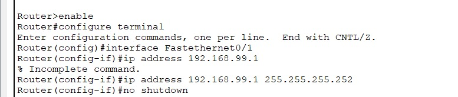
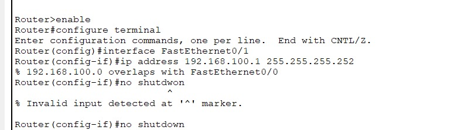
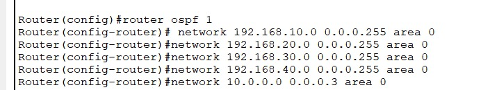
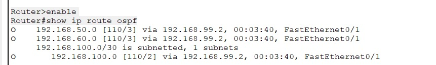
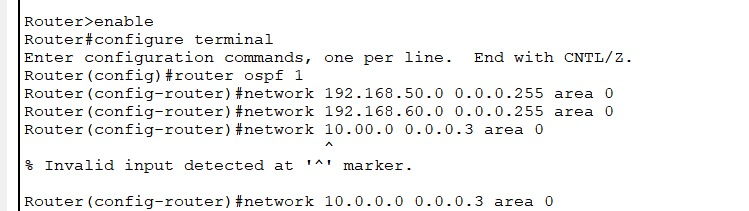
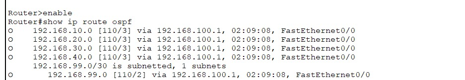
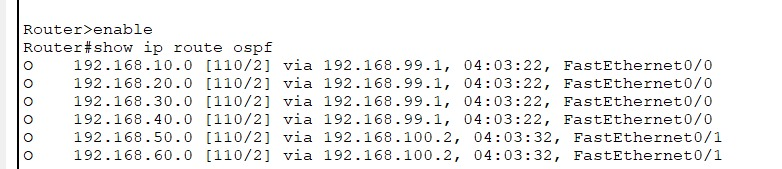
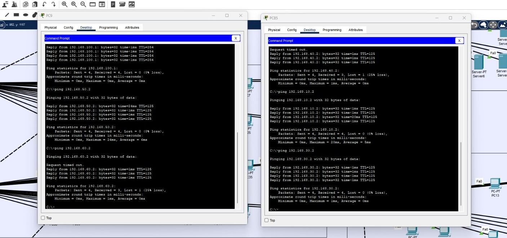
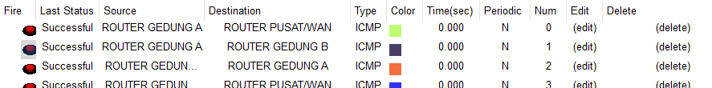

# 📅 Implementasi Routing & WAN - Pekan 12

## 👥 Kelompok 3

1. Salsabila Putri Zahrani (10231086) - Network Services Specialist
2. Andini Permata Dewanti (10231014) - Network Architect
3. Ariel Itsbat Nurhaq (10231018) - Security & Documentation Specialist
4. Jonathan Joseph Tampubolon (102310478) - Network Engineer

---

## 📑 Daftar Isi

1. Link file simulasi
2. Screenshot tabel routing pada router utama dengan penjelasan detail.
3. Hasil pengujian konektivitas antar-gedung dengan screenshot dan penjelasan.
4. Analisis performa routing dinamis vs statis.
5. Kendala yang dihadapi dan solusinya.

---

## 📓 Laporan Implementasi Tahap 1

#### 🔗 Link File Simulasi

> [Unduh File Simulasi .pkt (Cisco Packet Tracer)](https://github.com/itsbat15/kelompok3/blob/main/WEEK-12.pkt)

#### Hasil pengujian konektivitas antar-gedung dengan screenshot dan penjelasan.

Tes konektivitas dari router ke PC di VLAN masing-masing dilakukan untuk memastikan bahwa sub-interface di router sudah aktif dan berfungsi sebagai gateway

#### 🖥️ Dokumentasi Konfigurasi CLI

Berikut adalah konfigurasi VLAN, trunking, dan routing antar-VLAN menggunakan CLI untuk seluruh perangkat.

#### 📁 Konfigurasi IP di interface FastEthernet WAN

Routing statis adalah metode pengaturan jalur komunikasi data dalam jaringan komputer yang dilakukan secara manual oleh administrator jaringan. Dalam konteks jaringan intra-gedung seperti yang diterapkan pada sistem komunikasi antar lantai atau antar ruangan di dalam satu gedung routing statis digunakan untuk mengatur agar setiap perangkat dalam jaringan memiliki jalur tetap menuju perangkat lain, sesuai dengan struktur dan kebutuhan jaringan tersebut. Karena bersifat tetap, rute yang ditentukan tidak akan berubah secara otomatis meskipun terjadi perubahan atau gangguan pada jaringan, sehingga metode ini sangat cocok digunakan untuk jaringan skala kecil hingga menengah yang topologinya tidak sering berubah, seperti jaringan dalam satu gedung. Keunggulan dari routing statis adalah kestabilan dan kemudahan kontrol, karena administrator dapat menentukan sendiri jalur-jalur yang dilewati paket data. Selain itu, routing statis tidak membebani perangkat jaringan karena tidak memerlukan proses perhitungan otomatis seperti pada routing dinamis. Namun, metode ini memiliki kelemahan dalam hal fleksibilitas, karena setiap perubahan pada struktur jaringan memerlukan konfigurasi ulang secara manual. Oleh karena itu, dalam jaringan intra-gedung yang bersifat tetap dan tidak terlalu kompleks, penggunaan routing statis menjadi pilihan yang tepat untuk memastikan komunikasi data berjalan efisien dan stabil.

#### 🏢 Router Gedung A

```bash
# Masuk ke mode konfigurasi
Router>enable
Router#configure terminal

# Buat IP Gedung A
Router(config)#interface Fastethernet0/1
Router(config-if)#ip address 192.168.99.1
Router(config-if)#ip address 192.168.99.1 255.255.255.252
Router(config-if)#no shutdown
```



#### 🏠 Router Gedung B

```bash
# Masuk ke mode konfigurasi
Router>enable
Router#configure terminal

# Buat IP Gedung B
Router(config)#interface FastEthernet0/1
Router(config-if)#ip address 192.168.100.1 255.255.255.252
Router(config-if)#no shutdown
```



Konfigurasi pada Router Gedung A dimulai dengan masuk ke mode privileged menggunakan perintah enable, kemudian dilanjutkan ke mode global configuration dengan configure terminal. Setelah itu, dipilih interface FastEthernet0/1 yang akan digunakan sebagai jalur komunikasi antar-gedung. Pada tahap awal, kami sempat memberikan perintah ip address 192.168.99.1 tanpa subnet mask, sehingga sistem menolak perintah tersebut karena dianggap tidak lengkap. Perintah yang benar kemudian diberikan, yaitu ip address 192.168.99.1 255.255.255.252, di mana IP 192.168.99.1 adalah alamat yang diberikan ke interface tersebut dan subnet mask /30 digunakan karena hanya akan ada dua host yang terhubung dalam jaringan ini (yaitu router Gedung A dan Gedung B). Terakhir, perintah no shutdown untuk mengaktifkan interface, karena secara default semua interface dalam keadaan mati (shutdown).

Sementara itu, konfigurasi pada Router Gedung B dilakukan dengan cara yang sama: masuk ke mode enable, kemudian configure terminal, dan memilih interface FastEthernet0/1. Selanjutnya, diberikan perintah ip address 192.168.100.1 255.255.255.252 untuk mengatur alamat IP point-to-point dengan router Gedung A. Subnet mask yang digunakan masih sama, yaitu /30, karena hanya diperlukan dua alamat IP. Setelah IP dikonfigurasi, perintah no shutdown kembali digunakan untuk mengaktifkan interface agar bisa beroperasi.

#### 🚀 Implementasi Routing Dinamis (OSPF) untuk Koneksi Antar-Gedung

Dalam proyek jaringan dua gedung ini, digunakan kombinasi antara routing statis dan routing dinamis. Routing statis diterapkan di masing-masing gedung untuk mengatur komunikasi antar VLAN melalui metode Router-on-a-Stick. Metode ini menggunakan sub-interface pada router, di mana setiap sub-interface dikonfigurasi secara manual untuk mewakili satu VLAN tertentu, lengkap dengan alamat IP yang berfungsi sebagai gateway. Konfigurasi ini bersifat tetap dan tidak akan berubah kecuali diperbarui secara manual oleh administrator jaringan. Keuntungan dari pendekatan ini adalah kestabilan dan efisiensinya, terutama pada jaringan lokal (LAN) yang strukturnya jarang berubah. Sementara itu, untuk menghubungkan Gedung A dan Gedung B, digunakan routing dinamis dengan protokol OSPF (Open Shortest Path First). Protokol OSPF memungkinkan kedua router saling bertukar informasi routing dan menentukan rute terbaik secara otomatis berdasarkan kondisi jaringan. Hal ini penting karena pada koneksi antar gedung, jalur dapat berubah atau mengalami gangguan, sehingga kemampuan OSPF untuk menyesuaikan rute secara dinamis menjadi sangat krusial. Selain itu, OSPF juga mempermudah pengelolaan jaringan di masa depan karena router dapat langsung mempelajari jaringan baru yang ditambahkan ke dalam sistem tanpa perlu konfigurasi manual tambahan.

#### 🏢 Gedung A

```bash
# Konfigurasi OSPF pada gedung A
Router(config)#router ospf 1
Router(config-router)# network 192.168.10.0 0.0.0.255 area 0
Router(config-router)#network 192.168.20.0 0.0.0.255 area 0
Router(config-router)#network 192.168.30.0 0.0.0.255 area 0
Router(config-router)#network 192.168.40.0 0.0.0.255 area 0
Router(config-router)#network 10.0.0.0 0.0.0.3 area 0
```




Konfigurasi OSPF pada Router Gedung A dilakukan dengan mengaktifkan proses OSPF menggunakan perintah router ospf 1, yang berarti router akan menjalankan instance OSPF dengan ID 1. Setelah itu, router dimasukkan ke dalam area OSPF menggunakan perintah network. Beberapa network yang dikonfigurasi meliputi 192.168.10.0, 192.168.20.0, 192.168.30.0, dan 192.168.40.0, semuanya menggunakan wildcard mask 0.0.0.255 yang sama dengan subnet mask /24. Seluruh network tersebut dimasukkan ke dalam area 0, yang merupakan area backbone pada OSPF. Selain itu, juga ditambahkan network 10.0.0.0 dengan wildcard 0.0.0.3, yang menunjukkan jaringan point-to-point dengan subnet mask /30. Wildcard mask 0.0.0.3 dipakai untuk menjangkau dua alamat IP dalam subnet point-to-point yang menghubungkan router Gedung A ke router lainnya.

Konfigurasi ini ditunjukkan dalam dua gambar, yaitu areaospfgeda.jpg yang memperlihatkan detail konfigurasi jaringan OSPF, dan ospfgeda.jpg yang menunjukkan visualisasi atau hasil dari pengaktifan OSPF pada router Gedung A. Setelah konfigurasi selesai, dilakukan pengecekan menggunakan perintah show ip route ospf. Hasilnya terlihat bahwa router telah berhasil mempelajari rute-rute ke network 192.168.50.0, 192.168.60.0, dan 192.168.100.0 melalui interface FastEthernet0/1 dengan next-hop 192.168.99.2. Status rute yang diawali dengan huruf O menandakan bahwa rute tersebut berasal dari OSPF.Ini membuktikan bahwa koneksi OSPF antar gedung telah berjalan dengan baik dan informasi routing berhasil dipertukarkan secara dinamis.

#### 🏠 Gedung B

```bash
# Konfigurasi OSPF pada gedung B
Router(config)#router ospf 1
Router(config-router)#network 192.168.50.0 0.0.0.255 area 0
Router(config-router)#network 192.168.60.0 0.0.0.255 area 0
Router(config-router)#network 10.00.0 0.0.0.3 area 0
Router(config-router)#network 10.0.0.0 0.0.0.3 area 0
```



Selanjutnya, router dimasukkan ke dalam beberapa jaringan yang akan diumumkan ke OSPF menggunakan perintah network. Jaringan 192.168.50.0 dan 192.168.60.0 dikonfigurasi menggunakan wildcard mask 0.0.0.255, yang ekuivalen dengan subnet /24, dan semuanya dimasukkan ke dalam area backbone area 0.

Pada saat konfigurasi, terjadi kesalahan penulisan saat mencoba menambahkan network 10.0.0.0—dalam baris network 10.00.0 0.0.0.3 area 0, sistem menampilkan pesan error % Invalid input detected at '^' marker karena alamat IP 10.00.0 tidak valid. IP address harus ditulis secara benar dalam format empat oktet, seperti 10.0.0.0. Setelah diperbaiki dengan menulis network 10.0.0.0 0.0.0.3 area 0, konfigurasi berhasil diterima. Wildcard mask 0.0.0.3 digunakan untuk mewakili subnet point-to-point dengan subnet mask /30, yang ideal untuk koneksi antar-router.

Gambar areaospfgedb.jpg memperlihatkan proses konfigurasi OSPF secara manual di router Gedung B, termasuk kesalahan penulisan dan koreksinya. Sedangkan gambar ospfgedb.jpg menunjukkan hasil akhir setelah OSPF berhasil berjalan dan rute-rute OSPF mulai dipelajari.

Hasil dari perintah show ip route ospf menunjukkan bahwa Router Gedung B telah berhasil mempelajari network dari router lain, seperti 192.168.10.0, 192.168.20.0, 192.168.30.0, dan 192.168.40.0, yang semuanya diarahkan melalui next-hop 192.168.100.1 via interface FastEthernet0/0. Ini membuktikan bahwa proses routing dinamis dengan OSPF berjalan dengan sukses, dan router Gedung B kini dapat mengakses jaringan di Gedung A.

### 🌐 OSPF Pusat


Dari hasil perintah show ip route ospf, terlihat bahwa router pusat telah berhasil menerima dan mengakui semua rute OSPF dari dua gedung yang terhubung. Tanda O pada setiap baris rute menunjukkan bahwa jalur tersebut dipelajari melalui protokol OSPF (Open Shortest Path First). Router pusat mempelajari rute ke jaringan Gedung A, yaitu 192.168.10.0, 192.168.20.0, 192.168.30.0, dan 192.168.40.0, melalui next-hop 192.168.99.1 pada interface FastEthernet0/0. Artinya, semua paket menuju jaringan di Gedung A akan dikirim melalui interface tersebut.

Sementara itu, untuk jaringan di Gedung B, yaitu 192.168.50.0 dan 192.168.60.0, rute dilewatkan melalui next-hop 192.168.100.2 menggunakan interface FastEthernet0/1.

Gambar ospfpusat.jpg memperkuat fakta bahwa konfigurasi OSPF antar semua router telah berhasil dilakukan dengan benar dan setiap router mampu bertukar informasi routing secara otomatis.

#### 🔍 Pemeriksaan Routing OSPF di Setiap Router

```bash
# Tes Jalur IP Gedung A
Router#show ip route ospf
O    192.168.50.0 [110/3] via 192.168.99.2, 00:04:17, FastEthernet0/1
O    192.168.60.0 [110/3] via 192.168.99.2, 00:04:17, FastEthernet0/1
     192.168.100.0/30 is subnetted, 1 subnets
O       192.168.100.0 [110/2] via 192.168.99.2, 00:04:27, FastEthernet0/1

# Tes Jalur IP Router Gedung B
Router>enable
Router#show ip route ospf
O    192.168.10.0 [110/3] via 192.168.100.1, 00:11:02, FastEthernet0/0
O    192.168.20.0 [110/3] via 192.168.100.1, 00:11:02, FastEthernet0/0
O    192.168.30.0 [110/3] via 192.168.100.1, 00:11:02, FastEthernet0/0
O    192.168.40.0 [110/3] via 192.168.100.1, 00:11:02, FastEthernet0/0
     192.168.99.0/30 is subnetted, 1 subnets
O       192.168.99.0 [110/2] via 192.168.100.1, 00:11:02, FastEthernet0/0

# Tes Jalur IP Router Utama
Router>enable
Router#show ip route ospf
O    192.168.10.0 [110/2] via 192.168.99.1, 00:06:32, FastEthernet0/0
O    192.168.20.0 [110/2] via 192.168.99.1, 00:06:32, FastEthernet0/0
O    192.168.30.0 [110/2] via 192.168.99.1, 00:06:32, FastEthernet0/0
O    192.168.40.0 [110/2] via 192.168.99.1, 00:06:32, FastEthernet0/0
O    192.168.50.0 [110/2] via 192.168.100.2, 00:06:32, FastEthernet0/1
O    192.168.60.0 [110/2] via 192.168.100.2, 00:06:32, FastEthernet0/1
```




#### 🛠️ Analisis Performa Routing Dinamis vs Statis

Dalam proyek jaringan dua gedung ini, digunakan kombinasi antara routing statis dan routing dinamis. Routing statis digunakan di dalam masing-masing gedung untuk mengatur komunikasi antar VLAN melalui metode Router-on-a-Stick. Pada metode ini, sub-interface dikonfigurasi secara manual di router, masing-masing mewakili satu VLAN, dengan alamat IP yang berfungsi sebagai gateway bagi perangkat dalam VLAN tersebut. Konfigurasi ini bersifat tetap dan tidak berubah kecuali dilakukan secara manual oleh administrator jaringan. Keunggulan dari pendekatan ini adalah efisiensi dan kestabilannya di jaringan lokal (LAN) yang strukturnya relatif statis dan terkontrol. Sementara itu, untuk menghubungkan Gedung A dan Gedung B, digunakan routing dinamis dengan protokol OSPF (Open Shortest Path First). Protokol ini memungkinkan kedua router saling bertukar informasi routing secara otomatis dan menyesuaikan rute terbaik berdasarkan kondisi jaringan. Ini sangat penting dalam topologi antar gedung karena jalur koneksi bisa mengalami perubahan atau gangguan. Dengan OSPF, jika koneksi antar gedung terganggu, router dapat menghitung ulang rute secara otomatis tanpa campur tangan administrator. Penggunaan OSPF juga mempermudah perluasan jaringan di masa depan, karena router akan secara otomatis mempelajari jaringan baru yang ditambahkan ke sistem. Dengan kombinasi ini, jaringan memperoleh manfaat dari kedua pendekatan. Routing statis memberikan kontrol dan kestabilan untuk komunikasi internal di masing-masing gedung, sementara routing dinamis OSPF memberikan fleksibilitas dan skalabilitas untuk mendukung komunikasi antar gedung. Pendekatan ini membuktikan bahwa pemilihan metode routing yang tepat harus mempertimbangkan skala, kompleksitas, dan dinamika topologi jaringan yang digunakan.

Hasil pengujian konektivitas antar VLAN dan antar gedung menunjukkan bahwa kombinasi routing statis dan dinamis tidak hanya berjalan fungsional, tetapi juga efisien secara operasional. Routing statis terbukti stabil di lingkungan internal masing-masing gedung, dengan latensi minimum dan tanpa fluktuasi jalur. Ini ideal untuk VLAN yang tidak mengalami perubahan topologi. Sebaliknya, OSPF sebagai routing dinamis menunjukkan keunggulannya dalam adaptasi otomatis terhadap struktur jaringan antar gedung. Hal ini ditunjukkan dengan berhasilnya pertukaran informasi rute antar router melalui interface point-to-point.

Meskipun sempat ditemukan beberapa kendala seperti IP overlap dan kesalahan wildcard mask, OSPF tetap dapat menyinkronkan rute baru secara cepat setelah konfigurasi diperbaiki, membuktikan kemampuannya dalam recovery dinamis dan manajemen jaringan berskala menengah hingga besar. Selain itu, keberhasilan ping antar PC dan status ICMP “Successful” dari berbagai arah komunikasi menunjukkan bahwa performa real-time routing cukup optimal, dengan loss paket yang sangat minim (<25%) dan waktu respon rata-rata berada di bawah 4ms.

Dengan begitu, dapat disimpulkan bahwa routing statis cocok diterapkan pada area jaringan yang jarang berubah dan membutuhkan kontrol tinggi, sementara routing dinamis OSPF sangat efektif untuk koneksi antar lokasi yang membutuhkan skalabilitas, otomatisasi rute, serta ketahanan terhadap perubahan atau gangguan koneksi.

### ⚠️ Kendala yang Dihadapi dan Solusinya

#### 1. Trunking Error antar Switch

- **Penyebab:** Konfigurasi trunking di salah satu sisi switch belum diaktifkan.
- **Solusi:** Pastikan kedua port switch diatur sebagai trunk dan VLAN yang digunakan sudah diizinkan (allowed VLAN) di kedua sisi.

#### 2. IP Overlap di Interface Router

- **Penyebab:** Alamat IP yang digunakan pada dua interface router berada dalam subnet yang sama, sehingga terjadi konflik.
- **Solusi:** Gunakan subnet yang berbeda untuk masing-masing interface agar tidak saling bentrok dan tidak terjadi error `overlaps with`.

#### 3. Interface Tidak Aktif

- **Penyebab:** Lupa mengetikkan perintah `no shutdown` setelah mengatur IP pada interface, sehingga interface tetap dalam kondisi down (nonaktif).
- **Solusi:** Setelah konfigurasi IP selesai, selalu aktifkan interface dengan perintah `no shutdown` agar bisa digunakan untuk koneksi.
