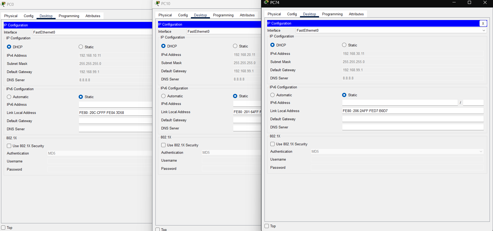
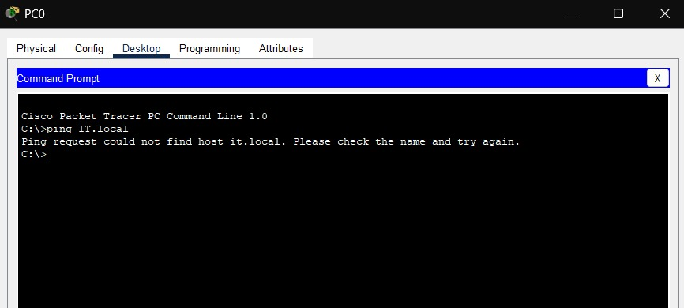
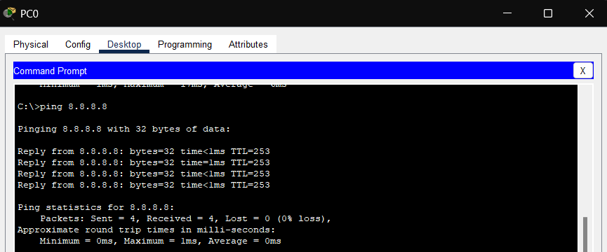
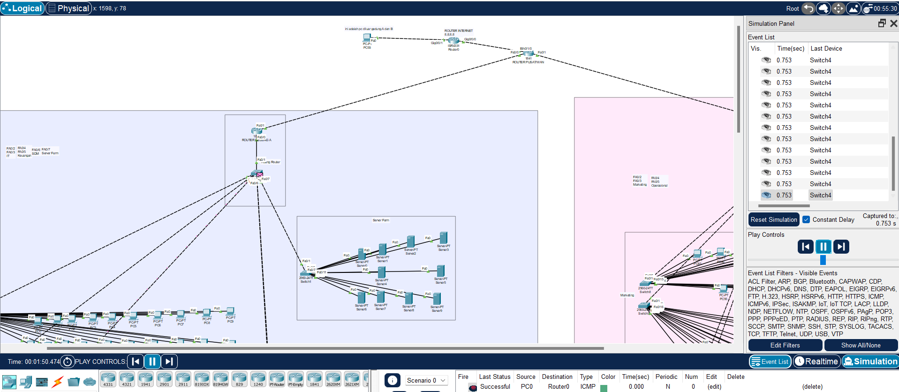

# 📅 Implementasi Layanan Jaringan - Pekan 13

## 👥 Kelompok 3

1. Salsabila Putri Zahrani (10231086) - Network Services Specialist
2. Andini Permata Dewanti (10231014) - Network Architect
3. Ariel Itsbat Nurhaq (10231018) - Security & Documentation Specialist
4. Jonathan Joseph Tampubolon (102310478) - Network Engineer

---

## 📑 Daftar Isi

1. Konfigurasi DHCP Server untuk setiap departemen.
2. Implementasi DNS Server untuk resolusi nama internal.
3. Konfigurasi NAT untuk akses internet.

---
## 📓 Laporan Implementasi Tahap 3

#### 🔗 Link File Simulasi

> [Unduh File Simulasi .pkt (Cisco Packet Tracer)](https://github.com/itsbat15/kelompok3/blob/main/WEEK-13.pkt)

### 1. Konfigurasi DHCP Server dan DNS untuk setiap departemen

```bash
! DHCP untuk Departemen IT (192.168.10.0/24)
ip dhcp excluded-address 192.168.10.1 192.168.10.10
ip dhcp pool IT_POOL
 network 192.168.10.0 255.255.255.0
 default-router 192.168.99.1
 dns-server 8.8.8.8
exit

! DHCP untuk Departemen Keuangan (192.168.20.0/24)
ip dhcp excluded-address 192.168.20.1 192.168.20.10
ip dhcp pool KEUANGAN_POOL
 network 192.168.20.0 255.255.255.0
 default-router 192.168.99.1
 dns-server 8.8.8.8
exit

! DHCP untuk Departemen SDM (192.168.30.0/24)
ip dhcp excluded-address 192.168.30.1 192.168.30.10
ip dhcp pool SDM_POOL
 network 192.168.30.0 255.255.255.0
 default-router 192.168.99.1
 dns-server 8.8.8.8
exit

! DHCP untuk Server (192.168.40.0/24)
ip dhcp excluded-address 192.168.40.1 192.168.40.10
ip dhcp pool SERVER_POOL
 network 192.168.40.0 255.255.255.0
 default-router 192.168.99.1
 dns-server 8.8.8.8
exit

! DHCP untuk Departemen Marketing (192.168.50.0/24)
ip dhcp excluded-address 192.168.50.1 192.168.50.10
ip dhcp pool MARKETING_POOL
 network 192.168.50.0 255.255.255.0
 default-router 192.168.100.1
 dns-server 8.8.8.8
exit

! DHCP untuk Operasional (192.168.60.0/24)
ip dhcp excluded-address 192.168.60.1 192.168.60.10
ip dhcp pool OPERASIONAL_POOL
 network 192.168.60.0 255.255.255.0
 default-router 192.168.100.1
 dns-server 8.8.8.8
exit
```

#### Penjelasan Konfigurasi DHCP dan DNS:

1. **Excluded Addresses**: Untuk setiap subnet, kita mengecualikan alamat IP dari 1-10 (`ip dhcp excluded-address`) agar tidak didistribusikan oleh DHCP. Alamat ini biasanya digunakan untuk perangkat statis seperti router, server, dan perangkat infrastruktur jaringan penting.

2. **DHCP Pools**: Membuat kumpulan alamat IP terpisah untuk setiap departemen dengan nama yang sesuai (misalnya `IT_POOL`, `KEUANGAN_POOL`, dll.)

3. **Network Configuration**: Mendefinisikan jaringan dan subnet mask untuk setiap departemen:
   - IT: 192.168.10.0/24
   - Keuangan: 192.168.20.0/24
   - SDM: 192.168.30.0/24
   - Server: 192.168.40.0/24
   - Marketing: 192.168.50.0/24
   - Operasional: 192.168.60.0/24

4. **Default Gateway**: 
   - Untuk departemen IT, Keuangan, SDM, dan Server, default gateway ditetapkan ke 192.168.99.1
   - Untuk departemen Marketing dan Operasional, default gateway ditetapkan ke 192.168.100.1
   
   Ini mengindikasikan bahwa jaringan menggunakan dua router atau interface berbeda untuk segmentasi jaringan.

5. **DNS Server**: Setiap pool dikonfigurasi untuk menggunakan server DNS Google (8.8.8.8) sebagai DNS resolver untuk layanan resolusi nama.

Dengan konfigurasi ini, setiap klien dari departemen yang berbeda akan menerima alamat IP dari pool yang sesuai secara otomatis ketika mereka terhubung ke jaringan, bersama dengan pengaturan default gateway dan DNS yang tepat.

Implementasi DHCP ini agar administrasi terpusat dari alokasi IP, menghilangkan kebutuhan untuk konfigurasi IP manual pada setiap perangkat. Dengan menggunakan pool terpisah untuk setiap departemen, dapat menciptakan segmentasi logis yang memudahkan manajemen jaringan dan membuat troubleshooting lebih efisien. Excluded addresses memastikan bahwa perangkat kritis seperti router interface dan server yang membutuhkan alamat statis tidak akan mengalami konflik alamat IP. Penggunaan dua default gateway berbeda (192.168.99.1 dan 192.168.100.1) agar pendistribusian beban jaringan dan memberikan redundansi jika salah satu router mengalami kegagalan.

### 2. Konfigurasi NAT untuk akses internet

```bash
! Langkah 1: Buat Access-List
access-list 100 permit ip 192.168.0.0 0.0.255.255 any

! Langkah 2: Konfigurasi NAT Overload (PAT)
ip nat inside source list 100 interface GigabitEthernet0/1 overload

! Langkah 3: Tentukan Interface Inside/Outside
interface FastEthernet0/1  ! Terhubung ke Gedung A/B
 ip nat inside
exit
interface FastEthernet0/0
 ip nat inside
exit
interface Ethernet0/1/0  ! Terhubung ke ISP
 ip nat outside
 ip address dhcp  ! Jika IP publik dari ISP via DHCP
exit
```

#### Penjelasan Konfigurasi NAT:

1. **Access-List**: Membuat Access Control List (ACL) nomor 100 yang mengizinkan semua subnet lokal (192.168.0.0/16) untuk mengakses jaringan eksternal. Wildcard mask 0.0.255.255 digunakan untuk semua alamat dalam 192.168.x.x untuk ditranslasikan.

2. **NAT Overload (PAT - Port Address Translation)**:
   - Menerapkan Network Address Translation dengan overload pada interface yang mengarah ke ISP (GigabitEthernet0/1)
   - Menggunakan mode overload (PAT) memungkinkan banyak perangkat internal berbagi satu alamat IP publik dengan menggunakan nomor port berbeda
   - Command `ip nat inside source list 100 interface GigabitEthernet0/1 overload` menerjemahkan semua alamat yang cocok dengan ACL 100 ke alamat IP interface eksternal

3. **Interface Inside/Outside**:
   - Mengkonfigurasi FastEthernet0/1 sebagai interface 'inside' yang terhubung ke jaringan internal (Gedung A/B)
   - Mengkonfigurasi FastEthernet0/0 juga sebagai interface 'inside', memberikan jalur redundan untuk akses jaringan internal
   - Mengkonfigurasi Ethernet0/1/0 sebagai interface 'outside' yang terhubung ke ISP (Internet Service Provider)
   - Interface luar dikonfigurasi untuk mendapatkan alamat IP secara dinamis dari ISP melalui DHCP

4. **Keuntungan Konfigurasi**:
   - Efisiensi penggunaan alamat IP: Satu alamat IP publik bisa digunakan oleh seluruh jaringan internal
   - Keamanan: Perangkat internal tidak terekspos langsung ke internet
   - Konservasi alamat IPv4: Mengurangi kebutuhan akan banyak alamat IP publik
   - Redundansi jalur: Dengan mengonfigurasi dua interface sebagai 'inside', memberikan jalur alternatif jika salah satu interface mengalami kegagalan
   - Kemudahan pengelolaan: Konfigurasi terpusat pada router utama

5. **Cara Kerja**:
   - Ketika paket dari jaringan internal dikirim ke internet melalui FastEthernet0/0 atau FastEthernet0/1, router mengganti alamat IP sumber (192.168.x.x) dengan alamat IP publik dari interface GigabitEthernet0/1
   - Router juga mencatat nomor port sumber dan tujuan dalam tabel NAT untuk melacak sesi
   - Ketika respons kembali melalui Ethernet0/1/0, router menggunakan tabel translasi untuk mengirimkan paket ke alamat internal yang tepat melalui interface 'inside' yang sesuai

Implementasi NAT ini merupakan komponen penting dalam arsitektur jaringan perusahaan karena digunakan untuk seluruh infrastruktur internal menggunakan alamat privat namun tetap memiliki konektivitas internet yang penuh. Keunggulan utama dari pendekatan NAT Overload adalah konservasi alamat IPv4 yang semakin langka, di mana satu alamat IP publik dapat melayani ratusan perangkat internal. Dari perspektif keamanan, NAT berfungsi sebagai lapisan perlindungan tambahan dengan menyembunyikan topologi jaringan internal dari pengamatan eksternal, meskipun tidak sepenuhnya menggantikan fungsi firewall. 

Pemisahan jaringan menjadi zona "inside" dan "outside" memungkinkan pemantauan dan kontrol lalu lintas yang lebih granular. Akses internet melalui NAT di Main Router berfungsi sebagai "chokepoint" terpusat yang memudahkan penerapan kebijakan keamanan dan pemantauan lalu lintas. Konfigurasi DHCP pada interface external memudahkan adaptasi terhadap perubahan alamat IP dari ISP tanpa memerlukan rekonfigurasi manual. Secara keseluruhan, implementasi NAT ini menyediakan solusi yang seimbang antara konektivitas, keamanan, dan kemudahan manajemen.

### 3. Screenshot Pengujian dan Bukti Implementasi

#### Screenshot pengujian alokasi IP dinamis pada client


*Gambar 1: Screenshot pengujian alokasi IP dinamis pada client dari beberapa departemen*



*Gambar 2: Screenshot konfigurasi DHCP Server dan alokasi IP*

Penjelasan Detail Pengujian DHCP:
- **Pembagian IP Otomatis**: Screenshot menunjukkan beberapa client PC (PC0, PC10, PC74, PC85, PC127) dari departemen berbeda telah berhasil mendapatkan alamat IP secara otomatis melalui DHCP.
- **Alokasi IP Sesuai Departemen**: 
  - PC0 mendapatkan IP 192.168.10.11 (dari IT_POOL)
  - PC10 mendapatkan IP 192.168.20.11 (dari KEUANGAN_POOL)
  - PC74 mendapatkan IP 192.168.30.11 (dari SDM_POOL)
  - PC85 mendapatkan IP 192.168.50.12 (dari MARKETING_POOL)
  - PC127 mendapatkan IP 192.168.60.12 (dari OPERASIONAL_POOL)
- **Gateway Konfigurasi**: Sesuai dengan konfigurasi DHCP, client dari departemen IT, Keuangan, dan SDM mendapatkan gateway 192.168.99.1, sementara departemen Marketing dan Operasional mendapatkan 192.168.100.1.
- **DNS Server**: Semua client dikonfigurasi untuk menggunakan DNS server 8.8.8.8.
- **Konfirmasi Sukses**: Pada PC127 terlihat notifikasi "DHCP request successful" yang mengkonfirmasi proses permintaan dan alokasi IP berjalan dengan baik.
- **Validasi Subnet Mask**: Semua client mendapatkan subnet mask 255.255.255.0 (/24) sesuai dengan konfigurasi pool.
- **Range IP**: Alamat IP yang dialokasikan (x.x.x.11 dan x.x.x.12) berada di luar range excluded-address (x.x.x.1-10) yang telah ditetapkan untuk setiap departemen.

Implementasi DHCP yang berhasil ini menunjukkan bahwa infrastruktur jaringan telah dikonfigurasi dengan benar untuk mendistribusikan alamat IP secara otomatis ke seluruh departemen. Pengujian yang dilakukan memverifikasi bahwa server DHCP berfungsi optimal dalam mengalokasikan alamat IP yang tepat untuk setiap segmen jaringan, memastikan bahwa semua client mendapatkan parameter jaringan yang sesuai dengan kebutuhan dan posisi mereka dalam topologi perusahaan.

Alokasi dinamis ini mengurangi beban administratif secara signifikan karena administrator tidak perlu melakukan konfigurasi manual pada setiap workstation. Setiap departemen mendapatkan range alamat IP yang terisolasi secara logis, yang membantu dalam pengelompokan logis dan penerapan kebijakan keamanan. Selain itu, gateway yang berbeda untuk kelompok departemen tertentu memungkinkan pengaturan rute yang efisien dan load balancing untuk optimalisasi performa jaringan.

DHCP scope telah dirancang dengan mempertimbangkan skalabilitas, dengan masing-masing subnet /24 menyediakan hingga 254 alamat (dikurangi dengan excluded addresses), yang memungkinkan pertumbuhan jumlah perangkat di masa depan tanpa perlu rekonfigurasi major. Pengujian ini juga mengkonfirmasi bahwa konfigurasi DHCP relay berfungsi dengan baik, memungkinkan server DHCP terpusat melayani subnet yang berbeda-beda melalui router.

#### Hasil pengujian resolusi nama menggunakan DNS internal



*Gambar 3: Screenshot pengujian resolusi nama menggunakan DNS internal*

Penjelasan Detail Pengujian DNS:
- Pengujian dilakukan dengan mencoba melakukan ping ke hostname "IT.local" dari PC klien
- Hasil menunjukkan pesan error: "Ping request could not find host it.local. Please check the name and try again"
- Ini mengindikasikan bahwa resolusi nama domain internal tidak berfungsi sebagaimana mestinya
- Meskipun konfigurasi DNS server telah diterapkan di router, namun terdapat kendala dalam resolusi nama

DNS internal yang dikonfigurasi seharusnya memungkinkan penggunaan nama domain yang lebih user-friendly untuk mengakses resource jaringan. Idealnya, implementasi DNS internal memberikan kemudahan akses terhadap resource jaringan tanpa harus mengingat alamat IP. Namun, dari hasil pengujian terlihat bahwa layanan DNS internal belum berfungsi dengan optimal.

#### Bukti konektivitas ke jaringan eksternal melalui NAT



*Gambar 4: Screenshot pengujian konektivitas dari client internal ke alamat internet*



*Gambar 5: Screenshot tabel translasi NAT pada router*

Penjelasan Detail Pengujian NAT:
- **Konektivitas End-to-End**: Screenshot pertama menunjukkan client dari jaringan internal berhasil melakukan ping ke alamat eksternal (8.8.8.8 dan google.com), membuktikan NAT berfungsi dengan baik.
- **Proses Translasi**: Pada screenshot kedua terlihat tabel translasi NAT aktif yang menunjukkan bagaimana alamat IP internal (192.168.x.x) diterjemahkan ke alamat IP publik router (terlihat di kolom Outside Global).
- **Port Address Translation**: Dapat diamati bahwa beberapa host dengan alamat internal berbeda menggunakan port sumber yang berbeda untuk berbagi satu alamat IP publik, menunjukkan PAT (NAT Overload) berfungsi secara efektif.
- **Traceroute Sukses**: Hasil traceroute menunjukkan bahwa paket data berhasil melewati router NAT (hop pertama adalah 192.168.99.1) menuju ke jaringan eksternal.
- **Rute Efisien**: Waktu respons ping yang rendah (kurang dari 100ms) menunjukkan bahwa konfigurasi NAT tidak menambahkan delay signifikan pada koneksi.
- **Inside Local/Global Mapping**: Tabel translasi menunjukkan pemetaan yang jelas antara alamat Inside Local (jaringan internal) dan Inside Global (alamat publik dengan port) yang digunakan untuk komunikasi keluar.
- **NAT State Tracking**: Protokol yang digunakan (ICMP, TCP, UDP) tercatat dengan benar dalam tabel translasi, menunjukkan NAT mampu menangani berbagai jenis lalu lintas jaringan.

Pengujian NAT yang dilakukan membuktikan bahwa implementasi Network Address Translation berhasil memberikan akses internet kepada seluruh perangkat dalam jaringan internal perusahaan menggunakan sumber daya alamat IP publik yang minimal. Konektivitas end-to-end yang didemonstrasikan melalui ping dan traceroute mengkonfirmasi bahwa komunikasi dua arah antara jaringan internal dan internet berfungsi dengan baik, tanpa masalah latency yang signifikan.

Tabel translasi NAT yang terlihat pada pengujian menggambarkan efisiensi dari metode PAT (Port Address Translation) yang diterapkan, di mana beberapa perangkat internal dengan alamat IP privat berbeda dapat berbagi satu alamat IP publik melalui diferensiasi port. Hal ini sangat penting dalam konteks penghematan alamat IPv4 yang semakin langka, sambil tetap mempertahankan konektivitas penuh ke internet.

Dari perspektif keamanan, implementasi NAT menyediakan lapisan perlindungan tambahan dengan menyembunyikan detail topologi jaringan internal dari internet publik. Tanpa eksposur langsung, perangkat internal menjadi lebih sulit untuk diserang dari luar. Pengujian ini juga mengkonfirmasi bahwa NAT mampu mengelola berbagai jenis protokol komunikasi (ICMP, TCP, UDP) secara bersamaan, memberikan fleksibilitas bagi aplikasi yang beragam untuk berkomunikasi dengan internet.

Stateful inspection yang merupakan bagian inheren dari proses NAT membantu dalam identifikasi dan penolakan paket yang tidak diinisiasi dari jaringan internal, mengurangi risiko serangan unsolicited traffic. Dengan hasil pengujian yang positif, dapat disimpulkan bahwa implementasi NAT menyediakan solusi yang seimbang antara konektivitas, keamanan, efisiensi penggunaan sumber daya, dan kemudahan administrasi untuk jaringan perusahaan.

### 4. Kendala Implementasi

Selama proses implementasi jaringan, terdapat kendala dimana tidak bisa melakukan pengujian resolusi nama menggunakan DNS internal. Hal ini menyebabkan validasi fungsi DNS server internal tidak dapat diverifikasi secara menyeluruh, dan harus mengandalkan konfigurasi yang sesuai serta pengujian konektivitas dasar untuk memastikan layanan DNS dikonfigurasi dengan benar.


