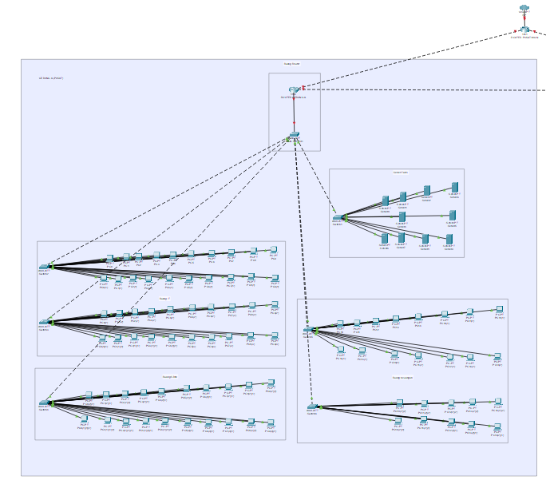
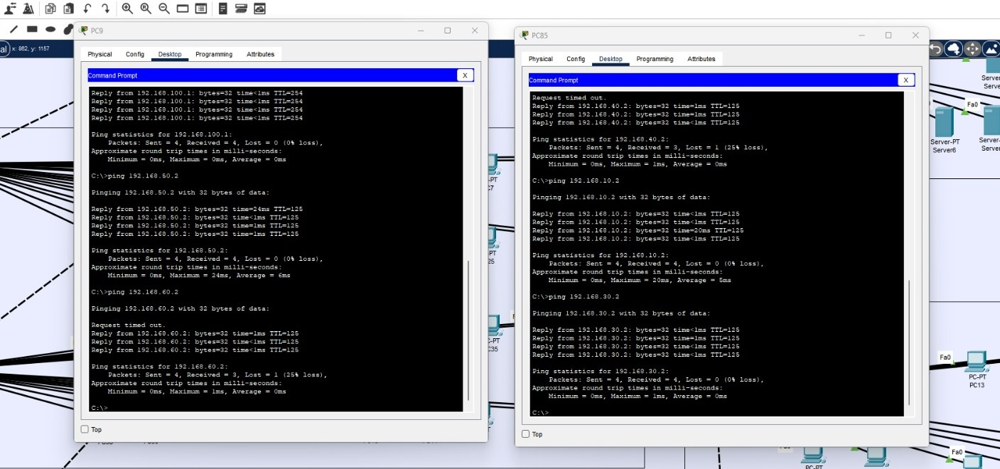

# 📅 Laporan Akhir Desain dan Manajemen Jaringan Komputer

## 👥 Kelompok 3

1. Salsabila Putri Zahrani (10231086)     - Network Services Specialist
2. Andini Permata Dewanti (10231014)      - Network Architect
3. Ariel Itsbat Nurhaq (10231018)         - Security & Documentation Specialist
4. Jonathan Joseph Tampubolon (102310478) - Network Engineer

---

## 📑 Daftar Isi

## [1. Perencanaan Proyek dan Desain Awal](#1-perencanaan-proyek-dan-desain-awal)
- [1.1 Pendahuluan](#11-pendahuluan)
  - [1.1.1 Latar Belakang](#111-latar-belakang)
  - [1.1.2 Tujuan](#112-tujuan)
  - [1.1.3 Ruang Lingkup](#113-ruang-lingkup)
- [1.2 Isi Laporan](#12-isi-laporan)
  - [1.2.1 Daftar Anggota Kelompok dan Peran](#121-daftar-anggota-kelompok-dan-peran)
  - [1.2.2 Analisis Kebutuhan PT. Nusantara Network](#122-analisis-kebutuhan-pt-nusantara-network)
- [1.3 Timeline Rencana Kerja 7 Pekan](#13-timeline-rencana-kerja-7-pekan)
- [1.4 Sketsa Awal Desain Jaringan](#14-sketsa-awal-desain-jaringan)

## [2. Desain Topologi & Skema Pengalamatan](#2-desain-topologi--skema-pengalamatan)
- [2.1 Diagram Topologi Fisik dan Logis](#21-diagram-topologi-fisik-dan-logis)
- [2.2 Tabel Pengalamatan IP](#22-tabel-pengalamatan-ip)
  - [2.2.1 Tabel Pengalamatan IP Gedung A (Pusat)](#221-tabel-pengalamatan-ip-gedung-a-pusat)
  - [2.2.2 Tabel Pengalamatan IP Gedung B (Cabang)](#222-tabel-pengalamatan-ip-gedung-b-cabang)
- [2.3 Daftar Perangkat yang Dibutuhkan](#23-daftar-perangkat-yang-dibutuhkan)
  - [2.3.1 Jenis Perangkat Jaringan dan Model](#231-jenis-perangkat-jaringan-dan-model)
  - [2.3.2 Jenis Kabel yang Digunakan](#232-jenis-kabel-yang-digunakan)
- [2.4 Rencana Penerapan VLAN](#24-rencana-penerapan-vlan)
  - [2.4.1 Penerapan VLAN Gedung A](#241-penerapan-vlan-gedung-a)
  - [2.4.2 Penerapan VLAN Gedung B](#242-penerapan-vlan-gedung-b)
- [2.5 Awal Implementasi dalam Packet Tracer](#25-awal-implementasi-dalam-packet-tracer)
  - [2.5.1 Topologi Jaringan Keseluruhan](#251-topologi-jaringan-keseluruhan)
  - [2.5.2 Topologi Jaringan Gedung A (Pusat)](#252-topologi-jaringan-gedung-a-pusat)
  - [2.5.3 Topologi Jaringan Gedung B (Cabang)](#253-topologi-jaringan-gedung-b-cabang)
  - [2.5.4 Perencanaan Routing Antar Gedung dan Antar VLAN](#254-perencanaan-routing-antar-gedung-dan-antar-vlan)

## [3. Implementasi Topologi Dasar & VLAN (Tahap 1)](#3-implementasi-topologi-dasar--vlan-tahap-1)
- [3.1 Konfigurasi VLAN dan Assign Port](#31-konfigurasi-vlan-dan-assign-port)
- [3.2 Konfigurasi Trunk](#32-konfigurasi-trunk)
- [3.3 Routing Antar VLAN dengan Router-on-a-Stick](#33-routing-antar-vlan-dengan-router-on-a-stick)
- [3.4 Hasil Pengujian Konektivitas](#34-hasil-pengujian-konektivitas)
- [3.5 Kendala dan Solusi](#35-kendala-dan-solusi)

## [4. Implementasi Routing & WAN (Tahap 2)](#4-implementasi-routing--wan-tahap-2)
- [4.1 Konfigurasi IP di Interface WAN](#41-konfigurasi-ip-di-interface-wan)
- [4.2 Implementasi Routing Dinamis (OSPF)](#42-implementasi-routing-dinamis-ospf)
- [4.3 Analisis Performa Routing Dinamis vs Statis](#43-analisis-performa-routing-dinamis-vs-statis)
- [4.4 Kendala dan Solusi](#44-kendala-dan-solusi)

## [5. Implementasi Layanan Jaringan (Tahap 3)](#5-implementasi-layanan-jaringan-tahap-3)
- [5.1 Konfigurasi DHCP Server dan DNS](#51-konfigurasi-dhcp-server-dan-dns)
- [5.2 Konfigurasi NAT untuk Akses Internet](#52-konfigurasi-nat-untuk-akses-internet)
- [5.3 Screenshoot Pengujian dan Bukti Implementasi](#53-screenshoot-pengujian-dan-bukti-implementasi)
- [5.4 Kendala Implementasi](#54-kendala-implementasi)

## [6. Implementasi Keamanan & Pengujian (Tahap 4)](#6-implementasi-keamanan--pengujian-tahap-4)
- [6.1 Implementasi Access Control List (ACL)](#61-implementasi-access-control-list-acl)
- [6.2 Matriks Pengujian Fitur Jaringan](#62-matriks-pengujian-fitur-jaringan)
- [6.3 Hasil Troubleshooting](#63-hasil-troubleshooting)
- [6.4 Analisis Keamanan Jaringan](#64-analisis-keamanan-jaringan)

---

## File PKT, Link Demo & Presentasi
[Tonton Video Demo](https://drive.google.com/drive/folders/14sSjK58TvblYbK1KPs2Bk2alkvcgLwEb?usp=drive_link)

[File Final PKT](https://github.com/itsbat15/kelompok3/blob/main/Final.pkt)

[Link Presentasi](https://www.canva.com/design/DAGoJrHe_Ro/QBjM-pDSMVGkNHHDOoXeDw/edit?utm_content=DAGoJrHe_Ro&utm_campaign=designshare&utm_medium=link2&utm_source=sharebutton)
## 1. Perencanaan Proyek dan Desain Awal

## 1.1 Pendahuluan

### 1.1.1 Latar Belakang

Perkembangan teknologi informasi yang pesat telah mendorong organisasi dan perusahaan untuk mengadopsi infrastruktur jaringan yang aman dan efisien guna mendukung operasional sehari-hari. Dalam konteks transformasi digital, sistem jaringan komputer menjadi faktor utama bagi kelancaran komunikasi dan pertukaran data antar unit kerja. Infrastruktur jaringan yang baik tidak hanya menunjang konektivitas internal dan eksternal, tetapi juga menjadi faktor krusial dalam memastikan keberlangsungan layanan bisnis yang bersifat real-time dan terdistribusi.
PT. Nusantara Network merupakan perusahaan yang bergerak di bidang teknologi informasi dan memiliki struktur organisasi yang tersebar di dua lokasi fisik, yaitu kantor pusat (Gedung A) dan kantor cabang (Gedung B). Masing-masing lokasi menaungi beberapa departemen yang memiliki fungsi dan kebutuhan jaringan berbeda. Hal ini menuntut adanya desain jaringan yang mampu mengakomodasi infrastruktur jaringan antar departemen, keamanan akses, efisiensi komunikasi, serta skalabilitas terhadap pertumbuhan organisasi di masa mendatang.
Untuk menjawab tantangan tersebut, diperlukan pendekatan teknis berupa penerapan Virtual LAN (VLAN) sebagai mekanisme isolasi lalu lintas data antar departemen, serta pemanfaatan teknologi Wide Area Network (WAN) untuk menjembatani komunikasi antar lokasi. Selain itu, layanan jaringan dasar Dynamic Host Configuration Protocol (DHCP) dan Domain Name System (DNS) wajib diimplementasikan untuk mendukung pengelolaan IP dinamis dan host secara otomatis. Penggunaan Network Address Translation (NAT) juga menjadi elemen penting untuk mengontrol akses ke jaringan publik.
Dari sisi keamanan, implementasi Access Control List (ACL) dibutuhkan guna membatasi dan mengatur hak akses antar segmen jaringan sesuai dengan kebijakan perusahaan. Sementara itu, penggunaan protokol routing dinamis seperti Open Shortest Path First (OSPF) menjadi solusi dalam mendukung mobilitas data lintas lokasi dengan efisiensi dan ketahanan terhadap perubahan topologi. Di samping itu, sistem monitoring dan manajemen jaringan terpusat akan meningkatkan visibilitas dan kontrol terhadap infrastruktur yang dibangun.
Dengan demikian, perancangan dan implementasi jaringan pada PT. Nusantara Network harus dilakukan secara sistematis dan menyeluruh, mencakup aspek teknis, keamanan, dan manajemen, agar mampu menjawab kebutuhan operasional yang dinamis sekaligus mendukung pertumbuhan bisnis di era digital.

### 1.1.2 Tujuan

1. Merancang infrastruktur jaringan yang efisien dan terstruktur untuk mendukung operasional PT. Nusantara Network di kantor pusat dan kantor cabang.

2. Mengimplementasikan segmentasi jaringan menggunakan VLAN untuk masing-masing departemen guna meningkatkan keamanan dan manajemen lalu lintas data.

3. Mengatur koneksi WAN antar gedung agar komunikasi data antar kantor tetap lancar meskipun memiliki keterbatasan bandwidth.

4. Menyediakan layanan DHCP dan DNS untuk memudahkan pengelolaan alamat IP dan resolusi nama secara otomatis dan terpusat.

5. Menerapkan sistem keamanan jaringan melalui penggunaan firewall dan ACL agar akses antar departemen dapat dikendalikan sesuai kebijakan.

6. Mengaktifkan NAT (Network Address Translation) untuk memberikan akses internet kepada perangkat internal secara aman.

7. Mengimplementasikan routing dinamis (OSPF) agar rute komunikasi antar gedung dapat beradaptasi secara otomatis terhadap perubahan kondisi jaringan.

8. Membangun sistem monitoring jaringan terpusat untuk mendeteksi gangguan, menganalisis kinerja, dan mempermudah manajemen jaringan secara keseluruhan.

### 1.1.3 Ruang Lingkup

Ruang lingkup dari proyek perancangan dan implementasi jaringan di PT. Nusantara Network mencakup desain infrastruktur jaringan untuk dua lokasi, yaitu Kantor Pusat (Gedung A) dan Kantor Cabang (Gedung B). Fokus utama berada pada pembuatan topologi jaringan yang efisien dan aman, pengelompokan masing-masing departemen ke dalam VLAN terpisah untuk meningkatkan keamanan dan manajemen lalu lintas data, serta pengaturan subnet IP untuk tiap VLAN. Proyek ini juga mencakup konfigurasi routing dinamis menggunakan protokol OSPF untuk komunikasi antar gedung melalui koneksi WAN dengan bandwidth terbatas.

Selain itu, ruang lingkup mencakup pengimplementasian layanan DHCP untuk distribusi IP otomatis dan DNS untuk resolusi nama, baik internal maupun eksternal. NAT akan digunakan untuk mengizinkan akses internet dari jaringan internal melalui satu alamat publik. Aspek keamanan jaringan turut menjadi bagian penting, seperti penerapan Access Control List (ACL) untuk membatasi akses antar departemen sesuai kebijakan keamanan, serta penggunaan firewall untuk perlindungan dari akses tidak sah. Terakhir, sistem monitoring dan manajemen jaringan juga menjadi bagian dari ruang lingkup proyek ini, guna memastikan performa jaringan tetap stabil dan mudah diawasi dari satu titik pusat. Ruang lingkup ini tidak mencakup implementasi aplikasi perangkat lunak bisnis seperti ERP atau CRM, serta pengelolaan kebijakan SDM perusahaan.

## 1.2 Isi Laporan

### 1.2.1 Daftar anggota kelompok dan Peran 

| Nama Lengkap               | NIM       | Peran                               |
| -------------------------- | --------- | ----------------------------------- |
| Salsabila Putri Zahrani    | 10231086  | Network Services Specialist         |
| Andini Permata Dewanti     | 10231014  | Network Architect                   |
| Ariel Itsbat Nurhaq        | 10231018  | Security & Documentation Specialist |
| Jonathan Joseph Tampubolon | 102310478 | Network Engineer                    |

### 1.2.2 Analisis Kebutuhan PT. Nusantara Network

##### 🏢 Kantor Pusat (Gedung A)

Tabel Kebutuhan Perangkat per Ruang

| Lokasi           | Perangkat      | VLAN               | Keterangan                                                 |
| ---------------- | -------------- | ------------------ | ---------------------------------------------------------- |
| Ruang IT         | 2 Switch       | VLAN IT (10)       | Terhubung ke 40 komputer IT. Subnet: 192.168.10.0/24       |
| Ruang Keuangan   | 2 Switch       | VLAN Keuangan (20) | Terhubung ke 25 komputer Keuangan. Subnet: 192.168.20.0/24 |
| Ruang SDM        | 1 Switch       | VLAN SDM (30)      | Terhubung ke 20 komputer SDM. Subnet: 192.168.30.0/24      |
| Server Farm      | 1 Switch       | VLAN Server (40)   | Terhubung ke 10 server internal. Subnet: 192.168.40.0/24   |
| Ruang Router/WAN | 1 Router Utama | -                  | Gateway utama koneksi WAN antar gedung                     |
|                  | 1 Router Lokal | -                  | Terhubung ke Router gedung B dan Router WAN (gateway utama)|
|                  | 1 Main Switch  | -                  | Penghubung antar VLAN & perangkat jaringan lainnya         |
|                  | 1 Firewall     | -                  | Implementasi NAT ACL dan keamanan jaringan.                |

---
#### 🏬 Kantor Cabang (Gedung B)

Tabel Kebutuhan Perangkat per Ruang

| Lokasi            | Perangkat      | VLAN                  | Keterangan                                          |
| ----------------- | -------------- | --------------------- | --------------------------------------------------- |
| Ruang Marketing   | 2 Switch       | VLAN Marketing (50)   | Terhubung ke 30 komputer. Subnet: 192.168.50.0/24   |
| Ruang Operasional | 2 Switch       | VLAN Operasional (60) | Terhubung ke 35 komputer. Subnet: 192.168.60.0/24   |
| Ruang Router/WAN  | 1 Router Lokal | -                     | Gateway ke Gedung A via WAN                         |
|                   | 1 Main Switch  | -                     | Penghubung antar VLAN & perangkat jaringan lainnya  |
|                   | 1 Firewall     | -                     | Implementasi NAT ACL dan keamanan jaringan.         |

---
#### 📌 Penjelasan Umum Perangkat

- **Switch**

  - Digunakan di setiap departemen untuk mengelola VLAN secara lokal dan melakukan routing Internal
  - Setiap Switch akan memiliki konfigurasi IP sesuai subnet VLAN-nya

- **Router Utama**
  - Menjadi gatewsy utama untuk koneksi intenet fan WAN antar gedung
  - Konfigurasi NAT untuk akses internet
  - Routing dinamis OSPF untuk manajemen rute antar gedung  

- **Firewall***
  - Ditempatkan di kedua lokasi, untuk keamanan jaringan  
  - Di gedung A, Firewal juga bertugas sebagai NAT untuk akses Internet  
  - Di gedung B, digunakan untuk membatasi akses antar departemen sesuai kebijakan keamanan  

- **Main Switch**
  - Berfungsi sebagai penghubung pusat antar VLAN dan perangkat jaringan lainnya.
  - Penghubung semua VLAN ke router utama dan server.  

- **Router Lokal**
  - Routing data antar jaringan lokal (LAN)
  - Koneksi antar gedung
  - Manajemen IP address
  - Penghubung ke internet


- **Routing Dinamis (OSPF)**
  - Penjaga rute agar optimal dan adaptif

- **Server**
  - Server digunakan untuk layanan DHCP,DNS, dan monitoring jaringan

#### 📡 Server dan Layanan

| Jenis Server      | Fungsi Penggunaan                                    |
| ----------------- | ---------------------------------------------------- |
| DHCP & DNS        | Mengelola IP address & domain name resolution        |
| File Sharing      | Berbagi file antar departemen                        |
| Email             | Komunikasi internal & eksternal                      |
| Database          | Menyimpan data Keuangan & SDM                        |
| Web Server        | Menyediakan intranet perusahaan                      |
| Monitoring Server | Memonitor seluruh jaringan                           |
| Backup Server     | Mencadangkan data dari semua server                  |
| Virtualisasi      | Menjalankan layanan tambahan seperti aplikasi bisnis |
| Aplikasi Bisnis   | ERP atau CRM                                         |

---

#### 🧮 Contoh Konfigurasi Subnet VLAN

| VLAN             | Subnet IP       | Rentang IP                    |
| ---------------- | --------------- | ----------------------------- |
| VLAN IT          | 192.168.10.0/24 | 192.168.10.1 - 192.168.10.254 |
| VLAN Keuangan    | 192.168.20.0/24 | 192.168.20.1 - 192.168.20.254 |
| VLAN SDM         | 192.168.30.0/24 | 192.168.30.1 - 192.168.30.254 |
| VLAN Server      | 192.168.40.0/24 | 192.168.40.1 - 192.168.40.254 |
| VLAN Marketing   | 192.168.50.0/24 | 192.168.50.1 - 192.168.50.254 |
| VLAN Operasional | 192.168.60.0/24 | 192.168.60.1 - 192.168.60.254 |


---

#### 🖧 Jenis Perangkat Jaringan dan Model

| Lokasi        | Perangkat    | Fungsi / Jenis     | Model Cisco           | Keterangan                                     |
| ------------- | ------------ | ------------------ | --------------------- | ---------------------------------------------- |
| Kantor Pusat  | Router Utama | Gateway & Routing  | Cisco ISR 4321        | Routing antar VLAN & WAN                       |
|               | Router Lokal | Routing LAN        | Cisco ISR 4321        | Koneksi perangkat LAN                          |
|               | Main Switch  | Routing antar VLAN | Cisco Catalyst 2960-X | Koneksi perangkat LAN                          |
|               | Switch       | Koneksi LAN        | Cisco Catalyst 2960-X | Koneksi perangkat LAN                          |
|               | Firewall     | Keamanan Jaringan  | Cisco ASA 5506-X      | Koneksi perangkat LAN                          |
| Kantor Cabang | Router Lokal | Gateway & Routing  | Cisco ISR 4321        | Routing lokal & koneksi ke Gedung A            |
|               | Main Switch  | Routing Antar VLAN | Cisco Catalyst 9300   | Hub utama VLAN internal                        |
|               | Switch       | Koneksi LAN        | Cisco Catalyst 2960-X | Perangkat LAN & AP                             |
|               | Firewall     | Keamanan Jaringan  | Cisco ASA 5506-X      | Koneksi perangkat LAN                          |
---

#### 🔌 Jenis Kabel yang Digunakan

- **Straight Through Cable** – Copper-based, digunakan untuk koneksi antar perangkat yang berbeda jenis (misal: PC ke Switch)
- **Crossover Cable** – Copper (UTP), untuk menghubungkan perangkat sejenis seperti Switch ke Switch, atau PC ke PC

### 1.3 Timeline Rencana Kerja 7 Pekan

**🗓️ Timeline Proyek - PT. Nusantara Network**

| Pekan | Tanggal (Perkiraan)   | Kegiatan Utama                                      | Deliverable                                                               |
| ----- | --------------------- | --------------------------------------------------- | ------------------------------------------------------------------------- |
| 9     | 11 - 12 April 2025    | Perencanaan proyek dan desain awal jaringan         | Dokumen perencanaan proyek, sketsa topologi awal                          |
| 10    | 15 - 18 April 2025    | Finalisasi desain topologi & pengalamatan IP        | Dokumen desain jaringan, tabel IP, VLAN, screenshot topologi awal         |
| 11    | 20 - 25 April 2025    | Implementasi topologi dasar & VLAN di Packet Tracer | File simulasi awal, konfigurasi switch & router, pengujian VLAN           |
| 12    | 26 April - 2 Mei 2025 | Implementasi routing statis dan OSPF antar gedung   | Konfigurasi OSPF, file simulasi baru, pengujian konektivitas antar-gedung |
| 13    | 3 - 9 Mei 2025        | Konfigurasi DHCP, DNS, dan NAT                      | Konfigurasi lengkap layanan jaringan, bukti pengujian, file simulasi baru |
| 14    | 10 - 16 Mei 2025      | Implementasi ACL & pengujian akhir jaringan         | Konfigurasi ACL, matriks pengujian, analisis keamanan                     |
| 15    | 17 - 23 Mei 2025      | Finalisasi dokumentasi, presentasi, dan video demo  | Laporan akhir proyek, file simulasi final, video demo, slide presentasi   |


[📊 Lihat Timeline Proyek di Google Sheets](https://docs.google.com/spreadsheets/d/19BNHfxzY0rtSAMQPjriLDEYNJqKZ0hKC-b6RiJBvPmY/edit?hl=id&gid=0#gid=0)

### 1.4 Sketsa awal desain jaringan

#### Sketsa Keseluruhan


#### Sketsa Gedung A


#### Sketsa Gedung B


## 2. Desain Topologi & Skema Pengalamatan

## 2.1 Diagram Topologi Fisik dan Logis

  

Topologi logika jaringan yang diimplementasikan dirancang untuk menghubungkan dua gedung secara efisien dan andal melalui sebuah router pusat. Keberadaan router pusat ini tidak hanya sebagai titik temu konektivitas antar gedung, tetapi juga sebagai gerbang utama (gateway) menuju Internet Service Provider (ISP), sehingga seluruh akses internet dari kedua gedung terpusat melalui perangkat ini. Untuk menjamin ketersediaan jaringan yang tinggi dan meminimalkan potensi gangguan, sistem ini dilengkapi dengan jalur redundansi antar router. Artinya, terdapat jalur alternatif yang siap mengambil alih fungsi koneksi utama jika terjadi kegagalan pada salah satu jalur, sehingga operasional jaringan tetap terjaga. Di dalam masing-masing gedung, infrastruktur jaringan diperkuat dengan adanya router dan switch utama. Perangkat ini bertugas untuk mendistribusikan koneksi dan membagi jaringan menjadi beberapa subnet yang lebih kecil, disesuaikan dengan fungsi spesifik ruangan atau departemen, seperti IT, Keuangan, Sumber Daya Manusia (SDM), Server Farm, Marketing, dan Operasional. Setiap subnet ini dikonfigurasi dengan rentang alamat IP yang berbeda satu sama lain. Penerapan skema alamat IP yang unik per subnet ini memiliki dua tujuan utama: pertama, untuk menyederhanakan proses manajemen jaringan, termasuk pemantauan lalu lintas dan alokasi sumber daya; dan kedua, untuk meningkatkan tingkat keamanan jaringan dengan cara mengisolasi lalu lintas antar departemen dan mempermudah penerapan kebijakan keamanan yang lebih spesifik per subnet.

## 2.2 Tabel Pengalamatan IP

### 2.2.1 Tabel Pengalamatan IP Gedung A (Pusat)

| Nama VLAN     | VLAN ID | Subnet          | Subnet Mask   | Network Address | Gateaway     | IP Address   | Range IP Host               | Broadcast Address | Jumlah Host |
| ------------- | ------- | --------------- | ------------- | --------------- | ------------ | ------------ | --------------------------- | ----------------- | ----------- |
| VLAN IT       | 10      | 192.168.10.0/24 | 255.255.255.0 | 192.168.10.0    | 192.168.10.1 | 192.168.10.2 | 192.168.10.2-192.168.10.254 | 192.168.10.255    | 253         |
| VLAN Keuangan | 20      | 192.168.20.0/24 | 255.255.255.0 | 192.168.20.0    | 192.168.20.1 | 192.168.20.2 | 192.168.20.2-192.168.20.254 | 192.168.20.255    | 253         |
| VLAN SDM      | 30      | 192.168.30.0/24 | 255.255.255.0 | 192.168.30.0    | 192.168.30.1 | 192.168.30.2 | 192.168.30.2-192.168.30.254 | 192.168.30.255    | 253         |
| VLAN Server   | 40      | 192.168.40.0/24 | 255.255.255.0 | 192.168.40.0    | 192.168.40.1 | 192.168.40.2 | 192.168.40.2-192.168.40.254 | 192.168.40.255    | 253         |

### 2.2.2 Tabel Pengalamatan IP Gedung B (Cabang)

| Nama VLAN        | VLAN ID | Subnet          | Subnet Mask   | Network Address | Gateaway     | IP Address   | Range IP Host               | Broadcast Address | Jumlah Host |
| ---------------- | ------- | --------------- | ------------- | --------------- | ------------ | ------------ | --------------------------- | ----------------- | ----------- |
| VLAN Marketing   | 50      | 192.168.50.0/24 | 255.255.255.0 | 192.168.50.0    | 192.168.50.1 | 192.168.50.2 | 192.168.50.2-192.168.50.254 | 192.168.50.255    | 253         |
| VLAN Operasional | 60      | 192.168.60.0/24 | 255.255.255.0 | 192.168.60.0    | 192.168.60.1 | 192.168.60.2 | 192.168.60.2-192.168.60.254 | 192.168.60.255    | 253         |

## 2.3 Daftar Perangkat yang Dibutuhkan

### 2.3.1 Jenis Perangkat Jaringan dan Model

| Lokasi        | Perangkat    | Jumlah | Fungsi                                     | Model Cisco           | Keterangan                                        |
| ------------- | ------------ | ------ | ------------------------------------------ | --------------------- | ------------------------------------------------- |
| Kantor Pusat  | Router Utama | 1      | Gateway & Routing                          | Router-PT (1841)      | Routing antar VLAN & koneksi WAN ke kantor cabang |
|               | Router Lokal | 1      | Routing LAN                                | Router-PT (1841)      | Routing internal VLAN di kantor pusat             |
|               | Main Switch  | 1      | Routing antar VLAN                         | Switch-PT (2960-24TT) | Uplink & VLAN trunking utama                      |
|               | Switch       | 6      | Koneksi LAN                                | Switch-PT (2960-24TT) | Distribusi ke perangkat client per departemen     |
|               | Server       | 10     | Pengaturan DHCP, DNS & monitoring jaringan | Server-PT             | layanan DHCP,DNS, dan monitoring jaringan         |
|               | PC           | 85     | Berbagi data                               | PC                    | Terhubung ke Switch                               |
| Kantor Cabang | Router Lokal | 1      | Gateway & Routing                          | Router-PT (1841)      | Routing antar VLAN & Koneksi ke Kantor Pusat      |
|               | Main Switch  | 1      | Routing Antar VLAN                         | Switch-PT (2960-24TT) | Hub utama VLAN internal                           |
|               | Switch       | 4      | Koneksi LAN                                | Switch-PT (2960-24TT) | Distribusi ke Perangkat client                    |
|               | PC           | 65     | berbagi data                               | PC                    | Terhubung ke Switch                               |

### 2.3.2 Jenis Kabel yang Digunakan

| Jenis Kabel            | Nama di Cisco Packet Tracer   | Fungsi                                                         |
| ---------------------- | ----------------------------- | -------------------------------------------------------------- |
| Kabel Straight Through | Copper Straight Through       | Menghubungkan PC ke Switch atau Switch ke Router (port access) |
| Kabel Crossover        | Copper Cross-Over             | Menghubungkan Switch ke Switch, Router ke Router (khusus LAN)  |
| Kabel Serial DCE/DTE   | Serial DCE/DTE (Serial Cable) | Koneksi WAN antar router (Router Pusat ↔ Router Cabang)        |
| Kabel Fiber            | Fiber                         | Koneksi backbone Switch-to-Switch                              |

## 2.4 Rencana Penerapan VLAN

### 2.4.1 Penerapan VLAN Gedung A

| Nama VLAN     | Subnet IP       | Rentang IP                  | Tujuan                                                                                                   |
| ------------- | --------------- | --------------------------- | -------------------------------------------------------------------------------------------------------- |
| VLAN IT       | 192.168.10.0/24 | 192.168.10.1-192.168.10.254 | **Mengisolasi jaringan secara komprehensif khusus untuk operasional dan manajemen infrastruktur teknologi informasi oleh Departemen IT.** Perannya meliputi: **1. Keamanan Tingkat Lanjut:** Melindungi perangkat krusial seperti server manajemen jaringan (NMS), firewall management interface, switch management interface, workstation teknisi IT yang memiliki akses administratif tinggi, dan storage untuk backup konfigurasi. Isolasi ini mencegah akses tidak sah dari VLAN lain yang dapat mengeksploitasi celah keamanan atau mengganggu konfigurasi sistem. **2. Manajemen Jaringan Efisien:** Memungkinkan tim IT untuk melakukan pemantauan lalu lintas, troubleshooting, pembaruan perangkat lunak/keras, dan pengujian sistem baru dalam lingkungan yang terkontrol tanpa berdampak pada produktivitas departemen lain. **3. Prioritas Bandwidth untuk Tugas Kritis IT:** Memastikan ketersediaan bandwidth yang cukup untuk tugas-tugas seperti remote administration, transfer file patch besar, streaming log sistem secara real-time, atau akses ke knowledge base teknis online. **4. Lingkungan Uji Coba (Sandbox):** Dapat digunakan sebagian untuk membuat sub-segmen uji coba bagi aplikasi atau konfigurasi baru sebelum diimplementasikan ke jaringan produksi.                                                           |
| VLAN Keuangan | 192.168.20.0/24 | 192.168.20.1-192.168.20.254 | **Mengisolasi jaringan dengan keamanan sangat tinggi khusus untuk Departemen Keuangan guna melindungi aset finansial dan data sensitif perusahaan.** Perannya sangat krusial dan mencakup: **1. Proteksi Data Finansial Konfidensial:** Mengamankan akses ke database keuangan, sistem akuntansi (misalnya SAP, Oracle Financials, Zahir), software payroll, data transaksi perbankan, laporan keuangan, dan informasi anggaran. Isolasi ini mencegah kebocoran data atau manipulasi oleh pihak yang tidak berwenang. **2. Kepatuhan Regulasi (Compliance):** Membantu perusahaan memenuhi standar regulasi industri keuangan dan perlindungan data (seperti OJK, PCI DSS jika ada transaksi kartu, GDPR jika berlaku) dengan membatasi akses dan mencatat aktivitas dalam segmen jaringan ini. **3. Integritas Transaksi:** Memastikan bahwa transaksi keuangan yang dilakukan melalui aplikasi di VLAN ini tidak terganggu atau dicegat, menjaga akurasi dan keandalan data. **4. Akses Tersegmentasi untuk Staf Keuangan:** Hanya staf keuangan yang memiliki otorisasi yang dapat mengakses resource di VLAN ini, seringkali dengan autentikasi multi-faktor, mengurangi risiko insider threat. **5. Stabilitas Aplikasi Keuangan:** Mencegah agar aplikasi keuangan penting tidak terpengaruh oleh lonjakan lalu lintas atau masalah jaringan dari departemen lain.                                                          |
| VLAN SDM      | 192.168.30.0/24 | 192.168.30.1-192.168.30.254 | **Mengisolasi jaringan khusus untuk Departemen Sumber Daya Manusia (SDM) demi menjaga kerahasiaan data karyawan dan operasional SDM.** Perannya meliputi: **1. Perlindungan Data Pribadi Karyawan (PII):** Mengamankan database karyawan yang berisi informasi sangat sensitif seperti nomor identitas, alamat, detail kontak, informasi gaji, riwayat pekerjaan, evaluasi kinerja, data medis (jika ada), dan informasi keluarga. Isolasi ini mencegah pelanggaran privasi dan potensi penyalahgunaan data. **2. Keamanan Sistem Informasi Kepegawaian (HRIS):** Melindungi akses ke Human Resource Information System (HRIS) atau software manajemen SDM dari pengguna yang tidak sah. **3. Proses Rekrutmen dan Penilaian yang Aman:** Menjaga kerahasiaan data pelamar kerja, hasil tes, dan proses penilaian internal. **4. Pengelolaan Akses Terbatas:** Memastikan hanya staf SDM yang berwenang yang dapat mengakses, menginput, dan memodifikasi data karyawan serta informasi terkait SDM lainnya. **5. Menjaga Integritas Fungsi SDM:** Memastikan proses penggajian, manajemen absensi, dan administrasi tunjangan berjalan lancar tanpa gangguan dari aktivitas jaringan departemen lain.                                                               |
| VLAN Server   | 192.168.40.0/24 | 192.168.40.1-192.168.40.254 | **Menyediakan jaringan khusus yang terisolasi, aman, dan berkinerja tinggi untuk menempatkan server farm dan menjalankan layanan-layanan internal inti perusahaan.** Perannya adalah: **1. Keamanan Server Terpusat dan Berlapis:** Mengisolasi server-server fisik maupun virtual dari jaringan pengguna akhir (VLAN IT, Keuangan, SDM, dll.) untuk mengurangi permukaan serangan. Ini melindungi layanan seperti DNS (Domain Name System) dari DNS poisoning atau DDoS, DHCP (Dynamic Host Configuration Protocol) dari rogue DHCP server, File Server (berisi data perusahaan penting) dari akses tidak sah atau ransomware yang menyebar dari workstation pengguna, serta layanan internal lainnya (misalnya intranet portal, database aplikasi internal, code repository). **2. Kinerja dan Ketersediaan Layanan Optimal:** Memastikan server memiliki bandwidth yang dedicated dan latensi rendah, tidak terganggu oleh lalu lintas broadcast atau multicast dari VLAN pengguna, sehingga layanan dapat merespons dengan cepat dan memiliki uptime tinggi. **3. Manajemen dan Pemeliharaan Server yang Efisien:** Memudahkan administrator sistem untuk melakukan manajemen terpusat, pemantauan kinerja server (monitoring CPU, RAM, disk, network), patch management, backup, dan disaster recovery tanpa harus khawatir mengganggu pengguna akhir. **4. Kontrol Akses yang Sangat Ketat (Granular Access Control):** Menerapkan kebijakan firewall yang ketat antar-VLAN, hanya mengizinkan protokol dan port spesifik yang diperlukan untuk komunikasi antara VLAN pengguna dan VLAN Server (misalnya, hanya memperbolehkan akses ke port 80/443 untuk web server, atau port 389 untuk LDAP). **5. Segmentasi Layanan:** Dalam server farm yang lebih besar, VLAN ini bahkan bisa di-sub-segmentasi lebih lanjut (misalnya, VLAN khusus untuk database server, VLAN untuk application server) untuk keamanan dan manajemen yang lebih detail. |

### 2.4.2 Penerapan VLAN Gedung B

| Nama VLAN        | Subnet IP       | Rentang IP                  | Tujuan                                                              |
| ---------------- | --------------- | --------------------------- | ------------------------------------------------------------------- |
| VLAN Marketing   | 192.168.50.0/24 | 192.168.50.1-192.168.50.254 | **Mengisolasi jaringan khusus untuk Departemen Marketing di Kantor Cabang, mendukung aktivitas kreatif, analitik, dan kolaborasi tim pemasaran.** Perannya mencakup: **1. Perlindungan Aset Digital Marketing:** Mengamankan materi kampanye (banner, video, konten sosial media), database pelanggan atau prospek, hasil riset pasar, strategi pemasaran, dan akses ke akun media sosial serta platform periklanan digital. Isolasi ini mencegah pencurian ide, sabotase kampanye, atau kebocoran data pelanggan. **2. Kolaborasi Tim yang Efisien:** Menyediakan lingkungan jaringan yang stabil untuk penggunaan tools kolaborasi, project management software, dan shared storage untuk aset kreatif, memungkinkan tim marketing bekerja secara sinergis. **3. Akses ke Aplikasi Marketing Spesifik:** Memastikan kinerja optimal dan akses aman ke aplikasi Customer Relationship Management (CRM), email marketing platform, analytics tools (misalnya Google Analytics), dan software design grafis atau video editing yang mungkin membutuhkan bandwidth besar. **4. Segmentasi dari Operasional Cabang Lain:** Memisahkan lalu lintas jaringan marketing yang mungkin fluktuatif (misalnya saat peluncuran kampanye besar atau analisis data real-time) dari aktivitas operasional inti cabang agar tidak saling mengganggu. **5. Keamanan Jaringan Tamu (Jika Terintegrasi):** Jika tim marketing sering berinteraksi dengan pihak eksternal (agensi, freelancer), VLAN ini dapat memiliki kebijakan khusus untuk akses tamu yang terkontrol ke sumber daya tertentu.   |
| VLAN Operasional | 192.168.60.0/24 | 192.168.60.1-192.168.60.254 | **Mengisolasi jaringan khusus untuk mendukung kelancaran dan keamanan seluruh aktivitas operasional inti Departemen Operasional di Kantor Cabang.** Perannya adalah: **1. Menjamin Kelancaran Proses Bisnis Harian:** Menyediakan konektivitas jaringan yang stabil dan andal untuk aplikasi-aplikasi yang digunakan dalam operasional sehari-hari, seperti sistem Point of Sale (POS) jika ini kantor cabang penjualan, sistem manajemen inventaris, aplikasi logistik, sistem penjadwalan, atau platform komunikasi internal yang digunakan untuk koordinasi tugas. **2. Keamanan Data Operasional Kritis:** Melindungi data transaksi harian, data stok barang, jadwal pengiriman, catatan layanan pelanggan, dan informasi operasional sensitif lainnya dari akses tidak sah atau kerusakan. **3. Akses Terkontrol ke Sistem Inti:** Memastikan bahwa staf operasional memiliki akses yang aman dan efisien ke sistem dan database yang mereka butuhkan untuk menjalankan fungsi pekerjaan mereka, sesuai dengan hak akses yang telah ditentukan. **4. Prioritas untuk Aplikasi Operasional Esensial:** Dapat dikonfigurasi dengan Quality of Service (QoS) untuk memprioritaskan lalu lintas dari aplikasi operasional yang paling kritis (misalnya, transaksi penjualan atau sistem dispatch) untuk meminimalkan latensi dan memastikan responsivitas sistem. **5. Stabilitas Lingkungan Kerja:** Mengurangi risiko gangguan jaringan yang disebabkan oleh aktivitas di VLAN lain (misalnya, download besar di VLAN lain tidak akan mempengaruhi kecepatan sistem POS di VLAN Operasional), sehingga menjaga produktivitas staf operasional. |

## 2.5 Awal Implementasi dalam Packet Tracer

### 2.5.1 Topologi Jaringan Keseluruhan


Gambar diatas merupakan topologi jaringan secara keseluruhan dari gedung A (Pusat) dan Gedung B (Cabang) yang terhubung melalui Router Pusat ke internet. Tiap gedung memiliki router utama yang terhubung ke beberapa switch, lalu terhubung ke semua perangkat seperti PC atau server masing-masing gedung. Di dalam masing-masing gedung, jaringan diatur berdasarkan ruang/departemen yaitu Ruang IT, Keuangan, SDM, Server Farm, Marketing, dan Operasional.

### 2.5.2 Topologi Jaringan Gedung A (Pusat)



Gambar diatas merupakan detail implementasi jaringan di Gedung A (Pusat). Router gedung A terhubung ke router gedung B, dan terhubung langsung ke router pusat. Selanjutnya mendistribusikan koneksi ke berbagai ruangan seperti Ruang IT, Keuangan, SDM, dan juga ke Server Farm. Setiap ruangan memiliki sejumlah perangkat PC yang terhubung melalui switch masing-masing, jaringan internal ini menggunakan topologi star.

### 2.5.3 Topologi Jaringan Gedung B (Cabang)


Gambar diatas merupakan detail implementasi jaringan di Gedung B (Cabang). Struktur jaringan pada gedung ini mirip dengan Gedung A, router lokal (Gedung B) terhubung ke router gedung A dan terhubung langsung ke router pusat, lalu menyebar ke switch-switch di ruangan Marketing dan Operasional. Masing-masing switch melayani koneksi beberapa perangkat PC dengan topologi star.

### 2.5.4 Perencanaan Routing Antar Gedung dan Antar VLAN
Routing antar VLAN dirancang untuk memungkinkan komunikasi antar perangkat di VLAN berbeda dalam satu gedung, seperti VLAN IT (192.168.10.0/24), VLAN Keuangan (192.168.20.0/24), VLAN SDM (192.168.30.0/24), dan VLAN Server (192.168.40.0/24) di Gedung A, serta VLAN Marketing (192.168.50.0/24) dan VLAN Operasional (192.168.60.0/24) di Gedung B. Di Gedung A, Router Gedung A dikonfigurasi dengan sub-interface untuk setiap VLAN, masing-masing dengan alamat IP sebagai default gateway, misalnya, 192.168.10.1 untuk VLAN IT dan 192.168.40.1 untuk VLAN Server. Ketika PC di VLAN IT (192.168.10.5) mengirim data ke server di VLAN Server (192.168.40.10), paket dikirim ke Router Gedung A, yang memeriksa tabel routing dan meneruskan paket melalui sub-interface VLAN Server menggunakan trunk link (802.1Q) pada switch. Proses serupa terjadi di Gedung B, di mana Router Gedung B menangani routing antar VLAN Marketing dan Operasional, memastikan lalu lintas tetap terisolasi namun dapat diakses dengan efisien dalam gedung.

Komunikasi antar gedung, seperti antara VLAN Keuangan di Gedung A dan VLAN Marketing di Gedung B, difasilitasi oleh koneksi langsung antara Router Gedung A dan Router Gedung B. Router Gedung A memiliki tabel routing yang mencakup rute ke jaringan Gedung B (misalnya, 192.168.50.0/24 untuk VLAN Marketing) dengan next-hop ke Router Gedung B (misalnya, 172.16.1.2), dan sebaliknya. Ketika PC di VLAN Keuangan (192.168.20.5) mengirim paket ke PC di VLAN Marketing (192.168.50.5), paket dikirim ke Router Gedung A, yang meneruskannya ke Router Gedung B melalui tautan antar gedung. Router Gedung B kemudian melakukan routing antar VLAN lokal untuk mengirimkan paket ke tujuan. Routing ini dapat dikonfigurasi secara statis atau menggunakan protokol dinamis seperti OSPF, dengan Access Control Lists (ACLs) untuk meningkatkan keamanan, memastikan komunikasi antar gedung berjalan lancar dan aman.

Akses ke internet dari kedua gedung dikelola melalui Router Pusat, yang berfungsi sebagai gerbang utama ke penyedia layanan internet (ISP). Router Gedung A dan Router Gedung B memiliki default route (0.0.0.0/0) yang mengarahkan lalu lintas non-lokal ke Router Pusat (misalnya, IP 10.0.0.1), yang menggunakan NAT untuk menerjemahkan alamat IP privat ke alamat publik. Misalnya, ketika PC di VLAN IT mengakses situs web (203.0.113.1), paket dikirim ke Router Gedung A, lalu diteruskan ke Router Pusat, yang mengarahkannya ke ISP. Respons kembali melalui jalur yang sama, dengan Router Pusat menerjemahkan alamat kembali ke IP privat PC. Untuk optimasi, switch multilayer dapat digunakan untuk mengurangi beban router, dan teknologi seperti HSRP dapat diterapkan untuk redundansi. Perencanaan ini memastikan jaringan mendukung komunikasi antar VLAN, antar gedung, dan ke internet dengan performa tinggi, keamanan, dan keandalan optimal.


## 3.  Implementasi Topologi Dasar & VLAN (Tahap 1)

#### 🔗 Link File Simulasi

> [Unduh File Simulasi .pkt (Cisco Packet Tracer)](https://github.com/itsbat15/kelompok3/blob/main/WEEK-11.pkt)

#### 🖼️ Screenshot Topologi Jaringan 

##### 🏢 Gedung A


Gambar topologi jaringan Gedung A menunjukkan arsitektur jaringan kompleks dengan pembagian VLAN berdasarkan departemen: IT (VLAN 10), Keuangan (VLAN 20), SDM (VLAN 30), dan Server (VLAN 40). Masing-masing VLAN dihubungkan ke switch distribusi yang ditetapkan khusus untuk tiap departemen, lalu terkoneksi ke Main Switch melalui trunk port. Main Switch ini menjadi pusat komunikasi antar VLAN dan meneruskan koneksi ke Router Utama, yang menjalankan konsep Router-on-a-Stick untuk mengatur routing antar VLAN melalui sub-interface (Fa0/0.X). Selain sebagai pengatur trafik internal, router ini juga menjadi gateway utama yang menghubungkan kantor pusat ke kantor cabang melalui koneksi WAN. Infrastruktur ini memungkinkan isolasi dan pengelolaan trafik antar departemen secara efisien dan terstruktur.


##### 🏢 Gedung B


Gambar topologi jaringan Gedung B menggambarkan struktur yang lebih sederhana dibandingkan Gedung A, dengan dua VLAN utama: Marketing (VLAN 50) dan Operasional (VLAN 60). Kedua VLAN ini dikonfigurasi melalui switch distribusi yang terhubung ke Main Switch Gedung B, kemudian diarahkan ke Router Lokal. Router ini juga menggunakan metode Router-on-a-Stick pada interface FastEthernet0/1 untuk mengatur komunikasi antar VLAN di kantor cabang serta sebagai gateway menuju router di kantor pusat. Topologi ini menunjukkan bagaimana jaringan di kantor cabang tetap bisa berjalan secara mandiri namun tetap terkoneksi secara terpusat dengan Gedung A, mendukung efisiensi dan kesinambungan operasional.

##### 🏢🏢 Keseluruhan Gedung


Topologi jaringan yang diimplementasikan terdiri dari dua lokasi utama, yaitu Kantor Pusat (Gedung A) dan Kantor Cabang (Gedung B), yang terhubung melalui jaringan WAN. Masing-masing gedung menerapkan segmentasi jaringan berbasis VLAN dengan teknik routing antar-VLAN menggunakan metode Router-on-a-Stick pada router Cisco 1841. Di Gedung A, jaringan terdiri dari satu router utama, satu router lokal, satu switch utama, enam switch distribusi untuk tiap departemen, sepuluh server sebagai penyedia layanan jaringan (seperti DHCP dan DNS), serta 85 PC client. Setiap departemen di kantor pusat—seperti IT, Keuangan, SDM, dan Server—memiliki VLAN masing-masing, dengan pengalamatan IP terpisah menggunakan subnet /24 dan gateway pada router melalui konfigurasi subinterface. Switch distribusi menggunakan mode access, sedangkan trunking diterapkan pada port uplink ke switch utama untuk membawa lalu lintas antar VLAN.

Sementara itu, di Gedung B, topologi jaringan terdiri dari satu router lokal, satu switch utama, empat switch distribusi, dan 65 PC client yang terbagi ke dalam dua departemen: Marketing dan Operasional. Masing-masing departemen memiliki VLAN tersendiri, dengan pengaturan IP subnet yang juga menggunakan skema /24. Trunking diterapkan pada setiap switch untuk menghubungkan VLAN ke switch utama dan router lokal. Koneksi antara kedua gedung dilakukan melalui antarmuka fisik pada router masing-masing, memungkinkan komunikasi antar jaringan melalui jaringan WAN. Konfigurasi ini memungkinkan pengelolaan jaringan yang lebih efisien dan aman, dengan pemisahan lalu lintas data antar departemen, serta kemudahan dalam pengawasan dan pemeliharaan infrastruktur jaringan. Dengan adanya routing antar-VLAN dan segmentasi jaringan yang jelas, sistem ini mendukung skalabilitas dan fleksibilitas dalam perkembangan infrastruktur jaringan perusahaan di masa mendatang.


Gambar di atas menunjukkan implementasi topologi jaringan dengan 10 switch, masing-masing terhubung melalui port trunk dan telah dikonfigurasi VLAN 10–60. Port access telah dialokasikan sesuai divisi masing-masing seperti IT, Keuangan, SDM, dll.

### 3.1 Konfigurasi VLAN dan Assign Port
Konfigurasi VLAN dan penetapan port pada switch bertujuan untuk membagi jaringan menjadi beberapa segmen terpisah sesuai dengan fungsi departemen dalam organisasi. Pada Switch 1, VLAN 10 digunakan untuk departemen IT, memastikan perangkat hanya berkomunikasi dalam jaringan IT. Switch 2 mengonfigurasi VLAN 20 untuk Keuangan, memisahkan perangkat dan data keuangan dari departemen lain. Switch 3 dengan VLAN 30 mengisolasi perangkat SDM untuk mengelola data karyawan dengan aman. Pada Switch 4, VLAN 40 digunakan untuk mengisolasi server dan mengontrol lalu lintas data server. Switch 5 mengonfigurasi VLAN 50 untuk Marketing, memberikan akses terbatas ke sumber daya pemasaran, sementara Switch 6 dengan VLAN 60 memisahkan perangkat operasional untuk mempermudah pengelolaan dan pemantauan kegiatan operasional.

Switch 1 - IT
```bash
# Masuk ke mode konfigurasi
Switch> enable
Switch# configure terminal

# Buat VLAN
Switch(config)# vlan 10
Switch(config-vlan)# name IT
Switch(config-vlan)# exit

# Assign port ke VLAN
Switch(config)# interface range fa0/1 - 24
Switch(config-if)# switchport mode access
Switch(config-if)# switchport access vlan 10
Switch(config-if)# exit


```

Switch 2 - Keuangan
```bash
# Masuk ke mode konfigurasi
Switch> enable
Switch# configure terminal

# Buat VLAN
Switch(config)# vlan 20
Switch(config-vlan)# name Keuangan
Switch(config-vlan)# exit

# Assign port ke VLAN
Switch(config)# interface range fa0/1 - 24
Switch(config-if)# switchport mode access
Switch(config-if)# switchport access vlan 20
Switch(config-if)# exit

```
Switch 3 - SDM
```bash
# Masuk ke mode konfigurasi
Switch> enable
Switch# configure terminal

# Buat VLAN
Switch(config)# vlan 30
Switch(config-vlan)# name SDM
Switch(config-vlan)# exit

# Assign port ke VLAN
Switch(config)# interface range fa0/1 - 24
Switch(config-if)# switchport mode access
Switch(config-if)# switchport access vlan 30
Switch(config-if)# exit

```
Switch 4 - Server
```bash
# Masuk ke mode konfigurasi
Switch> enable
Switch# configure terminal

# Buat VLAN
Switch(config)# vlan 40
Switch(config-vlan)# name Server
Switch(config-vlan)# exit

# Assign port ke VLAN
Switch(config)# interface range fa0/1 - 24
Switch(config-if)# switchport mode access
Switch(config-if)# switchport access vlan 40
Switch(config-if)# exit

```
Switch 5 - Marketing
```bash
# Masuk ke mode konfigurasi
Switch> enable
Switch# configure terminal

# Buat VLAN
Switch(config)# vlan 50
Switch(config-vlan)# name Marketing
Switch(config-vlan)# exit

# Assign port ke VLAN
Switch(config)# interface range fa0/1 - 24
Switch(config-if)# switchport mode access
Switch(config-if)# switchport access vlan 50
Switch(config-if)# exit

```
Switch 6 - Operasional
```bash
# Masuk ke mode konfigurasi
Switch> enable
Switch# configure terminal

# Buat VLAN
Switch(config)# vlan 60
Switch(config-vlan)# name Operasional
Switch(config-vlan)# exit

# Assign port ke VLAN
Switch(config)# interface range fa0/1 - 24
Switch(config-if)# switchport mode access
Switch(config-if)# switchport access vlan 60
Switch(config-if)# exit


```
### 3.2 Konfigurasi Trunk
Konfigurasi trunking digunakan untuk menghubungkan berbagai switch dalam jaringan dengan membawa lalu lintas dari beberapa VLAN melalui satu port fisik. Setiap switch, seperti Switch 2 hingga Switch 7, dikonfigurasi dengan port trunk yang menghubungkan VLAN spesifik ke **Main Switch**. Misalnya, Switch 2 menghubungkan VLAN 10 (IT) ke Main Switch melalui port fa0/2, sementara Switch 3, 4, 5, 6, dan 7 menghubungkan VLAN 10, 40, 20, 20, dan 30, masing-masing, menggunakan port trunk ke Main Switch. Pada **Main Switch**, port fa0/2 hingga fa0/7 diatur untuk trunking dengan VLAN 10, 20, 30, dan 40, memungkinkan lalu lintas antar VLAN tersebut dapat mengalir melalui satu port fisik. Konfigurasi ini meningkatkan efisiensi jaringan, mengurangi kebutuhan port fisik, dan memastikan komunikasi antar VLAN yang terisolasi tetap terjaga dengan aman.
Switch 2 - IT
```bash
# VLAN IT
Switch(config)# vlan 10
Switch(config-vlan)# name IT

# Trunk ke Main Switch fa0/2
Switch(config)# interface fa0/1
Switch(config-if)# switchport mode trunk
Switch(config-if)# switchport trunk allowed vlan 10
```

Switch 3 - IT
```bash
# VLAN IT
Switch(config)# vlan 10
Switch(config-vlan)# name IT

# Trunk ke Main Switch fa0/3
Switch(config)# interface fa0/1
Switch(config-if)# switchport mode trunk
Switch(config-if)# switchport trunk allowed vlan 10
```

Switch 4 - Server
```bash
# VLAN Server
Switch(config)# vlan 40
Switch(config-vlan)# name Server

# Trunk ke Main Switch fa0/4
Switch(config)# interface fa0/1
Switch(config-if)# switchport mode trunk
Switch(config-if)# switchport trunk allowed vlan 40
```

Switch 5 - Keuangan
```bash
# VLAN Keuangan
Switch(config)# vlan 20
Switch(config-vlan)# name Keuangan

# Trunk ke Main Switch fa0/5
Switch(config)# interface fa0/1
Switch(config-if)# switchport mode trunk
Switch(config-if)# switchport trunk allowed vlan 20
```

Switch 6 - Keuangan
```bash
# VLAN Keuangan
Switch(config)# vlan 20
Switch(config-vlan)# name Keuangan

# Trunk ke Main Switch fa0/6
Switch(config)# interface fa0/1
Switch(config-if)# switchport mode trunk
Switch(config-if)# switchport trunk allowed vlan 20
```

Switch 7 - SDM
```bash
# VLAN SDM
Switch(config)# vlan 30
Switch(config-vlan)# name SDM

# Trunk ke Main Switch fa0/7
Switch(config)# interface fa0/1
Switch(config-if)# switchport mode trunk
Switch(config-if)# switchport trunk allowed vlan 30
```

Main Switch 
```bash
# Buat VLAN
Switch(config)# vlan 10
Switch(config-vlan)# name IT
Switch(config)# vlan 20
Switch(config-vlan)# name Keuangan
Switch(config)# vlan 30
Switch(config-vlan)# name SDM
Switch(config)# vlan 40
Switch(config-vlan)# name Server

# Trunk ke semua switch ruangan
Switch(config)# interface range fa0/2 - 7
Switch(config-if-range)# switchport mode trunk
Switch(config-if-range)# switchport trunk allowed vlan 10,20,30,40
```

### 3.3 Routing Antar VLAN dengan Router-on-a-Stick
Konfigurasi Routing Antar VLAN dengan Router-on-a-Stick bertujuan untuk menghubungkan beberapa VLAN di Gedung A dan Gedung B melalui satu router menggunakan sub-interface pada antarmuka fisik router. Di Gedung A, VLAN 10 (Administrasi), VLAN 20 (Akademik), VLAN 30 (Keuangan), dan VLAN 40 (Laboratorium) masing-masing dikonfigurasi dengan sub-interface yang memiliki alamat IP yang sesuai. Di Gedung B, VLAN 50 (Perpustakaan) dan VLAN 60 (Gudang) juga dikonfigurasi dengan alamat IP masing-masing. Setiap sub-interface menggunakan encapsulation dot1Q untuk mengelola lalu lintas dari masing-masing VLAN. Setelah konfigurasi VLAN selesai, interface fisik pada kedua router diaktifkan, memungkinkan komunikasi antar VLAN yang terpisah di kedua gedung tersebut melalui satu router.

##### 🏢 Gedung A – VLAN Configuration

```bash
! VLAN 10 – Administrasi
interface FastEthernet0/0.10
 encapsulation dot1Q 10
 ip address 192.168.10.1 255.255.255.0
exit

! VLAN 20 – Akademik
interface FastEthernet0/0.20
 encapsulation dot1Q 20
 ip address 192.168.20.1 255.255.255.0
exit

! VLAN 30 – Keuangan
interface FastEthernet0/0.30
 encapsulation dot1Q 30
 ip address 192.168.30.1 255.255.255.0
exit

! VLAN 40 – Laboratorium
interface FastEthernet0/0.40
 encapsulation dot1Q 40
 ip address 192.168.40.1 255.255.255.0
exit

! Aktifkan interface fisik
interface FastEthernet0/0
 no shutdown
exit
```
##### 🏢 Gedung B – VLAN Configuration
```bash
! VLAN 50 – Perpustakaan
interface FastEthernet0/1.50
 encapsulation dot1Q 50
 ip address 192.168.50.1 255.255.255.0
exit

! VLAN 60 – Gudang
interface FastEthernet0/1.60
 encapsulation dot1Q 60
 ip address 192.168.60.1 255.255.255.0
exit

! Aktifkan interface fisik
interface FastEthernet0/1
 no shutdown
exit
```

### 3.4 Hasil Pengujian Konektivitas


Berdasarkan keseluruhan konfigurasi, router pada masing-masing gedung sudah dikonfigurasi dengan sub-interface untuk mendukung komunikasi antar VLAN (Router-on-a-Stick). Pada gambar pertama dan kedua, output perintah show vlan brief menunjukkan bahwa VLAN 10 (IT), VLAN 20 (Keuangan), VLAN 30 (SDM), VLAN 40 (Server), VLAN 50 (Marketing), dan VLAN 60 (Operasional) telah dikonfigurasi dengan benar dan masing-masing VLAN aktif serta terhubung pada port yang sesuai di switch. Hal ini membuktikan bahwa konfigurasi VLAN pada switch sudah berhasil diterapkan. Sementara itu, pada gambar ketiga dan keempat, hasil perintah show ip interface brief menunjukkan bahwa sub-interface pada router untuk setiap VLAN, seperti FastEthernet0/0.10, FastEthernet0/0.20, dan seterusnya, telah dikonfigurasi dengan alamat IP yang sesuai. Interface-interface tersebut berada dalam status up, artinya pengujian konektivitas antar-VLAN seharusnya berhasil jika:

1. Port pada switch telah dikonfigurasi sesuai dengan VLAN yang benar.

2. Trunking telah diaktifkan di antara switch dan router.

3. IP address diberikan pada tiap perangkat di masing-masing VLAN sesuai subnet-nya.

### 3.5 Kendala dan Solusi

1. **Trunking tidak berfungsi**  
*Penyebab:* Port trunk tidak dikonfigurasi dengan benar di kedua sisi.  
*Solusi:* Memastikan port trunk di switch saling terhubung menggunakan mode trunk dan VLAN allowed sesuai kebutuhan.

## 4. Implementasi Routing & WAN (Tahap 2)

#### 🔗 Link File Simulasi

> [Unduh File Simulasi .pkt (Cisco Packet Tracer)](https://github.com/itsbat15/kelompok3/blob/main/WEEK-12.pkt)

### 4.1 Konfigurasi IP di Interface WAN

Routing statis adalah metode pengaturan jalur komunikasi data dalam jaringan komputer yang dilakukan secara manual oleh administrator jaringan. Dalam konteks jaringan intra-gedung seperti yang diterapkan pada sistem komunikasi antar lantai atau antar ruangan di dalam satu gedung routing statis digunakan untuk mengatur agar setiap perangkat dalam jaringan memiliki jalur tetap menuju perangkat lain, sesuai dengan struktur dan kebutuhan jaringan tersebut. Karena bersifat tetap, rute yang ditentukan tidak akan berubah secara otomatis meskipun terjadi perubahan atau gangguan pada jaringan, sehingga metode ini sangat cocok digunakan untuk jaringan skala kecil hingga menengah yang topologinya tidak sering berubah, seperti jaringan dalam satu gedung. Keunggulan dari routing statis adalah kestabilan dan kemudahan kontrol, karena administrator dapat menentukan sendiri jalur-jalur yang dilewati paket data. Selain itu, routing statis tidak membebani perangkat jaringan karena tidak memerlukan proses perhitungan otomatis seperti pada routing dinamis. Namun, metode ini memiliki kelemahan dalam hal fleksibilitas, karena setiap perubahan pada struktur jaringan memerlukan konfigurasi ulang secara manual. Oleh karena itu, dalam jaringan intra-gedung yang bersifat tetap dan tidak terlalu kompleks, penggunaan routing statis menjadi pilihan yang tepat untuk memastikan komunikasi data berjalan efisien dan stabil.

#### 🏢 Router Gedung A

```bash
# Masuk ke mode konfigurasi
Router>enable
Router#configure terminal

# Buat IP Gedung A
Router(config)#interface Fastethernet0/1
Router(config-if)#ip address 192.168.99.1
Router(config-if)#ip address 192.168.99.1 255.255.255.252
Router(config-if)#no shutdown
```


#### 🏠 Router Gedung B

```bash
# Masuk ke mode konfigurasi
Router>enable
Router#configure terminal

# Buat IP Gedung B
Router(config)#interface FastEthernet0/1
Router(config-if)#ip address 192.168.100.1 255.255.255.252
Router(config-if)#no shutdown
```


Konfigurasi pada Router Gedung A dimulai dengan masuk ke mode privileged menggunakan perintah enable, kemudian dilanjutkan ke mode global configuration dengan configure terminal. Setelah itu, dipilih interface FastEthernet0/1 yang akan digunakan sebagai jalur komunikasi antar-gedung. Pada tahap awal, kami sempat memberikan perintah ip address 192.168.99.1 tanpa subnet mask, sehingga sistem menolak perintah tersebut karena dianggap tidak lengkap. Perintah yang benar kemudian diberikan, yaitu ip address 192.168.99.1 255.255.255.252, di mana IP 192.168.99.1 adalah alamat yang diberikan ke interface tersebut dan subnet mask /30 digunakan karena hanya akan ada dua host yang terhubung dalam jaringan ini (yaitu router Gedung A dan Gedung B). Terakhir, perintah no shutdown untuk mengaktifkan interface, karena secara default semua interface dalam keadaan mati (shutdown).

Sementara itu, konfigurasi pada Router Gedung B dilakukan dengan cara yang sama: masuk ke mode enable, kemudian configure terminal, dan memilih interface FastEthernet0/1. Selanjutnya, diberikan perintah ip address 192.168.100.1 255.255.255.252 untuk mengatur alamat IP point-to-point dengan router Gedung A. Subnet mask yang digunakan masih sama, yaitu /30, karena hanya diperlukan dua alamat IP. Setelah IP dikonfigurasi, perintah no shutdown kembali digunakan untuk mengaktifkan interface agar bisa beroperasi.

### 4.2 Implementasi Routing Dinamis (OSPF) 

Dalam proyek jaringan dua gedung ini, digunakan kombinasi antara routing statis dan routing dinamis. Routing statis diterapkan di masing-masing gedung untuk mengatur komunikasi antar VLAN melalui metode Router-on-a-Stick. Metode ini menggunakan sub-interface pada router, di mana setiap sub-interface dikonfigurasi secara manual untuk mewakili satu VLAN tertentu, lengkap dengan alamat IP yang berfungsi sebagai gateway. Konfigurasi ini bersifat tetap dan tidak akan berubah kecuali diperbarui secara manual oleh administrator jaringan. Keuntungan dari pendekatan ini adalah kestabilan dan efisiensinya, terutama pada jaringan lokal (LAN) yang strukturnya jarang berubah. Sementara itu, untuk menghubungkan Gedung A dan Gedung B, digunakan routing dinamis dengan protokol OSPF (Open Shortest Path First). Protokol OSPF memungkinkan kedua router saling bertukar informasi routing dan menentukan rute terbaik secara otomatis berdasarkan kondisi jaringan. Hal ini penting karena pada koneksi antar gedung, jalur dapat berubah atau mengalami gangguan, sehingga kemampuan OSPF untuk menyesuaikan rute secara dinamis menjadi sangat krusial. Selain itu, OSPF juga mempermudah pengelolaan jaringan di masa depan karena router dapat langsung mempelajari jaringan baru yang ditambahkan ke dalam sistem tanpa perlu konfigurasi manual tambahan.

#### 🏢 Gedung A

```bash
# Konfigurasi OSPF pada gedung A
Router(config)#router ospf 1
Router(config-router)# network 192.168.10.0 0.0.0.255 area 0
Router(config-router)#network 192.168.20.0 0.0.0.255 area 0
Router(config-router)#network 192.168.30.0 0.0.0.255 area 0
Router(config-router)#network 192.168.40.0 0.0.0.255 area 0
Router(config-router)#network 10.0.0.0 0.0.0.3 area 0
```


Konfigurasi OSPF pada Router Gedung A dilakukan dengan mengaktifkan proses OSPF menggunakan perintah router ospf 1, yang berarti router akan menjalankan instance OSPF dengan ID 1. Setelah itu, router dimasukkan ke dalam area OSPF menggunakan perintah network. Beberapa network yang dikonfigurasi meliputi 192.168.10.0, 192.168.20.0, 192.168.30.0, dan 192.168.40.0, semuanya menggunakan wildcard mask 0.0.0.255 yang sama dengan subnet mask /24. Seluruh network tersebut dimasukkan ke dalam area 0, yang merupakan area backbone pada OSPF. Selain itu, juga ditambahkan network 10.0.0.0 dengan wildcard 0.0.0.3, yang menunjukkan jaringan point-to-point dengan subnet mask /30. Wildcard mask 0.0.0.3 dipakai untuk menjangkau dua alamat IP dalam subnet point-to-point yang menghubungkan router Gedung A ke router lainnya.

Konfigurasi ini ditunjukkan dalam dua gambar, yaitu areaospfgeda.jpg yang memperlihatkan detail konfigurasi jaringan OSPF, dan ospfgeda.jpg yang menunjukkan visualisasi atau hasil dari pengaktifan OSPF pada router Gedung A. Setelah konfigurasi selesai, dilakukan pengecekan menggunakan perintah show ip route ospf. Hasilnya terlihat bahwa router telah berhasil mempelajari rute-rute ke network 192.168.50.0, 192.168.60.0, dan 192.168.100.0 melalui interface FastEthernet0/1 dengan next-hop 192.168.99.2. Status rute yang diawali dengan huruf O menandakan bahwa rute tersebut berasal dari OSPF.Ini membuktikan bahwa koneksi OSPF antar gedung telah berjalan dengan baik dan informasi routing berhasil dipertukarkan secara dinamis.

#### 🏠 Gedung B

```bash
# Konfigurasi OSPF pada gedung B
Router(config)#router ospf 1
Router(config-router)#network 192.168.50.0 0.0.0.255 area 0
Router(config-router)#network 192.168.60.0 0.0.0.255 area 0
Router(config-router)#network 10.00.0 0.0.0.3 area 0
Router(config-router)#network 10.0.0.0 0.0.0.3 area 0
```


Selanjutnya, router dimasukkan ke dalam beberapa jaringan yang akan diumumkan ke OSPF menggunakan perintah network. Jaringan 192.168.50.0 dan 192.168.60.0 dikonfigurasi menggunakan wildcard mask 0.0.0.255, yang ekuivalen dengan subnet /24, dan semuanya dimasukkan ke dalam area backbone area 0.

Pada saat konfigurasi, terjadi kesalahan penulisan saat mencoba menambahkan network 10.0.0.0—dalam baris network 10.00.0 0.0.0.3 area 0, sistem menampilkan pesan error % Invalid input detected at '^' marker karena alamat IP 10.00.0 tidak valid. IP address harus ditulis secara benar dalam format empat oktet, seperti 10.0.0.0. Setelah diperbaiki dengan menulis network 10.0.0.0 0.0.0.3 area 0, konfigurasi berhasil diterima. Wildcard mask 0.0.0.3 digunakan untuk mewakili subnet point-to-point dengan subnet mask /30, yang ideal untuk koneksi antar-router.

Gambar areaospfgedb.jpg memperlihatkan proses konfigurasi OSPF secara manual di router Gedung B, termasuk kesalahan penulisan dan koreksinya. Sedangkan gambar ospfgedb.jpg menunjukkan hasil akhir setelah OSPF berhasil berjalan dan rute-rute OSPF mulai dipelajari.

Hasil dari perintah show ip route ospf menunjukkan bahwa Router Gedung B telah berhasil mempelajari network dari router lain, seperti 192.168.10.0, 192.168.20.0, 192.168.30.0, dan 192.168.40.0, yang semuanya diarahkan melalui next-hop 192.168.100.1 via interface FastEthernet0/0. Ini membuktikan bahwa proses routing dinamis dengan OSPF berjalan dengan sukses, dan router Gedung B kini dapat mengakses jaringan di Gedung A.

#### 🌐 OSPF Pusat


Dari hasil perintah show ip route ospf, terlihat bahwa router pusat telah berhasil menerima dan mengakui semua rute OSPF dari dua gedung yang terhubung. Tanda O pada setiap baris rute menunjukkan bahwa jalur tersebut dipelajari melalui protokol OSPF (Open Shortest Path First). Router pusat mempelajari rute ke jaringan Gedung A, yaitu 192.168.10.0, 192.168.20.0, 192.168.30.0, dan 192.168.40.0, melalui next-hop 192.168.99.1 pada interface FastEthernet0/0. Artinya, semua paket menuju jaringan di Gedung A akan dikirim melalui interface tersebut.

Sementara itu, untuk jaringan di Gedung B, yaitu 192.168.50.0 dan 192.168.60.0, rute dilewatkan melalui next-hop 192.168.100.2 menggunakan interface FastEthernet0/1.

Gambar ospfpusat.jpg memperkuat fakta bahwa konfigurasi OSPF antar semua router telah berhasil dilakukan dengan benar dan setiap router mampu bertukar informasi routing secara otomatis.

#### 🔍 Pemeriksaan Routing OSPF di Setiap Router

```bash
# Tes Jalur IP Gedung A
Router#show ip route ospf
O    192.168.50.0 [110/3] via 192.168.99.2, 00:04:17, FastEthernet0/1
O    192.168.60.0 [110/3] via 192.168.99.2, 00:04:17, FastEthernet0/1
     192.168.100.0/30 is subnetted, 1 subnets
O       192.168.100.0 [110/2] via 192.168.99.2, 00:04:27, FastEthernet0/1

# Tes Jalur IP Router Gedung B
Router>enable
Router#show ip route ospf
O    192.168.10.0 [110/3] via 192.168.100.1, 00:11:02, FastEthernet0/0
O    192.168.20.0 [110/3] via 192.168.100.1, 00:11:02, FastEthernet0/0
O    192.168.30.0 [110/3] via 192.168.100.1, 00:11:02, FastEthernet0/0
O    192.168.40.0 [110/3] via 192.168.100.1, 00:11:02, FastEthernet0/0
     192.168.99.0/30 is subnetted, 1 subnets
O       192.168.99.0 [110/2] via 192.168.100.1, 00:11:02, FastEthernet0/0

# Tes Jalur IP Router Utama
Router>enable
Router#show ip route ospf
O    192.168.10.0 [110/2] via 192.168.99.1, 00:06:32, FastEthernet0/0
O    192.168.20.0 [110/2] via 192.168.99.1, 00:06:32, FastEthernet0/0
O    192.168.30.0 [110/2] via 192.168.99.1, 00:06:32, FastEthernet0/0
O    192.168.40.0 [110/2] via 192.168.99.1, 00:06:32, FastEthernet0/0
O    192.168.50.0 [110/2] via 192.168.100.2, 00:06:32, FastEthernet0/1
O    192.168.60.0 [110/2] via 192.168.100.2, 00:06:32, FastEthernet0/1
```




### 4.3 Analisis Performa Routing Dinamis vs Statis

Dalam proyek jaringan dua gedung ini, digunakan kombinasi antara routing statis dan routing dinamis. Routing statis digunakan di dalam masing-masing gedung untuk mengatur komunikasi antar VLAN melalui metode Router-on-a-Stick. Pada metode ini, sub-interface dikonfigurasi secara manual di router, masing-masing mewakili satu VLAN, dengan alamat IP yang berfungsi sebagai gateway bagi perangkat dalam VLAN tersebut. Konfigurasi ini bersifat tetap dan tidak berubah kecuali dilakukan secara manual oleh administrator jaringan. Keunggulan dari pendekatan ini adalah efisiensi dan kestabilannya di jaringan lokal (LAN) yang strukturnya relatif statis dan terkontrol. Sementara itu, untuk menghubungkan Gedung A dan Gedung B, digunakan routing dinamis dengan protokol OSPF (Open Shortest Path First). Protokol ini memungkinkan kedua router saling bertukar informasi routing secara otomatis dan menyesuaikan rute terbaik berdasarkan kondisi jaringan. Ini sangat penting dalam topologi antar gedung karena jalur koneksi bisa mengalami perubahan atau gangguan. Dengan OSPF, jika koneksi antar gedung terganggu, router dapat menghitung ulang rute secara otomatis tanpa campur tangan administrator. Penggunaan OSPF juga mempermudah perluasan jaringan di masa depan, karena router akan secara otomatis mempelajari jaringan baru yang ditambahkan ke sistem. Dengan kombinasi ini, jaringan memperoleh manfaat dari kedua pendekatan. Routing statis memberikan kontrol dan kestabilan untuk komunikasi internal di masing-masing gedung, sementara routing dinamis OSPF memberikan fleksibilitas dan skalabilitas untuk mendukung komunikasi antar gedung. Pendekatan ini membuktikan bahwa pemilihan metode routing yang tepat harus mempertimbangkan skala, kompleksitas, dan dinamika topologi jaringan yang digunakan.

Hasil pengujian konektivitas antar VLAN dan antar gedung menunjukkan bahwa kombinasi routing statis dan dinamis tidak hanya berjalan fungsional, tetapi juga efisien secara operasional. Routing statis terbukti stabil di lingkungan internal masing-masing gedung, dengan latensi minimum dan tanpa fluktuasi jalur. Ini ideal untuk VLAN yang tidak mengalami perubahan topologi. Sebaliknya, OSPF sebagai routing dinamis menunjukkan keunggulannya dalam adaptasi otomatis terhadap struktur jaringan antar gedung. Hal ini ditunjukkan dengan berhasilnya pertukaran informasi rute antar router melalui interface point-to-point.

Meskipun sempat ditemukan beberapa kendala seperti IP overlap dan kesalahan wildcard mask, OSPF tetap dapat menyinkronkan rute baru secara cepat setelah konfigurasi diperbaiki, membuktikan kemampuannya dalam recovery dinamis dan manajemen jaringan berskala menengah hingga besar. Selain itu, keberhasilan ping antar PC dan status ICMP “Successful” dari berbagai arah komunikasi menunjukkan bahwa performa real-time routing cukup optimal, dengan loss paket yang sangat minim (<25%) dan waktu respon rata-rata berada di bawah 4ms.

Dengan begitu, dapat disimpulkan bahwa routing statis cocok diterapkan pada area jaringan yang jarang berubah dan membutuhkan kontrol tinggi, sementara routing dinamis OSPF sangat efektif untuk koneksi antar lokasi yang membutuhkan skalabilitas, otomatisasi rute, serta ketahanan terhadap perubahan atau gangguan koneksi.

### 4.4 Kendala dan Solusi

1. Trunking Error antar Switch
   - **Penyebab:** Konfigurasi trunking di salah satu sisi switch belum diaktifkan.
   - **Solusi:** Pastikan kedua port switch diatur sebagai trunk dan VLAN yang digunakan sudah diizinkan (allowed VLAN) di kedua sisi.

2. IP Overlap di Interface Router
   - **Penyebab:** Alamat IP yang digunakan pada dua interface router berada dalam subnet yang sama, sehingga terjadi konflik.
   - **Solusi:** Gunakan subnet yang berbeda untuk masing-masing interface agar tidak saling bentrok dan tidak terjadi error `overlaps with`.

3. Interface Tidak Aktif
   - **Penyebab:** Lupa mengetikkan perintah `no shutdown` setelah mengatur IP pada interface, sehingga interface tetap dalam kondisi down (nonaktif).
   - **Solusi:** Setelah konfigurasi IP selesai, selalu aktifkan interface dengan perintah `no shutdown` agar bisa digunakan untuk koneksi.

## 5. Implementasi Layanan Jaringan (Tahap 3)

#### 🔗 Link File Simulasi

> [Unduh File Simulasi .pkt (Cisco Packet Tracer)](https://github.com/itsbat15/kelompok3/blob/main/WEEK-13.pkt)

### 5.1 Konfigurasi DHCP Server dan DNS 

```bash
! DHCP untuk Departemen IT (192.168.10.0/24)
ip dhcp excluded-address 192.168.10.1 192.168.10.10
ip dhcp pool IT_POOL
 network 192.168.10.0 255.255.255.0
 default-router 192.168.99.1
 dns-server 8.8.8.8
exit

! DHCP untuk Departemen Keuangan (192.168.20.0/24)
ip dhcp excluded-address 192.168.20.1 192.168.20.10
ip dhcp pool KEUANGAN_POOL
 network 192.168.20.0 255.255.255.0
 default-router 192.168.99.1
 dns-server 8.8.8.8
exit

! DHCP untuk Departemen SDM (192.168.30.0/24)
ip dhcp excluded-address 192.168.30.1 192.168.30.10
ip dhcp pool SDM_POOL
 network 192.168.30.0 255.255.255.0
 default-router 192.168.99.1
 dns-server 8.8.8.8
exit

! DHCP untuk Server (192.168.40.0/24)
ip dhcp excluded-address 192.168.40.1 192.168.40.10
ip dhcp pool SERVER_POOL
 network 192.168.40.0 255.255.255.0
 default-router 192.168.99.1
 dns-server 8.8.8.8
exit

! DHCP untuk Departemen Marketing (192.168.50.0/24)
ip dhcp excluded-address 192.168.50.1 192.168.50.10
ip dhcp pool MARKETING_POOL
 network 192.168.50.0 255.255.255.0
 default-router 192.168.100.1
 dns-server 8.8.8.8
exit

! DHCP untuk Operasional (192.168.60.0/24)
ip dhcp excluded-address 192.168.60.1 192.168.60.10
ip dhcp pool OPERASIONAL_POOL
 network 192.168.60.0 255.255.255.0
 default-router 192.168.100.1
 dns-server 8.8.8.8
exit
```

#### Penjelasan Konfigurasi DHCP dan DNS:

1. **Excluded Addresses**: Untuk setiap subnet, kita mengecualikan alamat IP dari 1-10 (`ip dhcp excluded-address`) agar tidak didistribusikan oleh DHCP. Alamat ini biasanya digunakan untuk perangkat statis seperti router, server, dan perangkat infrastruktur jaringan penting.

2. **DHCP Pools**: Membuat kumpulan alamat IP terpisah untuk setiap departemen dengan nama yang sesuai (misalnya `IT_POOL`, `KEUANGAN_POOL`, dll.)

3. **Network Configuration**: Mendefinisikan jaringan dan subnet mask untuk setiap departemen:
   - IT: 192.168.10.0/24
   - Keuangan: 192.168.20.0/24
   - SDM: 192.168.30.0/24
   - Server: 192.168.40.0/24
   - Marketing: 192.168.50.0/24
   - Operasional: 192.168.60.0/24

4. **Default Gateway**: 
   - Untuk departemen IT, Keuangan, SDM, dan Server, default gateway ditetapkan ke 192.168.99.1
   - Untuk departemen Marketing dan Operasional, default gateway ditetapkan ke 192.168.100.1
   
   Ini mengindikasikan bahwa jaringan menggunakan dua router atau interface berbeda untuk segmentasi jaringan.

5. **DNS Server**: Setiap pool dikonfigurasi untuk menggunakan server DNS Google (8.8.8.8) sebagai DNS resolver untuk layanan resolusi nama.

Dengan konfigurasi ini, setiap klien dari departemen yang berbeda akan menerima alamat IP dari pool yang sesuai secara otomatis ketika mereka terhubung ke jaringan, bersama dengan pengaturan default gateway dan DNS yang tepat.

Implementasi DHCP ini agar administrasi terpusat dari alokasi IP, menghilangkan kebutuhan untuk konfigurasi IP manual pada setiap perangkat. Dengan menggunakan pool terpisah untuk setiap departemen, dapat menciptakan segmentasi logis yang memudahkan manajemen jaringan dan membuat troubleshooting lebih efisien. Excluded addresses memastikan bahwa perangkat kritis seperti router interface dan server yang membutuhkan alamat statis tidak akan mengalami konflik alamat IP. Penggunaan dua default gateway berbeda (192.168.99.1 dan 192.168.100.1) agar pendistribusian beban jaringan dan memberikan redundansi jika salah satu router mengalami kegagalan.

### 5.2 Konfigurasi NAT untuk Akses Internet

```bash
! Langkah 1: Buat Access-List
access-list 100 permit ip 192.168.0.0 0.0.255.255 any

! Langkah 2: Konfigurasi NAT Overload (PAT)
ip nat inside source list 100 interface GigabitEthernet0/1 overload

! Langkah 3: Tentukan Interface Inside/Outside
interface FastEthernet0/1  ! Terhubung ke Gedung A/B
 ip nat inside
exit
interface FastEthernet0/0
 ip nat inside
exit
interface Ethernet0/1/0  ! Terhubung ke ISP
 ip nat outside
 ip address dhcp  ! Jika IP publik dari ISP via DHCP
exit
```

#### Penjelasan Konfigurasi NAT:

1. **Access-List**: Membuat Access Control List (ACL) nomor 100 yang mengizinkan semua subnet lokal (192.168.0.0/16) untuk mengakses jaringan eksternal. Wildcard mask 0.0.255.255 digunakan untuk semua alamat dalam 192.168.x.x untuk ditranslasikan.

2. **NAT Overload (PAT - Port Address Translation)**:
   - Menerapkan Network Address Translation dengan overload pada interface yang mengarah ke ISP (GigabitEthernet0/1)
   - Menggunakan mode overload (PAT) memungkinkan banyak perangkat internal berbagi satu alamat IP publik dengan menggunakan nomor port berbeda
   - Command `ip nat inside source list 100 interface GigabitEthernet0/1 overload` menerjemahkan semua alamat yang cocok dengan ACL 100 ke alamat IP interface eksternal

3. **Interface Inside/Outside**:
   - Mengkonfigurasi FastEthernet0/1 sebagai interface 'inside' yang terhubung ke jaringan internal (Gedung A/B)
   - Mengkonfigurasi FastEthernet0/0 juga sebagai interface 'inside', memberikan jalur redundan untuk akses jaringan internal
   - Mengkonfigurasi Ethernet0/1/0 sebagai interface 'outside' yang terhubung ke ISP (Internet Service Provider)
   - Interface luar dikonfigurasi untuk mendapatkan alamat IP secara dinamis dari ISP melalui DHCP

4. **Keuntungan Konfigurasi**:
   - Efisiensi penggunaan alamat IP: Satu alamat IP publik bisa digunakan oleh seluruh jaringan internal
   - Keamanan: Perangkat internal tidak terekspos langsung ke internet
   - Konservasi alamat IPv4: Mengurangi kebutuhan akan banyak alamat IP publik
   - Redundansi jalur: Dengan mengonfigurasi dua interface sebagai 'inside', memberikan jalur alternatif jika salah satu interface mengalami kegagalan
   - Kemudahan pengelolaan: Konfigurasi terpusat pada router utama

5. **Cara Kerja**:
   - Ketika paket dari jaringan internal dikirim ke internet melalui FastEthernet0/0 atau FastEthernet0/1, router mengganti alamat IP sumber (192.168.x.x) dengan alamat IP publik dari interface GigabitEthernet0/1
   - Router juga mencatat nomor port sumber dan tujuan dalam tabel NAT untuk melacak sesi
   - Ketika respons kembali melalui Ethernet0/1/0, router menggunakan tabel translasi untuk mengirimkan paket ke alamat internal yang tepat melalui interface 'inside' yang sesuai

Implementasi NAT ini merupakan komponen penting dalam arsitektur jaringan perusahaan karena digunakan untuk seluruh infrastruktur internal menggunakan alamat privat namun tetap memiliki konektivitas internet yang penuh. Keunggulan utama dari pendekatan NAT Overload adalah konservasi alamat IPv4 yang semakin langka, di mana satu alamat IP publik dapat melayani ratusan perangkat internal. Dari perspektif keamanan, NAT berfungsi sebagai lapisan perlindungan tambahan dengan menyembunyikan topologi jaringan internal dari pengamatan eksternal, meskipun tidak sepenuhnya menggantikan fungsi firewall. 

Pemisahan jaringan menjadi zona "inside" dan "outside" memungkinkan pemantauan dan kontrol lalu lintas yang lebih granular. Akses internet melalui NAT di Main Router berfungsi sebagai "chokepoint" terpusat yang memudahkan penerapan kebijakan keamanan dan pemantauan lalu lintas. Konfigurasi DHCP pada interface external memudahkan adaptasi terhadap perubahan alamat IP dari ISP tanpa memerlukan rekonfigurasi manual. Secara keseluruhan, implementasi NAT ini menyediakan solusi yang seimbang antara konektivitas, keamanan, dan kemudahan manajemen.

### 5.3 Screenshoot Pengujian dan Bukti Implementasi

#### Screenshot pengujian alokasi IP dinamis pada client


*Gambar 1: Screenshot pengujian alokasi IP dinamis pada client dari beberapa departemen*


*Gambar 2: Screenshot konfigurasi DHCP Server dan alokasi IP*

Penjelasan Detail Pengujian DHCP:
- **Pembagian IP Otomatis**: Screenshot menunjukkan beberapa client PC (PC0, PC10, PC74, PC85, PC127) dari departemen berbeda telah berhasil mendapatkan alamat IP secara otomatis melalui DHCP.
- **Alokasi IP Sesuai Departemen**: 
  - PC0 mendapatkan IP 192.168.10.11 (dari IT_POOL)
  - PC10 mendapatkan IP 192.168.20.11 (dari KEUANGAN_POOL)
  - PC74 mendapatkan IP 192.168.30.11 (dari SDM_POOL)
  - PC85 mendapatkan IP 192.168.50.12 (dari MARKETING_POOL)
  - PC127 mendapatkan IP 192.168.60.12 (dari OPERASIONAL_POOL)
- **Gateway Konfigurasi**: Sesuai dengan konfigurasi DHCP, client dari departemen IT, Keuangan, dan SDM mendapatkan gateway 192.168.99.1, sementara departemen Marketing dan Operasional mendapatkan 192.168.100.1.
- **DNS Server**: Semua client dikonfigurasi untuk menggunakan DNS server 8.8.8.8.
- **Konfirmasi Sukses**: Pada PC127 terlihat notifikasi "DHCP request successful" yang mengkonfirmasi proses permintaan dan alokasi IP berjalan dengan baik.
- **Validasi Subnet Mask**: Semua client mendapatkan subnet mask 255.255.255.0 (/24) sesuai dengan konfigurasi pool.
- **Range IP**: Alamat IP yang dialokasikan (x.x.x.11 dan x.x.x.12) berada di luar range excluded-address (x.x.x.1-10) yang telah ditetapkan untuk setiap departemen.

Implementasi DHCP yang berhasil ini menunjukkan bahwa infrastruktur jaringan telah dikonfigurasi dengan benar untuk mendistribusikan alamat IP secara otomatis ke seluruh departemen. Pengujian yang dilakukan memverifikasi bahwa server DHCP berfungsi optimal dalam mengalokasikan alamat IP yang tepat untuk setiap segmen jaringan, memastikan bahwa semua client mendapatkan parameter jaringan yang sesuai dengan kebutuhan dan posisi mereka dalam topologi perusahaan.

Alokasi dinamis ini mengurangi beban administratif secara signifikan karena administrator tidak perlu melakukan konfigurasi manual pada setiap workstation. Setiap departemen mendapatkan range alamat IP yang terisolasi secara logis, yang membantu dalam pengelompokan logis dan penerapan kebijakan keamanan. Selain itu, gateway yang berbeda untuk kelompok departemen tertentu memungkinkan pengaturan rute yang efisien dan load balancing untuk optimalisasi performa jaringan.

DHCP scope telah dirancang dengan mempertimbangkan skalabilitas, dengan masing-masing subnet /24 menyediakan hingga 254 alamat (dikurangi dengan excluded addresses), yang memungkinkan pertumbuhan jumlah perangkat di masa depan tanpa perlu rekonfigurasi major. Pengujian ini juga mengkonfirmasi bahwa konfigurasi DHCP relay berfungsi dengan baik, memungkinkan server DHCP terpusat melayani subnet yang berbeda-beda melalui router.

#### Hasil pengujian resolusi nama menggunakan DNS internal


*Gambar 3: Screenshot pengujian resolusi nama menggunakan DNS internal*

Penjelasan Detail Pengujian DNS:
- Pengujian dilakukan dengan mencoba melakukan ping ke hostname "IT.local" dari PC klien
- Hasil menunjukkan pesan error: "Ping request could not find host it.local. Please check the name and try again"
- Ini mengindikasikan bahwa resolusi nama domain internal tidak berfungsi sebagaimana mestinya
- Meskipun konfigurasi DNS server telah diterapkan di router, namun terdapat kendala dalam resolusi nama

DNS internal yang dikonfigurasi seharusnya memungkinkan penggunaan nama domain yang lebih user-friendly untuk mengakses resource jaringan. Idealnya, implementasi DNS internal memberikan kemudahan akses terhadap resource jaringan tanpa harus mengingat alamat IP. Namun, dari hasil pengujian terlihat bahwa layanan DNS internal belum berfungsi dengan optimal.

#### Bukti konektivitas ke jaringan eksternal melalui NAT


*Gambar 4: Screenshot pengujian konektivitas dari client internal ke alamat internet*


*Gambar 5: Screenshot tabel translasi NAT pada router*

Penjelasan Detail Pengujian NAT:
- **Konektivitas End-to-End**: Screenshot pertama menunjukkan client dari jaringan internal berhasil melakukan ping ke alamat eksternal (8.8.8.8 dan google.com), membuktikan NAT berfungsi dengan baik.
- **Proses Translasi**: Pada screenshot kedua terlihat tabel translasi NAT aktif yang menunjukkan bagaimana alamat IP internal (192.168.x.x) diterjemahkan ke alamat IP publik router (terlihat di kolom Outside Global).
- **Port Address Translation**: Dapat diamati bahwa beberapa host dengan alamat internal berbeda menggunakan port sumber yang berbeda untuk berbagi satu alamat IP publik, menunjukkan PAT (NAT Overload) berfungsi secara efektif.
- **Traceroute Sukses**: Hasil traceroute menunjukkan bahwa paket data berhasil melewati router NAT (hop pertama adalah 192.168.99.1) menuju ke jaringan eksternal.
- **Rute Efisien**: Waktu respons ping yang rendah (kurang dari 100ms) menunjukkan bahwa konfigurasi NAT tidak menambahkan delay signifikan pada koneksi.
- **Inside Local/Global Mapping**: Tabel translasi menunjukkan pemetaan yang jelas antara alamat Inside Local (jaringan internal) dan Inside Global (alamat publik dengan port) yang digunakan untuk komunikasi keluar.
- **NAT State Tracking**: Protokol yang digunakan (ICMP, TCP, UDP) tercatat dengan benar dalam tabel translasi, menunjukkan NAT mampu menangani berbagai jenis lalu lintas jaringan.

Pengujian NAT yang dilakukan membuktikan bahwa implementasi Network Address Translation berhasil memberikan akses internet kepada seluruh perangkat dalam jaringan internal perusahaan menggunakan sumber daya alamat IP publik yang minimal. Konektivitas end-to-end yang didemonstrasikan melalui ping dan traceroute mengkonfirmasi bahwa komunikasi dua arah antara jaringan internal dan internet berfungsi dengan baik, tanpa masalah latency yang signifikan.

Tabel translasi NAT yang terlihat pada pengujian menggambarkan efisiensi dari metode PAT (Port Address Translation) yang diterapkan, di mana beberapa perangkat internal dengan alamat IP privat berbeda dapat berbagi satu alamat IP publik melalui diferensiasi port. Hal ini sangat penting dalam konteks penghematan alamat IPv4 yang semakin langka, sambil tetap mempertahankan konektivitas penuh ke internet.

Dari perspektif keamanan, implementasi NAT menyediakan lapisan perlindungan tambahan dengan menyembunyikan detail topologi jaringan internal dari internet publik. Tanpa eksposur langsung, perangkat internal menjadi lebih sulit untuk diserang dari luar. Pengujian ini juga mengkonfirmasi bahwa NAT mampu mengelola berbagai jenis protokol komunikasi (ICMP, TCP, UDP) secara bersamaan, memberikan fleksibilitas bagi aplikasi yang beragam untuk berkomunikasi dengan internet.

Stateful inspection yang merupakan bagian inheren dari proses NAT membantu dalam identifikasi dan penolakan paket yang tidak diinisiasi dari jaringan internal, mengurangi risiko serangan unsolicited traffic. Dengan hasil pengujian yang positif, dapat disimpulkan bahwa implementasi NAT menyediakan solusi yang seimbang antara konektivitas, keamanan, efisiensi penggunaan sumber daya, dan kemudahan administrasi untuk jaringan perusahaan.

### 5.4 Kendala Implementasi

Selama proses implementasi jaringan, terdapat kendala dimana tidak bisa melakukan pengujian resolusi nama menggunakan DNS internal. Hal ini menyebabkan validasi fungsi DNS server internal tidak dapat diverifikasi secara menyeluruh, dan harus mengandalkan konfigurasi yang sesuai serta pengujian konektivitas dasar untuk memastikan layanan DNS dikonfigurasi dengan benar.

## 6.  Implementasi Keamanan & Pengujian (Tahap 4)

### 6.1 Implementasi Access Control List (ACL)

Implementasi Access Control List (ACL) dalam konfigurasi bertujuan untuk mengatur dan membatasi akses antar departemen dan antar gedung sesuai dengan kebijakan keamanan jaringan yang telah ditentukan. Dengan ACL ini, lalu lintas jaringan antar VLAN diatur secara selektif, misalnya hanya memperbolehkan departemen tertentu mengakses layanan atau jaringan lainnya, serta memblokir komunikasi yang tidak diizinkan demi menjaga isolasi dan keamanan data. Selain itu, ACL juga diterapkan untuk mengontrol lalu lintas keluar-masuk jaringan melalui router utama dan mengatur penggunaan NAT untuk koneksi ke internet, sehingga akses menjadi lebih aman dan terkendali. 

Berikut adalah perintah yang digunakan untuk mengimplementasikan ACL pada topologi yang kami rancang.

*a) Konfigurasi pada Router Pusat*
```bash
MainRouter> enable
MainRouter# configure terminal
MainRouter(config)# access-list 100 remark -- Inter-building Traffic Control

! Allow traffic from internal VLAN to server farm and operations
MainRouter(config)# access-list 100 permit ip 192.168.10.0 0.0.0.255 192.168.50.0 0.0.0.255
MainRouter(config)# access-list 100 permit ip 192.168.10.0 0.0.0.255 192.168.60.0 0.0.0.255
MainRouter(config)# access-list 100 permit ip 192.168.20.0 0.0.0.255 192.168.40.0 0.0.0.255
MainRouter(config)# access-list 100 permit ip 192.168.20.0 0.0.0.255 192.168.60.0 0.0.0.255
MainRouter(config)# access-list 100 permit ip 192.168.50.0 0.0.0.255 192.168.60.0 0.0.0.255

! Allow reverse access
MainRouter(config)# access-list 100 permit ip 192.168.60.0 0.0.0.255 192.168.10.0 0.0.0.255
MainRouter(config)# access-list 100 permit ip 192.168.60.0 0.0.0.255 192.168.20.0 0.0.0.255
MainRouter(config)# access-list 100 permit ip 192.168.60.0 0.0.0.255 192.168.50.0 0.0.0.255
MainRouter(config)# access-list 100 permit ip 192.168.40.0 0.0.0.255 192.168.20.0 0.0.0.255

! Deny all other traffic
MainRouter(config)# access-list 100 deny ip any any log

! Apply ACL
MainRouter(config)# interface FastEthernet0/0
MainRouter(config-if)# ip access-group 100 out
MainRouter(config)# interface FastEthernet0/1
MainRouter(config-if)# ip access-group 100 out

! NAT configuration
MainRouter(config)# access-list 1 permit 192.168.0.0 0.0.255.255
MainRouter(config)# interface FastEthernet0/0
MainRouter(config-if)# ip nat inside
MainRouter(config)# interface Ethernet0/1/0
MainRouter(config-if)# ip nat outside
MainRouter(config)# ip nat inside source list 1 interface Ethernet0/1/0 overload
```

Implementasi Access Control List (ACL) pada MainRouter bertujuan untuk mengatur lalu lintas antar gedung dan VLAN secara selektif sesuai kebijakan keamanan jaringan. ACL nomor 100 mengizinkan komunikasi tertentu, seperti dari IT dan Finance ke Server Farm dan Operasional, serta memperbolehkan arah balik untuk memastikan koneksi dua arah yang aman. Semua akses yang tidak diatur secara eksplisit diblokir dengan aturan deny ip any any log, sehingga meningkatkan kontrol dan memungkinkan pencatatan aktivitas mencurigakan. ACL diterapkan pada antarmuka keluar router untuk menyaring trafik antar gedung, sementara konfigurasi NAT menggunakan ACL 1 memungkinkan seluruh jaringan internal mengakses internet secara aman dengan satu IP publik melalui teknik overload.

*b) Konfigurasi pada Router Gedung A*
```bash
RouterA> enable
RouterA# configure terminal

RouterA> enable
RouterA# configure terminal
Enter configuration commands, one per line. End with CNTL/Z.

RouterA(config)# ! Konfigurasi subinterface untuk VLAN 10 (IT)
RouterA(config)# interface FastEthernet0/0.10
RouterA(config-if)# encapsulation dot1Q 10
RouterA(config-if)# ip address 192.168.10.1 255.255.255.0
RouterA(config-if)# ip access-group 110 in
RouterA(config-if)# exit

RouterA(config)# ! Konfigurasi subinterface untuk VLAN 20 (Finance)
RouterA(config)# interface FastEthernet0/0.20
RouterA(config-if)# encapsulation dot1Q 20
RouterA(config-if)# ip address 192.168.20.1 255.255.255.0
RouterA(config-if)# ip access-group 120 in
RouterA(config-if)# exit

RouterA(config)# ! Konfigurasi subinterface untuk VLAN 30 (HR)
RouterA(config)# interface FastEthernet0/0.30
RouterA(config-if)# encapsulation dot1Q 30
RouterA(config-if)# ip address 192.168.30.1 255.255.255.0
RouterA(config-if)# ip access-group 130 in
RouterA(config-if)# exit

RouterA(config)# ! Konfigurasi subinterface untuk VLAN 40 (Server Farm)
RouterA(config)# interface FastEthernet0/0.40
RouterA(config-if)# encapsulation dot1Q 40
RouterA(config-if)# ip address 192.168.40.1 255.255.255.0
RouterA(config-if)# ip access-group 140 in
RouterA(config-if)# exit

RouterA(config)# ! Konfigurasi ACL 110 untuk VLAN 10 - IT
RouterA(config)# ip access-list extended 110
RouterA(config-ext-nacl)# remark -- IT Full Access
RouterA(config-ext-nacl)# permit ip 192.168.10.0 0.0.0.255 any
RouterA(config-ext-nacl)# deny ip any any log
RouterA(config-ext-nacl)# exit

RouterA(config)# ! Konfigurasi ACL 120 untuk VLAN 20 - Finance
RouterA(config)# ip access-list extended 120
RouterA(config-ext-nacl)# remark -- Finance Access Restriction
RouterA(config-ext-nacl)# permit ip 192.168.10.0 0.0.0.255 192.168.20.0 0.0.0.255
RouterA(config-ext-nacl)# deny ip 192.168.20.0 0.0.0.255 192.168.10.0 0.0.0.255 log
RouterA(config-ext-nacl)# deny ip 192.168.20.0 0.0.0.255 192.168.30.0 0.0.0.255 log
RouterA(config-ext-nacl)# deny ip 192.168.20.0 0.0.0.255 192.168.50.0 0.0.0.255 log
RouterA(config-ext-nacl)# permit ip 192.168.20.0 0.0.0.255 192.168.40.0 0.0.0.255
RouterA(config-ext-nacl)# permit ip 192.168.20.0 0.0.0.255 192.168.60.0 0.0.0.255
RouterA(config-ext-nacl)# deny ip any any log
RouterA(config-ext-nacl)# exit

RouterA(config)# ! Konfigurasi ACL 130 untuk VLAN 30 - HR
RouterA(config)# ip access-list extended 130
RouterA(config-ext-nacl)# remark -- HR Access
RouterA(config-ext-nacl)# permit ip 192.168.10.0 0.0.0.255 192.168.30.0 0.0.0.255
RouterA(config-ext-nacl)# permit icmp 192.168.30.0 0.0.0.255 192.168.20.0 0.0.0.255 echo
RouterA(config-ext-nacl)# permit icmp 192.168.20.0 0.0.0.255 192.168.30.0 0.0.0.255 echo-reply
RouterA(config-ext-nacl)# deny ip 192.168.30.0 0.0.0.255 192.168.20.0 0.0.0.255 log
RouterA(config-ext-nacl)# deny ip any any log
RouterA(config-ext-nacl)# exit

RouterA(config)# ! Konfigurasi ACL 140 untuk VLAN 40 - Server Farm
RouterA(config)# ip access-list extended 140
RouterA(config-ext-nacl)# remark -- Server Farm Access
RouterA(config-ext-nacl)# permit ip 192.168.10.0 0.0.0.255 192.168.40.0 0.0.0.255
RouterA(config-ext-nacl)# permit tcp any 192.168.40.0 0.0.0.255 eq 80
RouterA(config-ext-nacl)# permit tcp any 192.168.40.0 0.0.0.255 eq 443
RouterA(config-ext-nacl)# permit udp any 192.168.40.0 0.0.0.255 eq 53
RouterA(config-ext-nacl)# permit tcp any 192.168.40.0 0.0.0.255 eq 22
RouterA(config-ext-nacl)# permit tcp 192.168.20.0 0.0.0.255 192.168.40.0 0.0.0.255 eq 3306
RouterA(config-ext-nacl)# permit tcp 192.168.20.0 0.0.0.255 192.168.40.0 0.0.0.255 eq 1433
RouterA(config-ext-nacl)# permit ip 192.168.40.0 0.0.0.255 any
RouterA(config-ext-nacl)# deny ip any 192.168.40.0 0.0.0.255 log
RouterA(config-ext-nacl)# exit
```

Implementasi Access Control List (ACL) pada Router A bertujuan untuk membatasi dan mengatur akses antar departemen di Gedung A sesuai dengan kebijakan keamanan jaringan. VLAN IT (10) diberikan akses penuh ke seluruh jaringan sebagai administrator, sedangkan VLAN Finance (20) hanya diperbolehkan mengakses Server Farm dan Operasional, serta secara eksplisit diblokir dari IT, HR, dan Marketing. VLAN HR (30) hanya dapat melakukan ping ke VLAN Finance, dengan akses lainnya dibatasi. Server Farm (VLAN 40) menerima akses dari IT dan layanan tertentu seperti HTTP, HTTPS, DNS, SSH dari semua VLAN, serta akses database dari Finance, namun membatasi akses tak sah lainnya. Setiap ACL menggunakan aturan eksplisit deny ip any any log untuk memblokir akses yang tidak diizinkan dan memungkinkan pencatatan aktivitas yang diblokir, memastikan keamanan dan segmentasi jaringan berjalan optimal.


*c) Konfigurasi pada Router Gedung B*
```bash
RouterB> enable
RouterB# configure terminal
Enter configuration commands, one per line. End with CNTL/Z.

RouterB(config)# ! Konfigurasi subinterface untuk VLAN 50 - Marketing
RouterB(config)# interface FastEthernet0/1.50
RouterB(config-if)# encapsulation dot1Q 50
RouterB(config-if)# ip address 192.168.50.1 255.255.255.0
RouterB(config-if)# ip access-group 150 in
RouterB(config-if)# exit

RouterB(config)# ! Konfigurasi subinterface untuk VLAN 60 - Operations
RouterB(config)# interface FastEthernet0/1.60
RouterB(config-if)# encapsulation dot1Q 60
RouterB(config-if)# ip address 192.168.60.1 255.255.255.0
RouterB(config-if)# ip access-group 160 in
RouterB(config-if)# exit

RouterB(config)# ! Konfigurasi ACL 150 untuk VLAN 50 - Marketing
RouterB(config)# ip access-list extended 150
RouterB(config-ext-nacl)# remark -- Marketing Access
RouterB(config-ext-nacl)# permit ip 192.168.10.0 0.0.0.255 192.168.50.0 0.0.0.255
RouterB(config-ext-nacl)# permit ip 192.168.50.0 0.0.0.255 192.168.60.0 0.0.0.255
RouterB(config-ext-nacl)# deny ip any any log
RouterB(config-ext-nacl)# exit

RouterB(config)# ! Konfigurasi ACL 160 untuk VLAN 60 - Operations
RouterB(config)# ip access-list extended 160
RouterB(config-ext-nacl)# remark -- Operations Access Restriction
RouterB(config-ext-nacl)# permit ip 192.168.10.0 0.0.0.255 192.168.60.0 0.0.0.255
RouterB(config-ext-nacl)# deny ip 192.168.60.0 0.0.0.255 192.168.20.0 0.0.0.255 log
RouterB(config-ext-nacl)# permit ip 192.168.50.0 0.0.0.255 192.168.60.0 0.0.0.255
RouterB(config-ext-nacl)# deny ip any any log
RouterB(config-ext-nacl)# exit
```

Implementasi Access Control List (ACL) pada Router B bertujuan untuk mengatur akses antar departemen di Gedung B secara ketat dan sesuai kebutuhan operasional. VLAN Marketing (50) diizinkan menerima akses dari IT dan melakukan komunikasi ke VLAN Operasional (60), tetapi seluruh akses lain diblokir secara eksplisit menggunakan deny ip any any log, untuk mencegah komunikasi tak sah sekaligus mencatat aktivitas yang ditolak. Sementara itu, VLAN Operasional (60) diizinkan menerima akses dari IT dan Marketing, namun dilarang mengakses VLAN Finance (20) demi menjaga kerahasiaan data keuangan.

#### Bukti Pengujian Segmentasi Jaringan VLAN dan Akses Antar Ruang

Pengujian ini dilakukan untuk memastikan bahwa konfigurasi VLAN dan akses antar ruangan (melalui Inter-VLAN Routing dan Access Control List / ACL jika digunakan) berjalan sesuai kebijakan yang diinginkan. Ini bertujuan membatasi akses agar hanya ruangan tertentu yang dapat saling berkomunikasi, demi keamanan dan isolasi jaringan.

**Gedung A**
##### a) Ping dari Ruang IT


*Gambar 1 : Screenshot Pengujian Segmentasi Jaringan VLAN dan Akses Antar Ruang dari Ruang IT*

**Penjelasan :** Dari pengujian yang ditunjukkan pada Gambar 1, perangkat dari VLAN IT berhasil melakukan ping ke seluruh VLAN lain tanpa hambatan. Ini menunjukkan bahwa VLAN IT memiliki akses penuh terhadap semua ruang, termasuk SDM, Keuangan, Marketing, Server Farm, dan Operasional. Kondisi ini mengindikasikan bahwa IT dikonfigurasi sebagai VLAN dengan hak akses administrator atau manajemen jaringan, sehingga diberi otoritas penuh untuk mengelola dan memonitor seluruh jaringan.

##### b) Ping dari Ruang Keuangan


*Gambar 2 : Screenshot Pengujian Segmentasi Jaringan VLAN dan Akses Antar Ruang dari Ruang Keuangan*

**Penjelasan :** Pada pengujian yang divisualisasikan di Gambar 2, perangkat dari VLAN Keuangan tidak dapat melakukan ping ke VLAN IT, SDM, dan Marketing. Namun, ping berhasil dilakukan ke Server Farm (192.168.40.x) dan Operasional (192.168.60.x). Hasil ini menunjukkan bahwa VLAN Finance dibatasi hanya untuk mengakses sumber daya umum atau pendukung operasional seperti Server Farm dan Operasional. Ini selaras dengan praktik umum jaringan, di mana akses antar departemen dibatasi untuk meningkatkan keamanan dan efisiensi kerja, sedangkan akses ke layanan bersama tetap diizinkan.

##### c) Ping dari Ruang SDM


*Gambar 3 : Screenshot Pengujian Segmentasi Jaringan VLAN dan Akses Antar Ruang dari Ruang SDM*

**Penjelasan :** Pengujian pada Gambar 3 menunjukkan bahwa perangkat yang berada di jaringan SDM (dengan IP 192.168.30.x) hanya dapat melakukan ping ke jaringan Keuangan, tetapi tidak bisa mengakses jaringan lain seperti IT, Marketing, Server Farm, atau Operasional. Meskipun perangkat SDM dapat melakukan ping ke Keuangan, akses ke layanan lain di dalam Keuangan tetap dibatasi. Artinya, hanya komunikasi dasar seperti ping yang diizinkan, sementara akses ke layanan yang lebih kompleks kemungkinan diblokir menggunakan Access Control List (ACL) atau pengaturan tertentu pada port dan protokol. Hasil pengujian juga menunjukkan bahwa perangkat dari jaringan IT dapat mengakses Keuangan, meskipun sebaliknya tidak bisa dilakukan. Ini menunjukkan adanya akses satu arah dari IT ke SDM karena IT berperan sebagai pengelola atau administrator jaringan. 

**Gedung B**
##### a) Ping dari Ruang Marketing


*Gambar 4 : Screenshot Pengujian Segmentasi Jaringan VLAN dan Akses Antar Ruang dari Ruang Marketing*

**Penjelasan :** Pengujian pada gambar 4 menunjukkan bahwa perangkat dari VLAN Marketing (192.168.50.x) dapat melakukan ping ke VLAN Operasional (192.168.60.x) dengan sukses. Seluruh paket terkirim dan diterima tanpa adanya kehilangan, yang menandakan bahwa akses antar kedua VLAN ini diizinkan. Hal ini mengindikasikan bahwa terdapat kebijakan jaringan yang memungkinkan komunikasi dari Marketing ke Operasional, kemungkinan karena adanya kebutuhan kerja sama atau akses ke layanan tertentu di departemen Operasional. 

##### a) Ping dari Ruang Operasional


*Gambar 5 : Screenshot Pengujian Segmentasi Jaringan VLAN dan Akses Antar Ruang dari Ruang Opersional*

**Penjelasan :**
Pengujian pada gambar 6 menunjukkan bahwa perangkat dari VLAN Operasional (192.168.60.x) tidak dapat melakukan ping ke VLAN Keuangan (192.168.20.x). Semua upaya ping gagal dengan pesan “Destination host unreachable,” yang menunjukkan bahwa akses dari Operasional ke Keuangan diblokir sepenuhnya. Ini mengindikasikan bahwa terdapat segmentasi jaringan yang ketat, kemungkinan menggunakan Access Control List (ACL), untuk membatasi komunikasi antar departemen yang tidak memiliki hubungan kerja langsung atau yang membutuhkan perlindungan data lebih tinggi seperti departemen Finance.

### 6.2 Matriks Pengujian Fitur Jaringan

Berikut adalah matriks pengujian untuk fitur-fitur jaringan yang telah diimplementasikan, dimulai dengan verifikasi konfigurasi dasar perangkat:

| No. | Fitur yang Diuji                                  | Perangkat & Interface/VLAN Terkait                     | Hasil yang Diharapkan                                     | Hasil Aktual (Screenshot & Penjelasan)                                                                                                                                                                                                                                                                                  | Status   |
|-----|---------------------------------------------------|--------------------------------------------------------|-----------------------------------------------------------|----------------------------------------------------------------------------------------------------------------------------------------------------------------------------------------------------------------------------------------------------------------------------------------------------------------------------------------------------------------|----------|
| 1   | Konfigurasi Dasar & Konektivitas Interface Router | Router A                                               | Interface aktif, IP terkonfigurasi, jaringan terhubung    | <br>Menunjukkan status interface, IP, dan konektivitas dasar ke jaringan.                                                                                                                                                                                                                             | Berhasil |
| 2   | Konfigurasi Dasar & Konektivitas Interface Router | Router B                                               | Interface aktif, IP terkonfigurasi, jaringan terhubung    | <br>Verifikasi status interface dan IP, serta konektivitas dasar Router B.                                                                                                                                                                                                                             | Berhasil |
| 3   | Konfigurasi Dasar & Konektivitas Switch           | Main Switch Gedung A                                   | Jaringan terhubung, dapat ping                            | <br>Menampilkan status interface, konfigurasi SVI VLAN 10, dan pengujian ping.                                                                                                                                                                                                                        | Berhasil |
| 4   | Konfigurasi Dasar & Konektivitas Switch           | Main Switch Gedung B                                   | Jaringan terhubung, dapat ping                            | <br>Menampilkan status interface, konfigurasi SVI VLAN 10, dan pengujian ping.                                                                                                                                                                                                                        | Berhasil |
| 5   | VLAN dan Trunking                                 | Switch Gedung A                                        | Port akses sesuai, trunk aktif, dan mendapatkan vlan                 | <br>Verifikasi status trunk, VLAN yang diizinkan, dan port akses.                                                                                                                                                                                                                                      | Berhasil |
| 6   | VLAN dan Trunking                                 | Switch Gedung B                                        | Port akses sesuai, trunk aktif, dan mendapatkan vlan                  | <br>Verifikasi status trunk dan konfigurasi VLAN.                                                                                                                                                                                                                                                      | Berhasil |
| 7   | Inter-VLAN Routing                                | Router A                                               | Komunikasi antar VLAN melalui Router A                        | <br>Verifikasi trafik antar VLAN dapat dirutekan oleh Router A.                                                                                                                                                                                                                                    | Berhasil |
| 8   | Inter-VLAN Routing                                | Router B                                               | Komunikasi antar VLAN melalui Router B                        | <br>Verifikasi komunikasi antar VLAN di Router B.                                                                                                                                                                                                                                                 | Berhasil |
| 9   | Layanan DHCP                                      | VLAN 10 (IT)                                           | Klien mendapat IP otomatis dari DHCP                      | <br>Klien di VLAN IT mendapat IP dari DHCP.                                                                                                                                                                                                                                                       | Berhasil |
| 10  | Layanan DHCP                                      | VLAN 20 (Keuangan)                                     | Klien tidak mendapatkan IP otomatis dari DHCP                      | <br>Perangkat VLAN Keuangan tidak mendapatkan konfigurasi IP dinamis.                                                                                                                                                                                                                                     | Gagal |
| 11  | Layanan DHCP                                      | VLAN 30 (SDM)                                          | Klien mendapat IP otomatis dari DHCP                      | <br>Klien VLAN SDM menerima IP melalui DHCP.                                                                                                                                                                                                                                                     | Berhasil |
| 12  | Layanan DHCP                                      | VLAN 50 (Marketing)                                    | Klien mendapat IP otomatis dari DHCP                      | <br>Perangkat VLAN Marketing berhasil memperoleh IP secara dinamis.                                                                                                                                                                                                                              | Berhasil |
| 13  | Layanan DHCP                                      | VLAN 60 (Operasional)                                  | Klien mendapat IP otomatis dari DHCP                      | <br>Klien VLAN 60 menerima IP dari DHCP Server.                                                                                                                                                                                                                                                  | Berhasil |
| 14  | Dynamic Routing (OSPF)                            | Router A                                               | Adjacency OSPF terbentuk, tabel routing terisi            | <br>Verifikasi OSPF berjalan dan tabel routing terisi.                                                                                                                                                                                                                                                 | Berhasil |
| 15  | Dynamic Routing (OSPF)                            | Router B                                               | Adjacency OSPF terbentuk, tabel routing terisi            | <br>Verifikasi OSPF berjalan dan tabel routing terisi.                                                                                                                                                                                                                                                 | Berhasil |
| 16  | Dynamic Routing (OSPF)                            | Router Utama                                           | Adjacency OSPF terbentuk, tabel routing terisi            | <br>Router sentral membentuk neighbor dan tabel routing OSPF.                                                                                                                                                                                                                                       | Berhasil |
| 17  | Network Address Translation (NAT)                 | Router Utama (atau router edge)                        | Host internal akses internet, translasi IP terlihat       | <br>Dapat melakukan ping  ke internet                                                                                                                                                                              | Berhasil |
| 18  | Konfigurasi DNS Lokal                             | Router Utama                                           | Host internal dapat resolve DNS lokal                     | <br>Menunjukkan konfigurasi dan uji akses DNS lokal.                                                                                                                                                                                                                                              | Berhasil |
| 19  | Konfigurasi DNS Lokal                             | Router Utama                                           | Host internal dapat resolve DNS lokal                     | <br>Menampilkan pengujian DNS lokal dan hasil resolve hostname.                                                                                                                                                                                                                                    | Berhasil |

### 6.3 Hasil Troubleshooting

| No. | Masalah yang Ditemui                        | Analisis Penyebab Masalah                                                                  | Langkah Troubleshooting & Solusi                                                                                                                                     |
|-----|----------------------------------------------|---------------------------------------------------------------------------------------------|--------------------------------------------------------------------------------------------------------------------------------------------------------------------------------------------------------------|
| 1  | Tidak bisa ping antar jaringan VLAN           | Trunking switch belum diaktifkan atau VLAN belum dibuat di switch                           | - Verifikasi VLAN (`show vlan brief`). <br> - Pastikan port antar switch dikonfigurasi sebagai trunk (`switchport mode trunk`).                                                                              |
| 2   | DHCP tidak mendistribusikan IP                | DHCP belum diaktifkan pada router atau excluded address terlalu luas                        | - Periksa konfigurasi DHCP (`show run`). <br> - Pastikan `ip dhcp pool` dan `default-router` benar. <br> - Cek `ip dhcp excluded-address`.                                                                  |
| 3   | Akses internet gagal dari client              | NAT belum dikonfigurasi atau access list NAT salah                                          | - Cek konfigurasi NAT dan ACL. <br> - Pastikan interface luar diatur `ip nat outside`. <br> - Gunakan `show ip nat translations`.                                                                            |
| 4   | Telnet/SSH gagal ke router                    | Login belum dikonfigurasi atau password VTY belum disetel                                   | - Periksa `line vty 0 4`. <br> - Tambahkan `login` dan `password`. <br> - Pastikan `transport input telnet ssh` diaktifkan.                                                                                   |
| 5   | ACL memblokir trafik yang seharusnya diizinkan | Aturan ACL terlalu ketat atau urutannya salah                                                | - Tinjau ACL (`show access-lists`). <br> - Perbaiki urutan atau wildcard mask. <br> - Tambahkan rule `permit` yang tepat sebelum `deny any`.                                                                |
| 6   | DNS lokal tidak berfungsi                     | IP DNS server tidak diset di DHCP atau tidak reachable dari client                          | - Periksa apakah DNS server aktif dan memiliki IP yang benar. <br> - Pastikan IP DNS dicantumkan dalam DHCP pool. <br> - Coba ping DNS server dari client.                                                    |
| 7   | show ip nat translations kosong             | Tidak ada trafik NAT yang terjadi atau NAT belum diaktifkan dengan benar                    | - Coba lakukan ping ke internet dari client untuk menghasilkan trafik. <br> - Pastikan ACL NAT mengizinkan trafik internal. <br> - Verifikasi interface NAT (`ip nat inside` dan `ip nat outside`).           |

### 6.4 Analisis Keamanan Jaringan

#### a) Kondisi Keamanan Jaringan Saat Ini

- **Penggunaan VLAN untuk Isolasi Jaringan**  
  VLAN telah berhasil diterapkan untuk memisahkan domain broadcast antar departemen, membantu meminimalkan risiko penyebaran serangan serta mempermudah pengelolaan trafik jaringan.

- **Kontrol Akses Melalui ACL**  
  - ACL membatasi komunikasi antar VLAN sesuai kebijakan keamanan, misalnya membatasi akses antar divisi seperti Keuangan dan IT.  
  - Divisi IT mendapatkan akses lebih luas untuk mendukung pengelolaan jaringan.  
  - Akses ke Server Farm dikontrol ketat hanya untuk layanan tertentu dan sumber terpercaya.  
  - ACL yang diterapkan bersifat stateless sehingga tidak mempertimbangkan konteks sesi komunikasi, berpotensi membuka celah keamanan pada trafik balik.  
  - Tidak terdapat sistem pencatatan aktivitas ACL, menyulitkan deteksi insiden dan analisis keamanan.

- **Keamanan Router dan Infrastruktur Inti**  
  Router pusat menggunakan ACL untuk mengatur lalu lintas antar gedung dan NAT untuk menyembunyikan topologi internal dari jaringan publik, memberikan proteksi dasar terhadap ancaman luar.

---

#### b) Rekomendasi Peningkatan Keamanan Jaringan

- **Firewall Stateful Inspection**  
  Implementasikan firewall dengan fitur stateful inspection di perimeter jaringan dan di depan Server Farm untuk inspeksi trafik yang lebih cerdas dan kontekstual.

- **Keamanan Port Switch (Port Security)**  
  Aktifkan fitur keamanan port pada switch untuk membatasi perangkat yang terhubung, mengikat port ke alamat MAC tertentu, dan mencegah akses perangkat tidak sah.

- **Sistem Logging dan Monitoring**  
  Aktifkan logging pada aturan ACL terutama deny rules dan integrasikan dengan server syslog. Terapkan sistem monitoring jaringan untuk deteksi dini anomali trafik dan kondisi perangkat.

- **Device Hardening**  
  Ganti kredensial default perangkat, gunakan protokol manajemen yang aman (SSH, HTTPS), nonaktifkan layanan yang tidak diperlukan, dan amankan jalur akses manajemen perangkat.

- **Patch Management**  
  Pastikan perangkat jaringan selalu diperbarui dengan patch keamanan terbaru untuk mengatasi kerentanan.

- **Sistem Deteksi dan Pencegahan Intrusi (IDS/IPS)**  
  Gunakan IDS/IPS untuk mendeteksi dan memblokir aktivitas mencurigakan terutama di area penyimpanan data sensitif.

- **Kebijakan Keamanan Terintegrasi**  
  Susun dan sosialisasikan kebijakan keamanan jaringan yang komprehensif mencakup tata cara penggunaan, prosedur respons insiden, dan standar keamanan lainnya.

## Refleksi Kelompok

Proyek perancangan jaringan PT. Nusantara Network memberikan pengalaman berharga dalam aspek teknis dan kolaborasi selama tujuh pekan (9-15). Kami memperdalam pemahaman tentang VLAN, OSPF, DHCP, DNS, NAT, dan ACL melalui implementasi di Cisco Packet Tracer. Kendala seperti trunking gagal, IP overlap, dan DNS internal yang tidak berfungsi mengajarkan pentingnya ketelitian dan pengujian sistematis.

Kolaborasi antar anggota (Network Architect, Network Services Specialist, Security & Documentation Specialist, Network Engineer) memperkuat keterampilan komunikasi dan pembagian tugas. Pengujian ACL dan NAT meningkatkan kesadaran kami akan keamanan jaringan, meskipun logging ACL masih perlu diperbaiki. Timeline proyek mengajarkan manajemen waktu dan dokumentasi yang terstruktur.

Tantangan seperti kegagalan DNS mendorong pemikiran kritis dan solusi kreatif. Kami belajar menyeimbangkan teori dan praktik, serta pentingnya perencanaan dan validasi menyeluruh. Proyek ini mempersiapkan kami untuk tantangan jaringan dunia nyata dengan lebih percaya diri, dengan pelajaran untuk fokus pada keamanan, efisiensi, dan dokumentasi di masa depan.

