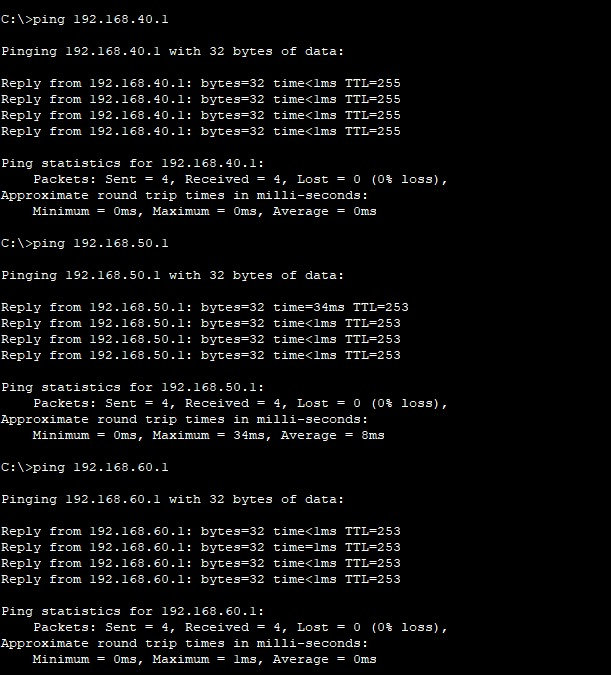
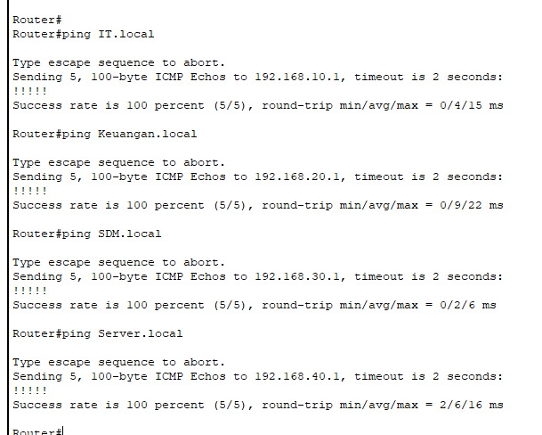

# 📅 Implementasi Layanan Jaringan - Pekan 14

## 👥 Kelompok 3

1. Salsabila Putri Zahrani (10231086) - Network Services Specialist
2. Andini Permata Dewanti (10231014) - Network Architect
3. Ariel Itsbat Nurhaq (10231018) - Security & Documentation Specialist
4. Jonathan Joseph Tampubolon (102310478) - Network Engineer

---

## 📑 Daftar Isi

1. Implementasi Access Control List (ACL) sesuai kebijakan keamanan.
2. Pengujian menyeluruh semua fitur jaringan.
3. Troubleshooting dan perbaikan masalah.

---

## 📓 Laporan Implementasi Tahap 4

#### 🔗 Link File Simulasi

> [Unduh File Simulasi .pkt (Cisco Packet Tracer)](https://github.com/itsbat15/kelompok3/blob/main/WEEK-14.pkt)

### 1. Implementasi Access Control List (ACL) sesuai kebijakan keamanan.

Implementasi Access Control List (ACL) dalam konfigurasi bertujuan untuk mengatur dan membatasi akses antar departemen dan antar gedung sesuai dengan kebijakan keamanan jaringan yang telah ditentukan. Dengan ACL ini, lalu lintas jaringan antar VLAN diatur secara selektif, misalnya hanya memperbolehkan departemen tertentu mengakses layanan atau jaringan lainnya, serta memblokir komunikasi yang tidak diizinkan demi menjaga isolasi dan keamanan data. Selain itu, ACL juga diterapkan untuk mengontrol lalu lintas keluar-masuk jaringan melalui router utama dan mengatur penggunaan NAT untuk koneksi ke internet, sehingga akses menjadi lebih aman dan terkendali.

Berikut adalah perintah yang digunakan untuk mengimplementasikan ACL pada topologi yang kami rancang.

**a) Konfigurasi pada Router Pusat**

```bash
MainRouter> enable
MainRouter# configure terminal

! ACL for WAN traffic control (between buildings)
MainRouter(config)# access-list 100 remark -- Inter-building Traffic Control

! Allow all traffic between buildings
MainRouter(config)# access-list 100 permit ip 192.168.10.0 0.0.0.255 192.168.50.0 0.0.0.255
MainRouter(config)# access-list 100 permit ip 192.168.10.0 0.0.0.255 192.168.60.0 0.0.0.255
MainRouter(config)# access-list 100 permit ip 192.168.20.0 0.0.0.255 192.168.50.0 0.0.0.255
MainRouter(config)# access-list 100 permit ip 192.168.20.0 0.0.0.255 192.168.60.0 0.0.0.255
MainRouter(config)# access-list 100 permit ip 192.168.30.0 0.0.0.255 192.168.50.0 0.0.0.255
MainRouter(config)# access-list 100 permit ip 192.168.30.0 0.0.0.255 192.168.60.0 0.0.0.255
MainRouter(config)# access-list 100 permit ip 192.168.40.0 0.0.0.255 192.168.50.0 0.0.0.255
MainRouter(config)# access-list 100 permit ip 192.168.40.0 0.0.0.255 192.168.60.0 0.0.0.255

! Allow reverse direction
MainRouter(config)# access-list 100 permit ip 192.168.50.0 0.0.0.255 192.168.10.0 0.0.0.255
MainRouter(config)# access-list 100 permit ip 192.168.50.0 0.0.0.255 192.168.20.0 0.0.0.255
MainRouter(config)# access-list 100 permit ip 192.168.50.0 0.0.0.255 192.168.30.0 0.0.0.255
MainRouter(config)# access-list 100 permit ip 192.168.50.0 0.0.0.255 192.168.40.0 0.0.0.255
MainRouter(config)# access-list 100 permit ip 192.168.60.0 0.0.0.255 192.168.10.0 0.0.0.255
MainRouter(config)# access-list 100 permit ip 192.168.60.0 0.0.0.255 192.168.20.0 0.0.0.255
MainRouter(config)# access-list 100 permit ip 192.168.60.0 0.0.0.255 192.168.30.0 0.0.0.255
MainRouter(config)# access-list 100 permit ip 192.168.60.0 0.0.0.255 192.168.40.0 0.0.0.255

! Deny any other traffic
MainRouter(config)# access-list 100 deny ip any any

! Apply ACL to interfaces
MainRouter(config)# interface FastEthernet0/0
MainRouter(config-if)# description Link to Building A
MainRouter(config-if)# ip access-group 100 out
MainRouter(config-if)# exit

MainRouter(config)# interface FastEthernet0/1
MainRouter(config-if)# description Link to Building B
MainRouter(config-if)# ip access-group 100 out
MainRouter(config-if)# exit

! NAT ACL - Define internal networks for NAT
MainRouter(config)# access-list 1 remark -- NAT internal networks
MainRouter(config)# access-list 1 permit 192.168.10.0 0.0.0.255
MainRouter(config)# access-list 1 permit 192.168.20.0 0.0.0.255
MainRouter(config)# access-list 1 permit 192.168.30.0 0.0.0.255
MainRouter(config)# access-list 1 permit 192.168.40.0 0.0.0.255
MainRouter(config)# access-list 1 permit 192.168.50.0 0.0.0.255
MainRouter(config)# access-list 1 permit 192.168.60.0 0.0.0.255
MainRouter(config)# access-list 1 permit 192.168.99.0 0.0.0.255
MainRouter(config)# access-list 1 permit 192.168.100.0 0.0.0.255

! Configure NAT
MainRouter(config)# interface Ethernet0/1/0
MainRouter(config-if)# description Link to ISP
MainRouter(config-if)# ip nat outside
MainRouter(config-if)# exit

MainRouter(config)# interface FastEthernet0/0
MainRouter(config-if)# ip nat inside
MainRouter(config-if)# exit

MainRouter(config)# interface FastEthernet0/1
MainRouter(config-if)# ip nat inside
MainRouter(config-if)# exit

MainRouter(config)# ip nat inside source list 1 interface Ethernet0/1/0 overload
MainRouter(config)# exit
```

**b) Konfigurasi pada Router Gedung A**

```bash
RouterA> enable
RouterA# configure terminal

! IT Department ACL (VLAN 10)
RouterA(config)# access-list 110 remark -- IT department full access
RouterA(config)# access-list 110 permit ip 192.168.10.0 0.0.0.255 any

! Allow all other normal traffic
RouterA(config)# access-list 110 permit ip any any

! Apply the ACL to IT VLAN subinterface
RouterA(config)# interface FastEthernet0/0.10
RouterA(config-subif)# ip access-group 110 in
RouterA(config-subif)# exit

! Finance Department ACL (VLAN 20)
RouterA(config)# access-list 120 remark -- Restrict Finance department access

! IMPORTANT: Allow IT department to access Finance department
RouterA(config)# access-list 120 permit ip 192.168.10.0 0.0.0.255 192.168.20.0 0.0.0.255

! Deny Finance access to IT, HR, and Marketing
RouterA(config)# access-list 120 deny ip 192.168.20.0 0.0.0.255 192.168.10.0 0.0.0.255
RouterA(config)# access-list 120 deny ip 192.168.20.0 0.0.0.255 192.168.30.0 0.0.0.255
RouterA(config)# access-list 120 deny ip 192.168.20.0 0.0.0.255 192.168.50.0 0.0.0.255

! Allow Finance to access Server Farm
RouterA(config)# access-list 120 permit ip 192.168.20.0 0.0.0.255 192.168.40.0 0.0.0.255

! Allow Finance to access Operations
RouterA(config)# access-list 120 permit ip 192.168.20.0 0.0.0.255 192.168.60.0 0.0.0.255

! Allow all other return traffic
RouterA(config)# access-list 120 permit ip any 192.168.20.0 0.0.0.255

! Deny any other traffic
RouterA(config)# access-list 120 deny ip any any

! Apply the ACL to Finance VLAN subinterface
RouterA(config)# interface FastEthernet0/0.20
RouterA(config-subif)# ip access-group 120 in
RouterA(config-subif)# exit

! HR Department ACL (VLAN 30)
RouterA(config)# access-list 130 remark -- Restrict HR department access

! Allow IT full access to HR
RouterA(config)# access-list 130 permit ip 192.168.10.0 0.0.0.255 192.168.30.0 0.0.0.255

! Allow HR to ping Finance only
RouterA(config)# access-list 130 permit icmp 192.168.30.0 0.0.0.255 192.168.20.0 0.0.0.255 echo
RouterA(config)# access-list 130 permit icmp 192.168.30.0 0.0.0.255 192.168.20.0 0.0.0.255 echo-reply

! Allow echo reply from Finance back to HR
RouterA(config)# access-list 130 permit icmp 192.168.20.0 0.0.0.255 192.168.30.0 0.0.0.255 echo-reply
RouterA(config)# access-list 130 deny ip 192.168.30.0 0.0.0.255 192.168.20.0 0.0.0.255

! Allow all other traffic
RouterA(config)# access-list 130 permit ip any any

! Apply the ACL to HR VLAN subinterface
RouterA(config)# interface FastEthernet0/0.30
RouterA(config-subif)# ip access-group 130 in
RouterA(config-subif)# exit

! Server Farm ACL (VLAN 40)
RouterA(config)# access-list 140 remark -- Restrict access to Server Farm

! Allow IT department full access (support purposes)
RouterA(config)# access-list 140 permit ip 192.168.10.0 0.0.0.255 192.168.40.0 0.0.0.255

! Allow standard HTTP/HTTPS/DNS/SSH access for all
RouterA(config)# access-list 140 permit tcp any 192.168.40.0 0.0.0.255 eq 80
RouterA(config)# access-list 140 permit tcp any 192.168.40.0 0.0.0.255 eq 443
RouterA(config)# access-list 140 permit udp any 192.168.40.0 0.0.0.255 eq 53
RouterA(config)# access-list 140 permit tcp any 192.168.40.0 0.0.0.255 eq 22

! Allow Finance department specific database access
RouterA(config)# access-list 140 permit tcp 192.168.20.0 0.0.0.255 192.168.40.0 0.0.0.255 eq 3306
RouterA(config)# access-list 140 permit tcp 192.168.20.0 0.0.0.255 192.168.40.0 0.0.0.255 eq 1433

! Allow return traffic from Server Farm to all departments
RouterA(config)# access-list 140 permit ip 192.168.40.0 0.0.0.255 any

! Deny any other access to Server Farm
RouterA(config)# access-list 140 deny ip any 192.168.40.0 0.0.0.255

! Allow all other traffic
RouterA(config)# access-list 140 permit ip any any

! Apply the ACL to Server Farm VLAN subinterface
RouterA(config)# interface FastEthernet0/0.40
RouterA(config-subif)# ip access-group 140 in
RouterA(config-subif)# exit
```

**c) Konfigurasi pada Router Gedung B**

```bash
RouterB> enable
RouterB# configure terminal

! Marketing Department ACL (VLAN 50)
RouterB(config)# access-list 150 remark -- Marketing department access

! Allow IT department full access
RouterB(config)# access-list 150 permit ip 192.168.10.0 0.0.0.255 192.168.50.0 0.0.0.255

! Marketing department access to Operations
RouterB(config)# access-list 150 permit ip 192.168.50.0 0.0.0.255 192.168.60.0 0.0.0.255

! Allow all other traffic except those restricted by other ACLs
RouterB(config)# access-list 150 permit ip any any

! Apply the ACL to Marketing VLAN subinterface
RouterB(config)# interface FastEthernet0/1.50
RouterB(config-subif)# ip access-group 150 in
RouterB(config-subif)# exit

! Operations Department ACL (VLAN 60)
RouterB(config)# access-list 160 remark -- Restrict Operations department access

! Allow IT department full access
RouterB(config)# access-list 160 permit ip 192.168.10.0 0.0.0.255 192.168.60.0 0.0.0.255

! Deny Operations to Finance
RouterB(config)# access-list 160 deny ip 192.168.60.0 0.0.0.255 192.168.20.0 0.0.0.255

! Allow Marketing to Operations
RouterB(config)# access-list 160 permit ip 192.168.50.0 0.0.0.255 192.168.60.0 0.0.0.255

! Allow all other traffic
RouterB(config)# access-list 160 permit ip any any

! Apply the ACL to Operations VLAN subinterface
RouterB(config)# interface FastEthernet0/1.60
RouterB(config-subif)# ip access-group 160 in
RouterB(config-subif)# exit
```

#### Penjelasan Implementasi Access Control List (ACL) :

**a) Konfigurasi pada Router Pusat**

1.  **Pengaturan ACL untuk kontrol lalu lintas antar gedung :** Pada bagian ini, dibuat Access Control List (ACL) dengan nomor 100 yang berfungsi untuk mengatur lalu lintas data antar jaringan di berbagai gedung. Beberapa alamat IP jaringan (subnet) dari gedung A, B, dan lainnya diizinkan untuk saling berkomunikasi dengan subnet di gedung pusat, yaitu jaringan 192.168.50.0 dan 192.168.60.0.

2.  **Mengizinkan arah lalu lintas balik (reverse direction) :** Setelah komunikasi satu arah diizinkan, dibuat juga aturan agar jaringan 192.168.50.0 dan 192.168.60.0 bisa mengirimkan data kembali ke masing-masing jaringan pengirim. Hal ini penting agar komunikasi dua arah antar gedung dapat berjalan normal tanpa terblokir.

3.  **Menolak semua lalu lintas lain yang tidak diizinkan :** Setelah semua aturan yang diizinkan ditetapkan, ACL juga ditambahkan aturan terakhir yaitu deny ip any any. Artinya, semua lalu lintas data yang tidak sesuai dengan aturan yang telah ditentukan sebelumnya akan otomatis ditolak. Ini dilakukan untuk menjaga keamanan jaringan

4.  **Penerapan ACL pada antarmuka jaringan :** ACL nomor 100 kemudian diterapkan pada dua antarmuka jaringan router, yaitu FastEthernet0/0 dan FastEthernet0/1, yang terhubung ke gedung-gedung lain. Arah penerapannya adalah keluar (out), yang berarti hanya data yang keluar dari router ke arah gedung yang akan dicek oleh ACL.

5.  **Pengaturan ACL untuk NAT (Network Address Translation) :** Selanjutnya, dibuat ACL nomor 1 yang berisi daftar jaringan internal yang akan menggunakan NAT. Seluruh subnet dari gedung-gedung dan jaringan pendukung dimasukkan dalam daftar ini agar dapat diubah alamat IP-nya saat akan mengakses internet.

6.  **Konfigurasi NAT :** NAT dikonfigurasi dengan menetapkan antarmuka Ethernet0/1/0 yang terhubung ke ISP sebagai sisi luar (ip nat outside), dan antarmuka yang terhubung ke jaringan internal sebagai sisi dalam (ip nat inside). Terakhir, dilakukan konfigurasi agar semua alamat IP dari jaringan internal yang sesuai dengan ACL 1 dapat diterjemahkan menjadi satu alamat IP publik melalui antarmuka luar, menggunakan metode overload (Port Address Translation), sehingga seluruh jaringan internal dapat mengakses internet menggunakan satu alamat IP publik.

**b) Konfigurasi pada Router Gedung A**

1.  **Ruang IT :** Access Control List (ACL) nomor 110 dibuat untuk VLAN 10 yang digunakan oleh ruang IT. Di sini, aturan pertama memberikan akses penuh bagi jaringan IT (192.168.10.0/24) ke jaringan manapun. Hal ini memungkinkan tim IT menjalankan tugas pemeliharaan atau dukungan ke seluruh departemen. Selanjutnya, aturan `permit ip any any` memastikan semua lalu lintas lainnya tetap diizinkan agar tidak mengganggu komunikasi umum. ACL ini kemudian diterapkan secara inbound pada subinterface `FastEthernet0/0.10`, yang artinya semua lalu lintas masuk dari jaringan IT akan diperiksa dan diizinkan berdasarkan ACL ini.

2.  **Ruang Keuangan :** ACL 120 dikonfigurasi untuk membatasi akses jaringan Ruang Keuangan (192.168.20.0/24). Aturan pertama memungkinkan jaringan IT (192.168.10.0/24) mengakses Keuangan, misalnya untuk keperluan dukungan teknis. Sebaliknya, akses dari Keuangan ke ruang IT, SDM, dan Marketing secara eksplisit ditolak untuk menjaga keamanan data antar divisi. Namun, Keuangan tetap diizinkan mengakses Server Farm (192.168.40.0/24) dan Operasional (192.168.60.0/24), kemungkinan untuk keperluan database atau koordinasi operasional. Untuk memastikan komunikasi dua arah tetap lancar, return traffic ke Keuangan juga diizinkan. Di akhir ACL, semua lalu lintas yang tidak termasuk aturan sebelumnya ditolak, lalu ACL ini dipasang pada interface VLAN 20 (`FastEthernet0/0.20`) untuk mengontrol lalu lintas masuk dari jaringan Keuangan.

3.  **Ruang SDM :** ACL 130 ditujukan untuk VLAN 30, yaitu jaringan SDM (192.168.30.0/24), dan bertujuan membatasi akses keluar dari SDM. Aturan pertama memperbolehkan IT untuk mengakses SDM sepenuhnya. SDM sendiri hanya diizinkan untuk melakukan ping ke jaringan Finance melalui protokol ICMP (echo dan echo-reply). Untuk memastikan balasan ping bisa diterima, echo-reply dari Keuangan ke SDM juga diizinkan. Setelah itu, komunikasi IP dari SDM ke Keuangan selain ICMP ditolak, namun lalu lintas lainnya tetap diizinkan dengan aturan `permit ip any any`, menunjukkan bahwa pembatasan hanya fokus pada hubungan SDM dengan Keuangan. ACL ini kemudian diterapkan pada subinterface VLAN 30.

4.  **Server Farm :** ACL 140 digunakan untuk membatasi akses ke Server Farm (192.168.40.0/24). IT diberikan akses penuh ke Server Farm untuk keperluan manajemen teknis. Semua departemen diperbolehkan mengakses layanan penting seperti HTTP (port 80), HTTPS (443), DNS (53), dan SSH (22). Finance memiliki tambahan akses ke port database seperti MySQL (3306) dan SQL Server (1433) untuk menjalankan aplikasinya. Agar komunikasi dua arah tetap berjalan, semua return traffic dari Server Farm ke jaringan mana pun diizinkan. Sementara itu, akses selain yang telah diatur secara eksplisit ditolak untuk menjaga keamanan data server. Terakhir, ACL ini diterapkan pada subinterface VLAN 40 untuk mengatur lalu lintas masuk.

**c) Konfigurasi pada Router Gedung B**

1.  **Ruang Marketing :** ACL bernomor 150 dikonfigurasi untuk mengatur lalu lintas masuk pada jaringan VLAN 50 yang digunakan oleh Ruang Marketing (192.168.50.0/24). Aturan pertama memberikan akses penuh bagi ruang IT (192.168.10.0/24) ke jaringan Marketing, memungkinkan tim IT melakukan pemeliharaan atau dukungan teknis. Selanjutnya, ruang Marketing diizinkan untuk mengakses jaringan Operations (192.168.60.0/24), mungkin untuk keperluan koordinasi kerja antar tim. Aturan terakhir `permit ip any any` memastikan bahwa semua lalu lintas lain yang tidak dibatasi secara spesifik oleh ACL lain tetap diperbolehkan, menjaga kelancaran komunikasi umum. ACL ini kemudian diterapkan secara inbound pada subinterface `FastEthernet0/1.50`, sehingga setiap paket yang masuk dari VLAN Marketing akan difilter berdasarkan kebijakan ini.

2.  **Ruang Operasional :** ACL 160 diterapkan untuk VLAN 60 yang digunakan oleh Ruang Operasional (192.168.60.0/24), dengan tujuan membatasi akses ke dan dari jaringan ini. Aturan pertama memungkinkan ruang IT untuk mengakses ruang Operasional sepenuhnya, sesuai kebutuhan dukungan teknis. Namun, terdapat larangan eksplisit bagi Ruang Operasional untuk mengakses jaringan Finance (192.168.20.0/24), kemungkinan untuk menjaga kerahasiaan atau keamanan data keuangan. Sementara itu, akses dari ruang Marketing ke Operasional diizinkan, menandakan adanya kerja sama antar divisi tersebut. Terakhir, aturan `permit ip any any` memastikan semua lalu lintas selain yang dilarang secara eksplisit tetap diperbolehkan. ACL ini diterapkan secara inbound pada subinterface `FastEthernet0/1.60` untuk mengatur semua lalu lintas masuk dari VLAN Operasional.

#### Bukti Pengujian Segmentasi Jaringan VLAN dan Akses Antar Ruang

Pengujian ini dilakukan untuk memastikan bahwa konfigurasi VLAN dan akses antar ruangan (melalui Inter-VLAN Routing dan Access Control List / ACL jika digunakan) berjalan sesuai kebijakan yang diinginkan. Ini bertujuan membatasi akses agar hanya ruangan tertentu yang dapat saling berkomunikasi, demi keamanan dan isolasi jaringan.

**Gedung A**

##### a) Ping dari Ruang IT




_Gambar 1 : Screenshot Pengujian Segmentasi Jaringan VLAN dan Akses Antar Ruang dari Ruang IT_

**Penjelasan :** Dari pengujian yang ditunjukkan pada Gambar 1, perangkat dari VLAN IT berhasil melakukan ping ke seluruh VLAN lain tanpa hambatan. Ini menunjukkan bahwa VLAN IT memiliki akses penuh terhadap semua ruang, termasuk SDM, Keuangan, Marketing, Server Farm, dan Operasional. Kondisi ini mengindikasikan bahwa IT dikonfigurasi sebagai VLAN dengan hak akses administrator atau manajemen jaringan, sehingga diberi otoritas penuh untuk mengelola dan memonitor seluruh jaringan.

##### b) Ping dari Ruang Keuangan


_Gambar 2 : Screenshot Pengujian Segmentasi Jaringan VLAN dan Akses Antar Ruang dari Ruang Keuangan_

**Penjelasan :** Pada pengujian yang divisualisasikan di Gambar 2, perangkat dari VLAN Keuangan tidak dapat melakukan ping ke VLAN IT, SDM, dan Marketing. Namun, ping berhasil dilakukan ke Server Farm (192.168.40.x) dan Operasional (192.168.60.x). Hasil ini menunjukkan bahwa VLAN Finance dibatasi hanya untuk mengakses sumber daya umum atau pendukung operasional seperti Server Farm dan Operasional. Ini selaras dengan praktik umum jaringan, di mana akses antar departemen dibatasi untuk meningkatkan keamanan dan efisiensi kerja, sedangkan akses ke layanan bersama tetap diizinkan.

##### c) Ping dari Ruang SDM


_Gambar 3 : Screenshot Pengujian Segmentasi Jaringan VLAN dan Akses Antar Ruang dari Ruang SDM_

**Penjelasan :** Pengujian pada Gambar 3 menunjukkan bahwa perangkat yang berada di jaringan SDM (dengan IP 192.168.30.x) hanya dapat melakukan ping ke jaringan Keuangan, tetapi tidak bisa mengakses jaringan lain seperti IT, Marketing, Server Farm, atau Operasional. Meskipun perangkat SDM dapat melakukan ping ke Keuangan, akses ke layanan lain di dalam Keuangan tetap dibatasi. Artinya, hanya komunikasi dasar seperti ping yang diizinkan, sementara akses ke layanan yang lebih kompleks kemungkinan diblokir menggunakan Access Control List (ACL) atau pengaturan tertentu pada port dan protokol. Hasil pengujian juga menunjukkan bahwa perangkat dari jaringan IT dapat mengakses Keuangan, meskipun sebaliknya tidak bisa dilakukan. Ini menunjukkan adanya akses satu arah dari IT ke SDM karena IT berperan sebagai pengelola atau administrator jaringan.

**Gedung B**

##### a) Ping dari Ruang Marketing


_Gambar 4 : Screenshot Pengujian Segmentasi Jaringan VLAN dan Akses Antar Ruang dari Ruang Marketing_

**Penjelasan :** Pengujian pada gambar 4 menunjukkan bahwa perangkat dari VLAN Marketing (192.168.50.x) dapat melakukan ping ke VLAN Operasional (192.168.60.x) dengan sukses. Seluruh paket terkirim dan diterima tanpa adanya kehilangan, yang menandakan bahwa akses antar kedua VLAN ini diizinkan. Hal ini mengindikasikan bahwa terdapat kebijakan jaringan yang memungkinkan komunikasi dari Marketing ke Operasional, kemungkinan karena adanya kebutuhan kerja sama atau akses ke layanan tertentu di departemen Operasional.

##### a) Ping dari Ruang Operasional


_Gambar 5 : Screenshot Pengujian Segmentasi Jaringan VLAN dan Akses Antar Ruang dari Ruang Opersional_

**Penjelasan :**
Pengujian pada gambar 6 menunjukkan bahwa perangkat dari VLAN Operasional (192.168.60.x) tidak dapat melakukan ping ke VLAN Keuangan (192.168.20.x). Semua upaya ping gagal dengan pesan “Destination host unreachable,” yang menunjukkan bahwa akses dari Operasional ke Keuangan diblokir sepenuhnya. Ini mengindikasikan bahwa terdapat segmentasi jaringan yang ketat, kemungkinan menggunakan Access Control List (ACL), untuk membatasi komunikasi antar departemen yang tidak memiliki hubungan kerja langsung atau yang membutuhkan perlindungan data lebih tinggi seperti departemen Finance.

### 2. Pengujian menyeluruh semua fitur jaringan.

Pengujian ini dilakukan untuk memastikan bahwa seluruh layanan jaringan seperti DHCP, DNS internal, dan NAT sudah berjalan dengan baik pada masing-masing client yang terhubung ke jaringan VLAN. Berikut hasil pengujian yang dilakukan dari sisi client:

#### A. Pengujian Fitur DHCP


_Gambar 6_ : Screenshot Screenshot Pengujian fitur DHCP

Pengujian DHCP dilakukan dengan perintah ipconfig /renew pada client yang berada di VLAN IT. Hasil dari perintah ini menunjukkan bahwa client berhasil memperoleh konfigurasi IP secara otomatis dari server DHCP. Alamat IP yang diperoleh adalah 192.168.10.12 dengan subnet mask 255.255.255.0, default gateway 192.168.10.1, dan DNS server 192.168.10.1. Ini membuktikan bahwa layanan DHCP telah dikonfigurasi dan berjalan dengan benar, di mana router pada VLAN IT berhasil mendistribusikan alamat IP dan informasi jaringan lainnya kepada perangkat client melalui DHCP pool bernama IT_POOL.

#### B. Pengujian DNS Internal (Gagal)


_Gambar 7_ : Screenshot Pengujian fitur DNS

Pengujian DNS internal dilakukan dengan menggunakan perintah nslookup IT.local 192.168.10.1. Namun, hasil pengujian menunjukkan bahwa permintaan DNS mengalami timeout selama 15.000 milidetik sebanyak dua kali. Hal ini mengindikasikan bahwa resolusi nama internal terhadap domain IT.local gagal dilakukan oleh DNS server yang berada di alamat 192.168.10.1. Kegagalan ini dapat disebabkan oleh belum dikonfigurasinya entri DNS lokal menggunakan perintah ip host, atau DNS server tidak berfungsi sebagaimana mestinya. Masalah ini kemudian diperbaiki pada tahap berikutnya dengan menambahkan entri DNS lokal pada router serta mengatur DNS server dalam konfigurasi DHCP.

#### C. Pengujian NAT (Network Address Translation) dari Client


\*Gambar 8 : Screenshot Pengujian fitur NAT

Pengujian NAT dilakukan dengan perintah ping 8.8.8.8 dari client VLAN IT. Hasil pengujian menunjukkan bahwa semua paket berhasil dikirim dan diterima tanpa kehilangan (loss = 0%). Selain itu, waktu respons sangat cepat dengan rata-rata 0 milidetik. Ini membuktikan bahwa NAT telah dikonfigurasi dengan benar pada router utama. Konfigurasi NAT melibatkan penerapan ip nat inside pada interface jaringan internal dan ip nat outside pada interface yang terhubung ke ISP. Selain itu, digunakan juga metode NAT overload (Port Address Translation) dengan perintah ip nat inside source list 1 interface Ethernet0/1/0 overload sehingga seluruh jaringan internal dapat mengakses internet menggunakan satu alamat IP publik.

#### D. Pengujian Akses Jaringan Antar VLAN (ACL)


\*Gambar 9 : Screenshot Pengujian ACL

Pengujian ACL dilakukan untuk memastikan bahwa kontrol akses antar VLAN yang dikonfigurasi melalui Access Control List (ACL) bekerja sesuai dengan kebijakan keamanan. Setiap VLAN diuji untuk memastikan akses ke gateway dan pembatasan antar departemen diterapkan dengan benar.
• Pengujian ACL pada VLAN Finance
Pengujian dilakukan dari PC74 (VLAN Finance) ke gateway 192.168.20.1. Hasilnya menunjukkan bahwa client berhasil melakukan ping ke gateway-nya dengan 0% packet loss dan waktu respons sangat cepat (0–1ms). Ini membuktikan bahwa ACL yang diterapkan pada interface VLAN 20 tidak menghalangi lalu lintas internal dalam VLAN Finance, serta gateway dapat diakses dengan normal oleh seluruh perangkat dalam subnet tersebut.

• Pengujian ACL pada VLAN SDM
Dari sisi client VLAN SDM (PC0), dilakukan ping ke gateway 192.168.30.1. Hasilnya menunjukkan bahwa semua paket diterima dengan sukses, tidak ada paket yang hilang, dan waktu respon rata-rata adalah 0 ms. Ini menunjukkan bahwa aturan ACL pada VLAN 30 tidak memblokir akses internal ke gateway, dan perangkat SDM dapat berkomunikasi dengan router secara lokal.

### 3. Troubleshooting dan perbaikan masalah.

#### Perbaikan Implementasi DNS Server untuk Resolusi Nama Internal

Pada implementasi tahap 3, sebelumnya, perangkat dalam jaringan tidak bisa melakukan ping ke host internal menggunakan nama domain. Hal ini menunjukkan bahwa resolusi nama (_name resolution_) tidak berfungsi dengan baik, sehingga sistem tidak bisa menerjemahkan nama ke IP address. Oleh karena itu, dilakukan perbaikan implentasi DNS server terlebih dahulu agar perangkat di dalam jaringan lokal dapat mengakses layanan internal menggunakan nama domain. Perbaikan ini penting dilakukan terlebih dahulu karena jika DNS server tidak berfungsi dengan baik, maka implementasi Access Control List (ACL) pun dapat terganggu, misalnya ketika ACL mengatur akses berdasarkan alamat IP hasil resolusi nama, maka kegagalan DNS akan membuat aturan ACL tidak dapat dijalankan secara efektif.

Perbaikan ini dilakukan di CLI router masing-masing gedung dengan menggunakan perintah sebagai berikut.

**Gedung A**

```bash
Router(config)# ip host IT.local 192.168.10.1
Router(config)# ip name-server 8.8.8.8

Router(config)# ip dhcp pool IT_POOL
Router(dhcp-config)# network 192.168.10.0 255.255.255.0
Router(dhcp-config)# default-router 192.168.10.1  # Ganti ke gateway VLAN IT
Router(dhcp-config)# dns-server 192.168.10.1 8.8.8.8
```

```bash
Router(config)# ip host Keuangan.local 192.168.20.1
Router(config)# ip name-server 8.8.8.8

Router(config)# ip dhcp pool Keuangan_POOL
Router(dhcp-config)# network 192.168.20.0 255.255.255.0
Router(dhcp-config)# default-router 192.168.20.1
Router(dhcp-config)# dns-server 192.168.20.1 8.8.8.8
```

```bash
Router(config)# ip host SDM.local 192.168.30.1
Router(config)# ip name-server 8.8.8.8

Router(config)# ip dhcp pool SDM_POOL
Router(dhcp-config)# network 192.168.30.0 255.255.255.0
Router(dhcp-config)# default-router 192.168.30.1
Router(dhcp-config)# dns-server 192.168.30.1 8.8.8.8
```

```bash
Router(config)# ip host Server.local 192.168.40.1
Router(config)# ip name-server 8.8.8.8

Router(config)# ip dhcp pool Server_POOL
Router(dhcp-config)# network 192.168.40.0 255.255.255.0
Router(dhcp-config)# default-router 192.168.40.1
Router(dhcp-config)# dns-server 192.168.40.1 8.8.8.8
```

**Gedung B**

```bash
Router(config)# ip host Marketing.local 192.168.50.1
Router(config)# ip name-server 8.8.8.8

Router(config)# ip dhcp pool Marketing_POOL
Router(dhcp-config)# network 192.168.50.0 255.255.255.0
Router(dhcp-config)# default-router 192.168.50.1
Router(dhcp-config)# dns-server 192.168.50.1 8.8.8.8
```

```bash
Router(config)# ip host Operasional.local 192.168.60.1
Router(config)# ip name-server 8.8.8.8

Router(config)# ip dhcp pool Operasional_POOL
Router(dhcp-config)# network 192.168.60.0 255.255.255.0
Router(dhcp-config)# default-router 192.168.60.1
Router(dhcp-config)# dns-server 192.168.60.1 8.8.8.8
```

#### Penjelasan Perbaikan Implementasi DNS Server untuk Resolusi Nama Internal :

1.  **Konfigurasi Entri DNS Lokal dengan `ip host`** : Perintah `ip host <nama>.local <IP>` digunakan untuk menambahkan entri DNS statis di dalam router. Ini berfungsi agar perangkat dalam jaringan bisa mengakses perangkat lain menggunakan nama domain lokal seperti `IT.local`, `Keuangan.local`, dan sebagainya, tanpa perlu menggunakan IP address secara langsung. Misalnya, ketika pengguna melakukan ping ke `IT.local`, router akan menerjemahkannya menjadi `192.168.10.1` berdasarkan entri yang telah dikonfigurasi.

2.  **Penetapan DNS Eksternal dengan `ip name-server`** : Perintah `ip name-server 8.8.8.8` digunakan untuk menetapkan DNS publik (dalam hal ini milik Google) sebagai fallback jika nama domain yang diminta tidak dikenali dalam entri lokal router. Ini memungkinkan perangkat jaringan juga bisa melakukan resolusi nama ke situs internet (seperti `google.com` atau `youtube.com`) jika jaringan memiliki akses keluar.

3.  **Konfigurasi DHCP Pool untuk Tiap VLAN** : Perintah `ip dhcp pool <nama_pool>` diikuti dengan konfigurasi `network`, default-router, dan dns-server digunakan untuk mengaktifkan layanan DHCP pada masing-masing VLAN. DHCP pool bertugas memberikan alamat IP secara otomatis kepada perangkat dalam jaringan, bersama dengan pengaturan gateway dan DNS yang sesuai. Misalnya, VLAN IT akan mendapatkan IP dari subnet `192.168.10.0/24`, gateway `192.168.10.1`, dan DNS `192.168.10.1` serta `8.8.8.8`.

4.  **Pengaturan Default Gateway melalui DHCP** : Parameter `default-router` dalam konfigurasi DHCP menentukan gateway default yang akan digunakan oleh perangkat di jaringan tersebut. Gateway ini memungkinkan perangkat dalam satu VLAN mengakses jaringan lain melalui router. Misalnya, untuk VLAN Keuangan, gateway-nya adalah `192.168.20.1`.

5.  **Pengaturan DNS Server melalui DHCP** : Parameter `dns-server` dalam DHCP pool memberi tahu klien DNS mana yang harus digunakan untuk melakukan resolusi nama. Dalam konfigurasi ini, digunakan dua DNS: satu internal (alamat router VLAN masing-masing) dan satu eksternal (8.8.8.8). Penggunaan DNS lokal memungkinkan resolusi nama domain internal seperti `Server.local`, sedangkan DNS eksternal memungkinkan akses ke internet.

6.  **Fungsi Konfigurasi Ini dalam Mendukung ACL** : Konfigurasi DNS lokal dan DHCP ini sangat penting untuk mendukung implementasi Access Control List (ACL) di tahap selanjutnya. Jika resolusi nama tidak berjalan dengan baik, maka aturan ACL yang berbasis IP akan gagal diterapkan saat pengguna mencoba mengakses layanan menggunakan nama domain. Dengan kata lain, DNS yang berfungsi dengan baik menjadi fondasi agar ACL dapat mengatur lalu lintas jaringan secara akurat.

#### Bukti Konfigurasi DNS Lokal (_Host Mapping_) pada Router


*Gambar 10 : Screenshot Bukti Konfigurasi DNS Lokal (*Host Mapping*) pada Router Gedung A*


*Gambar 11 : Screenshot Bukti Konfigurasi DNS Lokal (*Host Mapping*) pada Router Gedung B*

#### Penjelasan Detail Konfigurasi DNS Lokal (_Host Mapping_) pada Router :

Konfigurasi yang ditampilkan melalui show hosts membuktikan bahwa router di Gedung A telah berhasil mengatur DNS lokal untuk resolusi nama internal. Hal ini penting untuk memastikan perangkat dapat saling berkomunikasi menggunakan nama domain, yang juga mendukung keberhasilan pengaturan ACL (_Access Control List_) dan layanan jaringan lainnya. Berikut penjelasan detailnya.

1.  **Perintah `show hosts` Menampilkan Daftar Host yang Dikonfigurasi** : Perintah `show hosts` digunakan untuk menampilkan daftar hostname dan alamat IP yang telah dikonfigurasi secara manual di router. Output dari perintah ini menunjukkan bahwa beberapa entri hostname lokal telah ditambahkan, seperti `IT.local`, `Keuangan.local`, `SDM.local`, dan `Server.local`. Setiap hostname tersebut memiliki IP yang sesuai dengan subnet atau VLAN masing-masing.

2.  **Konfigurasi Hostname dengan `ip host` Berhasil Diterapkan** : Masing-masing hostname dioutput-kan bersama dengan alamat IP-nya, menunjukkan bahwa perintah `ip host <nama> <IP>` berhasil diterapkan sebelumnya. Misalnya, `IT.local` dipetakan ke `192.168.10.1`, `Keuangan.local` ke `192.168.20.1`, dan seterusnya. Ini membuktikan bahwa router sudah mampu melakukan resolusi nama internal tanpa memerlukan DNS eksternal.

3.  **Tanda `perm, OK` Menunjukkan Status Host Valid dan Permanen** : Kolom `Flags` menunjukkan nilai (`perm, OK`), yang berarti bahwa entri DNS tersebut bersifat permanen (`perm`) dan saat ini berfungsi dengan baik (`OK`). Artinya, konfigurasi ini tidak bersifat sementara atau dinamis, melainkan dikonfigurasi secara manual dan siap digunakan oleh perangkat dalam jaringan.

4.  **DNS Server Eksternal (`8.8.8.8`) Sudah Diset Sebagai Cadangan** : Di bagian atas output, terlihat bahwa router menggunakan `8.8.8.8` sebagai name server eksternal. Ini merupakan langkah umum untuk menyediakan fallback jika suatu nama domain tidak dikenali secara lokal. Namun untuk domain internal seperti `*.local`, router mengutamakan entri dari `ip host`.

#### Bukti Pengujian Resolusi Nama DNS Lokal



_Gambar 12 : Screenshot Bukti Pengujian Resolusi Nama DNS Lokal Gedung A_


_Gambar 13 : Screenshot Bukti Pengujian Resolusi Nama DNS Lokal Gedung B_

#### Penjelasan Bukti Pengujian Resolusi Nama DNS Lokal :

Bukti pada hasil `ping` ini memperlihatkan bahwa DNS lokal berhasil dikonfigurasi dan berjalan dengan baik di kedua gedung. Tidak hanya menunjukkan konektivitas, tetapi juga mengonfirmasi bahwa sistem penamaan lokal, pembagian VLAN, dan manajemen jaringan sudah berjalan sebagaimana mestinya dan siap digunakan untuk implementasi sistem jaringan skala menengah hingga besar. Berikut penjelasan detailnya.

1.  **Pengujian Nama Host Lokal (DNS Lokal) Berhasil** : Pengujian dilakukan dengan perintah ping ke nama host seperti `IT.local`, `Keuangan.local`, `SDM.local`, `Server.local`, `Marketing.local`, dan `Operasional.local`. Hasil `ping` menunjukkan bahwa masing-masing nama host berhasil diterjemahkan menjadi alamat IP yang sesuai. Ini membuktikan bahwa konfigurasi DNS lokal menggunakan perintah `ip host` di router berhasil, sehingga perangkat dapat saling berkomunikasi hanya menggunakan nama domain lokal tanpa perlu mengingat IP address.

2.  **Tingkat Keberhasilan Konektivitas 100%** : Setiap pengujian `ping` menampilkan "Success rate is 100 percent (5/5)", yang berarti semua paket ICMP yang dikirim berhasil mendapatkan balasan dari alamat tujuan. Hal ini menunjukkan bahwa konektivitas antar perangkat atau VLAN di Gedung A dan B berjalan dengan baik dan tidak ada gangguan jaringan yang menyebabkan paket hilang.

3.  **IP Address Sudah Sesuai dengan Setiap VLAN** : Nama host seperti `IT.local`, `Keuangan.local`, dan lainnya berhasil dipetakan ke alamat IP yang sesuai dengan subnet masing-masing VLAN, seperti 192.168.10.1 untuk IT, 192.168.20.1 untuk Keuangan, dan seterusnya. Ini membuktikan bahwa sistem penamaan DNS lokal sudah dikonfigurasi dengan benar, selaras dengan skema VLAN yang telah dirancang di jaringan.

4.  **Waktu Respons Jaringan Stabil dan Rendah** : Dalam hasil `ping`, ditampilkan waktu round-trip min/avg/max yang cukup rendah, contohnya 0/4/15 ms atau 1/7/19 ms. Ini menandakan bahwa jaringan internal memiliki latency yang rendah dan stabil, sehingga komunikasi antar perangkat berlangsung cepat dan efisien. Latency rendah sangat penting untuk mendukung aplikasi real-time seperti VoIP, file sharing, atau sistem berbasis server lokal.

5.  **Jaringan Siap untuk Operasional Berbasis Nama Host** : Dengan DNS lokal yang telah berfungsi dan konektivitas yang stabil, jaringan di Gedung A dan B sudah siap digunakan untuk operasional tingkat lanjut. Penggunaan nama host (`.local`) akan sangat memudahkan manajemen jaringan, mempermudah akses ke layanan antar departemen, dan meningkatkan efisiensi serta keamanan dalam pengelolaan trafik jaringan internal.
