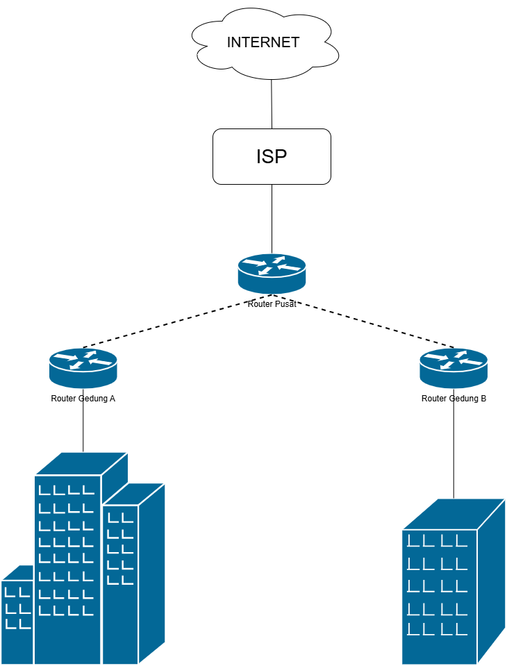
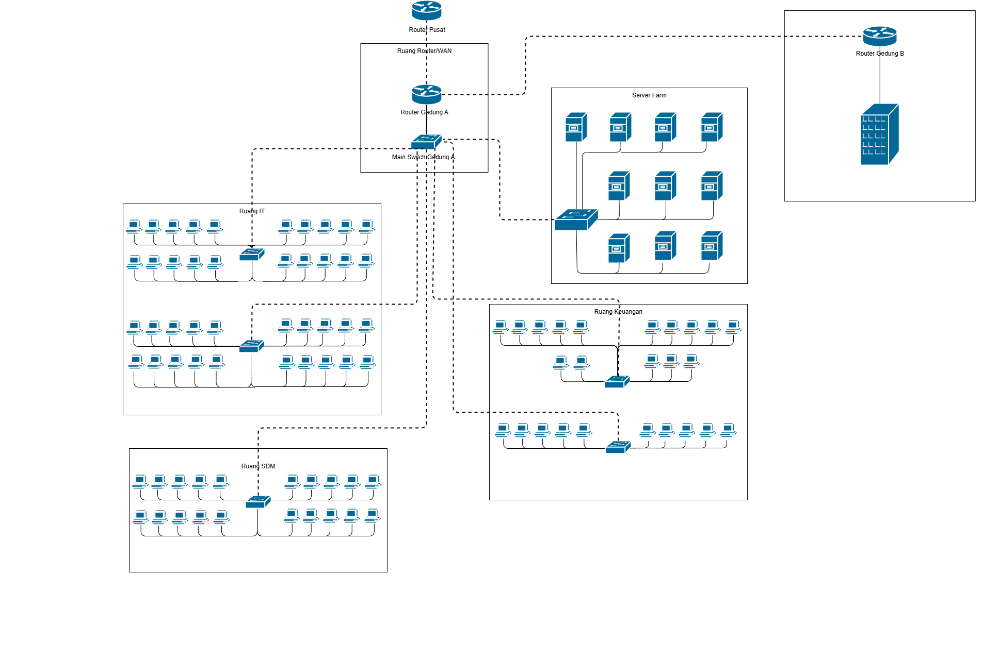

# 📅 Perencanaan Proyek & Desain Awal - Pekan 9

## 👥 Kelompok 3

1. Salsabila Putri Zahrani (10231086)     - Network Services Specialist
2. Andini Permata Dewanti (10231014)      - Network Architect
3. Ariel Itsbat Nurhaq (10231018)         - Security & Documentation Specialist
4. Jonathan Joseph Tampubolon (102310478) - Network Engineer

---

## 📑 Daftar Isi

1. [Pendahuluan](#1-pendahuluan)
2. [Isi Laporan](#2-isi-laporan)
3. [Konfigurasi Perangkat](#3-konfigurasi-perangkat)
4. dst..

---

## 1. Pendahuluan

### 1.1 Latar Belakang

Perkembangan teknologi informasi yang pesat telah mendorong organisasi dan perusahaan untuk mengadopsi infrastruktur jaringan yang aman dan efisien guna mendukung operasional sehari-hari. Dalam konteks transformasi digital, sistem jaringan komputer menjadi faktor utama bagi kelancaran komunikasi dan pertukaran data antar unit kerja. Infrastruktur jaringan yang baik tidak hanya menunjang konektivitas internal dan eksternal, tetapi juga menjadi faktor krusial dalam memastikan keberlangsungan layanan bisnis yang bersifat real-time dan terdistribusi.
PT. Nusantara Network merupakan perusahaan yang bergerak di bidang teknologi informasi dan memiliki struktur organisasi yang tersebar di dua lokasi fisik, yaitu kantor pusat (Gedung A) dan kantor cabang (Gedung B). Masing-masing lokasi menaungi beberapa departemen yang memiliki fungsi dan kebutuhan jaringan berbeda. Hal ini menuntut adanya desain jaringan yang mampu mengakomodasi infrastruktur jaringan antar departemen, keamanan akses, efisiensi komunikasi, serta skalabilitas terhadap pertumbuhan organisasi di masa mendatang.
Untuk menjawab tantangan tersebut, diperlukan pendekatan teknis berupa penerapan Virtual LAN (VLAN) sebagai mekanisme isolasi lalu lintas data antar departemen, serta pemanfaatan teknologi Wide Area Network (WAN) untuk menjembatani komunikasi antar lokasi. Selain itu, layanan jaringan dasar Dynamic Host Configuration Protocol (DHCP) dan Domain Name System (DNS) wajib diimplementasikan untuk mendukung pengelolaan IP dinamis dan host secara otomatis. Penggunaan Network Address Translation (NAT) juga menjadi elemen penting untuk mengontrol akses ke jaringan publik.
Dari sisi keamanan, implementasi Access Control List (ACL) dibutuhkan guna membatasi dan mengatur hak akses antar segmen jaringan sesuai dengan kebijakan perusahaan. Sementara itu, penggunaan protokol routing dinamis seperti Open Shortest Path First (OSPF) menjadi solusi dalam mendukung mobilitas data lintas lokasi dengan efisiensi dan ketahanan terhadap perubahan topologi. Di samping itu, sistem monitoring dan manajemen jaringan terpusat akan meningkatkan visibilitas dan kontrol terhadap infrastruktur yang dibangun.
Dengan demikian, perancangan dan implementasi jaringan pada PT. Nusantara Network harus dilakukan secara sistematis dan menyeluruh, mencakup aspek teknis, keamanan, dan manajemen, agar mampu menjawab kebutuhan operasional yang dinamis sekaligus mendukung pertumbuhan bisnis di era digital.

### 2.2 Tujuan

1. Merancang infrastruktur jaringan yang efisien dan terstruktur untuk mendukung operasional PT. Nusantara Network di kantor pusat dan kantor cabang.

2. Mengimplementasikan segmentasi jaringan menggunakan VLAN untuk masing-masing departemen guna meningkatkan keamanan dan manajemen lalu lintas data.

3. Mengatur koneksi WAN antar gedung agar komunikasi data antar kantor tetap lancar meskipun memiliki keterbatasan bandwidth.

4. Menyediakan layanan DHCP dan DNS untuk memudahkan pengelolaan alamat IP dan resolusi nama secara otomatis dan terpusat.

5. Menerapkan sistem keamanan jaringan melalui penggunaan firewall dan ACL agar akses antar departemen dapat dikendalikan sesuai kebijakan.

6. Mengaktifkan NAT (Network Address Translation) untuk memberikan akses internet kepada perangkat internal secara aman.

7. Mengimplementasikan routing dinamis (OSPF) agar rute komunikasi antar gedung dapat beradaptasi secara otomatis terhadap perubahan kondisi jaringan.

8. Membangun sistem monitoring jaringan terpusat untuk mendeteksi gangguan, menganalisis kinerja, dan mempermudah manajemen jaringan secara keseluruhan.

### 3.3 Ruang Lingkup

Ruang lingkup dari proyek perancangan dan implementasi jaringan di PT. Nusantara Network mencakup desain infrastruktur jaringan untuk dua lokasi, yaitu Kantor Pusat (Gedung A) dan Kantor Cabang (Gedung B). Fokus utama berada pada pembuatan topologi jaringan yang efisien dan aman, pengelompokan masing-masing departemen ke dalam VLAN terpisah untuk meningkatkan keamanan dan manajemen lalu lintas data, serta pengaturan subnet IP untuk tiap VLAN. Proyek ini juga mencakup konfigurasi routing dinamis menggunakan protokol OSPF untuk komunikasi antar gedung melalui koneksi WAN dengan bandwidth terbatas.

Selain itu, ruang lingkup mencakup pengimplementasian layanan DHCP untuk distribusi IP otomatis dan DNS untuk resolusi nama, baik internal maupun eksternal. NAT akan digunakan untuk mengizinkan akses internet dari jaringan internal melalui satu alamat publik. Aspek keamanan jaringan turut menjadi bagian penting, seperti penerapan Access Control List (ACL) untuk membatasi akses antar departemen sesuai kebijakan keamanan, serta penggunaan firewall untuk perlindungan dari akses tidak sah. Terakhir, sistem monitoring dan manajemen jaringan juga menjadi bagian dari ruang lingkup proyek ini, guna memastikan performa jaringan tetap stabil dan mudah diawasi dari satu titik pusat. Ruang lingkup ini tidak mencakup implementasi aplikasi perangkat lunak bisnis seperti ERP atau CRM, serta pengelolaan kebijakan SDM perusahaan.

## 2. Isi Laporan

### 2.1 Daftar anggota kelompok dan peran masing-masing

| Nama Lengkap               | NIM       | Peran                               |
| -------------------------- | --------- | ----------------------------------- |
| Salsabila Putri Zahrani    | 10231086  | Network Services Specialist         |
| Andini Permata Dewanti     | 10231014  | Network Architect                   |
| Ariel Itsbat Nurhaq        | 10231018  | Security & Documentation Specialist |
| Jonathan Joseph Tampubolon | 102310478 | Network Engineer                    |

### 2.2 Analisis Kebutuhan PT. Nusantara Network

##### 🏢 Kantor Pusat (Gedung A)

Tabel Kebutuhan Perangkat per Ruang

| Lokasi           | Perangkat      | VLAN               | Keterangan                                                 |
| ---------------- | -------------- | ------------------ | ---------------------------------------------------------- |
| Ruang IT         | 2 Switch       | VLAN IT (10)       | Terhubung ke 40 komputer IT. Subnet: 192.168.10.0/24       |
| Ruang Keuangan   | 2 Switch       | VLAN Keuangan (20) | Terhubung ke 25 komputer Keuangan. Subnet: 192.168.20.0/24 |
| Ruang SDM        | 1 Switch       | VLAN SDM (30)      | Terhubung ke 20 komputer SDM. Subnet: 192.168.30.0/24      |
| Server Farm      | 1 Switch       | VLAN Server (40)   | Terhubung ke 10 server internal. Subnet: 192.168.40.0/24   |
| Ruang Router/WAN | 1 Router Utama | -                  | Gateway utama koneksi WAN antar gedung                     |
|                  | 1 Router Lokal | -                  | Terhubung ke Router gedung B dan Router WAN (gateway utama)|
|                  | 1 Main Switch  | -                  | Penghubung antar VLAN & perangkat jaringan lainnya         |
|                  | 1 Firewall     | -                  | Implementasi NAT ACL dan keamanan jaringan.                |

---
#### 🏬 Kantor Cabang (Gedung B)

Tabel Kebutuhan Perangkat per Ruang

| Lokasi            | Perangkat      | VLAN                  | Keterangan                                          |
| ----------------- | -------------- | --------------------- | --------------------------------------------------- |
| Ruang Marketing   | 2 Switch       | VLAN Marketing (50)   | Terhubung ke 30 komputer. Subnet: 192.168.50.0/24   |
| Ruang Operasional | 2 Switch       | VLAN Operasional (60) | Terhubung ke 35 komputer. Subnet: 192.168.60.0/24   |
| Ruang Router/WAN  | 1 Router Lokal | -                     | Gateway ke Gedung A via WAN                         |
|                   | 1 Main Switch  | -                     | Penghubung antar VLAN & perangkat jaringan lainnya  |
|                   | 1 Firewall     | -                     | Implementasi NAT ACL dan keamanan jaringan.         |

---
#### 📌 Penjelasan Umum Perangkat

- **Switch**

  - Digunakan di setiap departemen untuk mengelola VLAN secara lokal dan melakukan routing Internal
  - Setiap Switch akan memiliki konfigurasi IP sesuai subnet VLAN-nya

- **Router Utama**
  - Menjadi gatewsy utama untuk koneksi intenet fan WAN antar gedung
  - Konfigurasi NAT untuk akses internet
  - Routing dinamis OSPF untuk manajemen rute antar gedung  

- **Firewall***
  - Ditempatkan di kedua lokasi, untuk keamanan jaringan  
  - Di gedung A, Firewal juga bertugas sebagai NAT untuk akses Internet  
  - Di gedung B, digunakan untuk membatasi akses antar departemen sesuai kebijakan keamanan  

- **Main Switch**
  - Berfungsi sebagai penghubung pusat antar VLAN dan perangkat jaringan lainnya.
  - Penghubung semua VLAN ke router utama dan server.  

- **Router Lokal**
  - Routing data antar jaringan lokal (LAN)
  - Koneksi antar gedung
  - Manajemen IP address
  - Penghubung ke internet

- **Routing Dinamis (OSPF)**
  - Penjaga rute agar optimal dan adaptif

- **Server**
  - Server digunakan untuk layanan DHCP,DNS, dan monitoring jaringan

#### 📡 Server dan Layanan

| Jenis Server      | Fungsi Penggunaan                                    |
| ----------------- | ---------------------------------------------------- |
| DHCP & DNS        | Mengelola IP address & domain name resolution        |
| File Sharing      | Berbagi file antar departemen                        |
| Email             | Komunikasi internal & eksternal                      |
| Database          | Menyimpan data Keuangan & SDM                        |
| Web Server        | Menyediakan intranet perusahaan                      |
| Monitoring Server | Memonitor seluruh jaringan                           |
| Backup Server     | Mencadangkan data dari semua server                  |
| Virtualisasi      | Menjalankan layanan tambahan seperti aplikasi bisnis |
| Aplikasi Bisnis   | ERP atau CRM                                         |

---

#### 🧮 Contoh Konfigurasi Subnet VLAN

| VLAN             | Subnet IP       | Rentang IP                    |
| ---------------- | --------------- | ----------------------------- |
| VLAN IT          | 192.168.10.0/24 | 192.168.10.1 - 192.168.10.254 |
| VLAN Keuangan    | 192.168.20.0/24 | 192.168.20.1 - 192.168.20.254 |
| VLAN SDM         | 192.168.30.0/24 | 192.168.30.1 - 192.168.30.254 |
| VLAN Server      | 192.168.40.0/24 | 192.168.40.1 - 192.168.40.254 |
| VLAN Marketing   | 192.168.50.0/24 | 192.168.50.1 - 192.168.50.254 |
| VLAN Operasional | 192.168.60.0/24 | 192.168.60.1 - 192.168.60.254 |

---

#### 🖧 Jenis Perangkat Jaringan dan Model

| Lokasi        | Perangkat    | Fungsi / Jenis     | Model Cisco           | Keterangan                                     |
| ------------- | ------------ | ------------------ | --------------------- | ---------------------------------------------- |
| Kantor Pusat  | Router Utama | Gateway & Routing  | Cisco ISR 4321        | Routing antar VLAN & WAN                       |
|               | Router Lokal | Routing LAN        | Cisco ISR 4321        | Koneksi perangkat LAN                          |
|               | Main Switch  | Routing antar VLAN | Cisco Catalyst 2960-X | Koneksi perangkat LAN                          |
|               | Switch       | Koneksi LAN        | Cisco Catalyst 2960-X | Koneksi perangkat LAN                          |
|               | Firewall     | Keamanan Jaringan  | Cisco ASA 5506-X      | Koneksi perangkat LAN                          |
| Kantor Cabang | Router Lokal | Gateway & Routing  | Cisco ISR 4321        | Routing lokal & koneksi ke Gedung A            |
|               | Main Switch  | Routing Antar VLAN | Cisco Catalyst 9300   | Hub utama VLAN internal                        |
|               | Switch       | Koneksi LAN        | Cisco Catalyst 2960-X | Perangkat LAN & AP                             |
|               | Firewall     | Keamanan Jaringan  | Cisco ASA 5506-X      | Koneksi perangkat LAN                          |
---

#### 🔌 Jenis Kabel yang Digunakan

- **Straight Through Cable** – Copper-based, digunakan untuk koneksi antar perangkat yang berbeda jenis (misal: PC ke Switch)
- **Crossover Cable** – Copper (UTP), untuk menghubungkan perangkat sejenis seperti Switch ke Switch, atau PC ke PC

### 3. Timeline Rencana Kerja 7 Pekan

# 🗓️ Timeline Proyek - PT. Nusantara Network

| Pekan | Tanggal (Perkiraan)   | Kegiatan Utama                                      | Deliverable                                                               |
| ----- | --------------------- | --------------------------------------------------- | ------------------------------------------------------------------------- |
| 9     | 11 - 12 April 2025    | Perencanaan proyek dan desain awal jaringan         | Dokumen perencanaan proyek, sketsa topologi awal                          |
| 10    | 15 - 18 April 2025    | Finalisasi desain topologi & pengalamatan IP        | Dokumen desain jaringan, tabel IP, VLAN, screenshot topologi awal         |
| 11    | 20 - 25 April 2025    | Implementasi topologi dasar & VLAN di Packet Tracer | File simulasi awal, konfigurasi switch & router, pengujian VLAN           |
| 12    | 26 April - 2 Mei 2025 | Implementasi routing statis dan OSPF antar gedung   | Konfigurasi OSPF, file simulasi baru, pengujian konektivitas antar-gedung |
| 13    | 3 - 9 Mei 2025        | Konfigurasi DHCP, DNS, dan NAT                      | Konfigurasi lengkap layanan jaringan, bukti pengujian, file simulasi baru |
| 14    | 10 - 16 Mei 2025      | Implementasi ACL & pengujian akhir jaringan         | Konfigurasi ACL, matriks pengujian, analisis keamanan                     |
| 15    | 17 - 23 Mei 2025      | Finalisasi dokumentasi, presentasi, dan video demo  | Laporan akhir proyek, file simulasi final, video demo, slide presentasi   |

[📊 Lihat Timeline Proyek di Google Sheets](https://docs.google.com/spreadsheets/d/19BNHfxzY0rtSAMQPjriLDEYNJqKZ0hKC-b6RiJBvPmY/edit?hl=id&gid=0#gid=0)

### 4. Sketsa awal desain jaringan

#### Sketsa Keseluruhan

#### Sketsa Gedung A

#### Sketsa Gedung B

